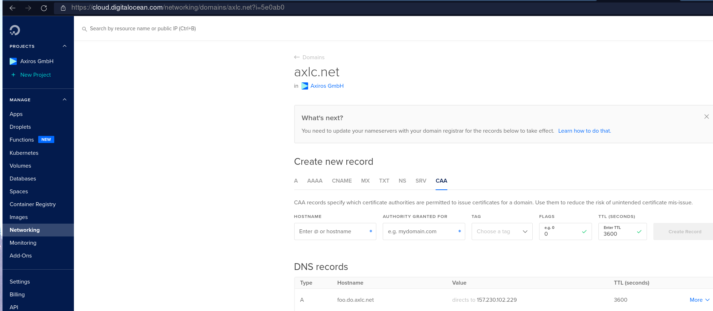

# DNS

## [nip.io](https://nip.io)

Pretty cool for testing:

Resolves a-b-c-d.nip.io to a.b.c.d

or also: app-c0a801fc.nip.io maps to 192.168.1.252 (c0a...is hex of the ip)

## Dynu and DigitalOcean

I registered a domain at dynu, which is a DDNS provider. I could have also registered simple hosts
with predefined domains for free but I invested the 10 euro / year into owning `axlc.net`.

Here is [their API](https://www.dynu.com/Support/API), you can easily add resolutions for hosts.

Example:

```bash
curl -X POST https://api.dynu.com/v2/dns  -H  "accept: application/json" -H "API-key:$(pass show AX/ddns_dynu_api)" -d '{"ipv4Address": "167.71.34.171", "name": "b-2.axlc.net", "group": "lowcode", "ipv4": true, "ipv4WildcardAlias": true}'
```

But: This is NOT how we want to update our cluster services. This should be done from inside k8s.

We have https://github.com/kubernetes-sigs/external-dns to automatically publish your services/ingresses/gateways to DNS
and it has a plugin for DO

https://github.com/kubernetes-sigs/external-dns/blob/master/docs/tutorials/digitalocean.md

I.e. we need to use DO ns servers for our domain.

Add ns1.digitalocean.com and ns2 as well, then delete all dynu dns servers here, and no, you don't
need to pay the 10$ for membership to do that:

Home / Control Panel/ Domain Registrations / Manage Domain Name / Manage Name Servers

```
~ ❯ whois axlc.net |grep 'Name Server'
Name Server: NS1.DIGITALOCEAN.COM
Name Server: NS2.DIGITALOCEAN.COM
```

Test: Configure in DO networking a resolution:



So that

```
[gk@axgk devapps]$ dig @ns1.digitalocean.com foo.do.axlc.net +short
157.230.102.229
```

Then wait an hour or so until `ping foo.do.axlc.net` works as well.

here you can check right away: https://dnschecker.org/all-dns-records-of-domain.php?query=foo.do.axlc.net&rtype=ALL&dns=google

## Addendum

Direct API of DO for DNS: https://surdu.me/2019/07/28/digital-ocean-ddns.html
