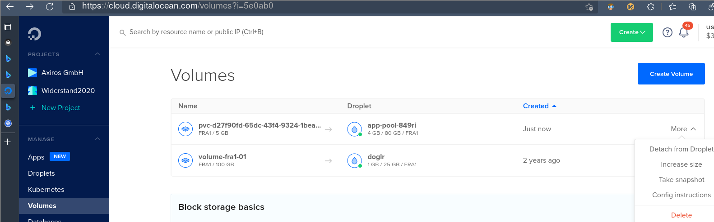
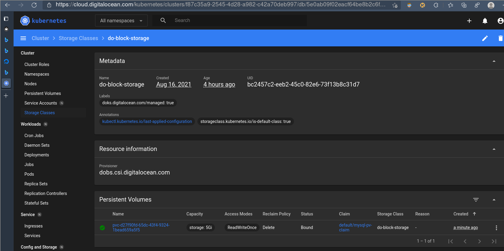

# Stateful App With MySQL Database

Lets connect a database to our [hello app](../1_hello_app/), i.e. we need a Stateful Set.

## Requirements

We require the app from [last chapter](../1_hello_app/):

<!-- id: 1e36edf2f174f4c02372408a11c40ef6 -->

=== "Cmd"
    
    ```console
    $ git ls-files # lp: asserts=server.py
    $ git tag
    $ sed -i 's/0.2/0.3/' environ # version now 0.3
    $ source ./environ
    $ rm -f *.yaml
    ```

=== "Output"

    
    <xterm />
    
        $ git ls-files           
        Dockerfile               
        environ                  
        server.py
        $ git tag                
        0.2                      
        0.3
        $ sed -i 's/0.2/0.3/' environ # version now 0.3    
        $ 
        $ source ./environ
        $ rm -f *.yaml
    
    


<!-- id: 1e36edf2f174f4c02372408a11c40ef6 -->

## Server App

First we need a mysql server:

<!-- id: 67fb95a429eb155e68034ba317de5c3f -->

=== "Cmd"
    
    ```console
    $ ( p images | grep mysql | grep 5.7 || p pull docker.io/library/mysql:5.7 )
    $ p run -d -e MYSQL_ROOT_HOST='%' -e MYSQL_ROOT_PASSWORD=secret -e MYSQL_DATABASE=db -p3306:3306 --rm -ti mysql:5.7
    ```

=== "Output"

    
    <xterm />
    
        $ ( p images | grep mysql | grep 5.7 || p pull docker.io/library/mysql:5.7 ) 
        docker.io/library/mysql                                  5.7         8cf625070931  3 weeks ago   454 MB
        $ p run -d -e MYSQL_ROOT_HOST='%' -e MYSQL_ROOT_PASSWORD=secret -e MYSQL_DATABASE=db -p3306:3306 --rm -ti mysql:5.7             
        ae4eebc46b6fd78074d9586f68a1e891f58d2a1a951a90bcfdb404458a12e975
    
    


<!-- id: 67fb95a429eb155e68034ba317de5c3f -->

The app is simple webserver, now with database support plus a real app server framework:

<!-- id: 1b2787aec4e34f00b4798bd0ca41efff -->
```python
$ cat server.py
#!/usr/bin/env python
import os, sys, time, bottle, bottle_mysql, json as j

app = bottle.Bottle()
dbconf = {k: os.environ[k] for k in ('dbuser', 'dbpass', 'dbname', 'dbhost')}
plugin = bottle_mysql.Plugin(**dict(dbconf))
app.install(plugin)

now, die = time.time, sys.exit

@app.route('/initdb')
def initdb(db):
    db.execute('drop TABLE IF EXISTS items')
    db.execute('CREATE TABLE items (name varchar(255), age int)')
    db.execute("INSERT INTO items (name, age) VALUES ('brian', 42)")
    db.execute('show tables')
    row = db.fetchone()
    return {'result': str(row)}


@app.route('/show/<item>')
def show(item, db):
    db.execute('SELECT * from items where name=%s', (item,))
    row = db.fetchone()
    if row:
        return {'result': row}
    return bottle.HTTPError(404, 'Item not found')


@app.route('/env', method='GET')
def env():
    return {'at': now(), 'env': dict(os.environ)}


@app.route('/kill/<ec>')
def kill(ec):
    sys.stderr.close()
    die(int(ec))


if __name__ == '__main__':
    print(f'Starting bottle httpd server')
    bottle.run(app, host='0.0.0.0', port=28001)
```
<!-- id: 1b2787aec4e34f00b4798bd0ca41efff -->


### Containerize

<!-- id: c11fb1022b1a2b9cd75ad89cbfcbb163 -->
```docker
$ cat Dockerfile
FROM         python:3.8
MAINTAINER   gk
RUN          mkdir -p /app
RUN          pip install mysql bottle bottle-mysql
WORKDIR      /app
COPY         server.py /app/server.py
ENV          APP_ENV development
EXPOSE       28001
CMD          ["python", "server.py"]
```
<!-- id: c11fb1022b1a2b9cd75ad89cbfcbb163 -->

<!-- id: 84c7f95145cdd1580776a54f8a37f904 -->

=== "Cmd"
    
    ```console
    $ p rmi -f $namespace/$app
    $ p build --quiet -t $app  .
    $ p tag "$app:latest" "$namespace/$app:$ver"
    ```

=== "Output"

    
    <xterm />
    
        $ p rmi -f $namespace/$app                                                   
        Untagged: localhost/devapps/hello_app:0.3
        $ p build --quiet -t $app  .                                                 
        603b3f682f1e101453ca517ab5bd9f9d45a60b7825f80ff21df899abc91c5f84
        $ p tag "$app:latest" "$namespace/$app:$ver"
    
    


<!-- id: 84c7f95145cdd1580776a54f8a37f904 -->

### Test


<!-- id: c686722e8caaa40c9f168b820b05dad3 -->
<xterm />

    $ hostip="$(ip addr show |grep 'inet ' | grep -v 127 | head -n 1 | cut -d t -f2 | cut -db -f1 | cut -d'/' -f1 | xargs)"
    $ echo $hostip           
    10.0.0.84
    $ p run -d -ti --rm -p 28001:28001 -e dbuser=root -e dbpass=secret -e dbname=db -e dbhost=$hostip $namespace/$app:$ver          
    6b28f15292eefdc92fda8c1bee52207c47299a4958f42b72bef717309fb140af
    $ ( while true; do sleep 1; wget -q http://127.0.0.1:28001/initdb -O - && break; done )               
    {"result": "{'Tables_in_db': 'items'}"}
    wget -q http://127.0.0.1:28001/show/brian -O - | jq . # lp: asserts=brian and result
    $ wget -q http://127.0.0.1:28001/show/brian -O - | jq .                      
    {                        
      "result": {            
        "name": "brian",     
        "age": 42            
      }                      
    }


<!-- id: c686722e8caaa40c9f168b820b05dad3 -->

!!! note
    The app container needed to connect to an ip different to 127.0.0.1 (mysql binds to `0.0.0.0` but
    127.0.0.1 within the app container is within its own network namespace).


Cleanup:

<!-- id: 64e3efed68c3a0cc50e88c3dcb300d64 -->

=== "Cmd"
    
    ```console
    $ wget -q http://127.0.0.1:28001/kill/0
    $ ( p ps | grep mysqld | cut -d' ' -f1 | xargs podman stop; echo stopped ) # lp: asserts=stopped
    ```

=== "Output"

    
    <xterm />
    
        $ wget -q http://127.0.0.1:28001/kill/0
        $ ( p ps | grep mysqld | cut -d' ' -f1 | xargs podman stop; echo stopped )   
        ae4eebc46b6f                                    
        stopped
    
    


<!-- id: 64e3efed68c3a0cc50e88c3dcb300d64 -->

### Commit

<!-- id: 3de05d63e060a71ab8ed584eed9b17c4 -->

=== "Cmd"
    
    ```console
    $ git commit -am 'feat: mysql connection'
    $ git tag $ver
    ```

=== "Output"

    
    <xterm />
    
        $ git commit -am 'feat: mysql connection'                             
        On branch master                                
        Untracked files:                                
          (use "git add <file>..." to include in what will be committed)                                
                env                                     
        
        nothing added to commit but untracked files present (use "git add" to track)
        $ git tag $ver        
        fatal: tag '0.3' already exists
    
    


<!-- id: 3de05d63e060a71ab8ed584eed9b17c4 -->

### Push


<!-- id: 23ed0b2db0dbe69c84c7a76c93ac10e5 -->

=== "Cmd"
    
    ```console
    $ p login "$(pass show reg/domain)" -u $(pass show reg/user) -p "$(pass show reg/passw)"
    $ r="docker://$(pass show reg/domain)/docker-internal/$namespace"
    $ p push --quiet --authfile=$fn_reg_auth $namespace/$app:$ver "$r/$app:$ver" && echo success # lp: assert=success
    ```

=== "Output"

    
    <xterm />
    
        $ p login "$(pass show reg/domain)" -u $(pass show reg/user) -p "$(pass show reg/passw)"                                                                              
        Login Succeeded!
        $ r="docker://$(pass show reg/domain)/docker-internal/$namespace"
        $ p push --quiet --authfile=$fn_reg_auth $namespace/$app:$ver "$r/$app:$ver" && echo success                                                                          
        success
    
    


<!-- id: 23ed0b2db0dbe69c84c7a76c93ac10e5 -->


## Cloud Deployment

!!! note

    We follow [this][tut] tutorial, modified for our app.

Again we deploy the app using K8s' solely. First a secret "generator", configured for a static one
(but you [could](https://kubernetes.io/docs/concepts/configuration/secret/) have varying ones at every redeploy):

<!-- id: 197c4a39463011b1a4ab8c5f3292d5ab -->

=== "Cmd"
    
    ```console
    $ cat <<EOF >./kustomization.yaml
    secretGenerator:
    - name: mysql-pass
      literals:
      - password=myk8ssecret
    resources:
      - mysql-deployment.yaml
      - hello2-deployment.yaml
    EOF
    ```

=== "Output"

    
    <xterm />
    
        $ cat <<EOF >./kustomization.yaml               
        > secretGenerator:                              
        > - name: mysql-pass                            
        >   literals:                                   
        >   - password=myk8ssecret                      
        > resources:                                    
        >   - mysql-deployment.yaml                     
        >   - hello2-deployment.yaml                    
        > EOF                                           
        $ 
    
    


<!-- id: 197c4a39463011b1a4ab8c5f3292d5ab -->


<!-- id: e0cc65adf966c9384a07d4606dd8395e -->

=== "Cmd"
    
    ```console
    $ cat <<EOF >./mysql-deployment.yaml
    apiVersion: v1
    kind: Service
    metadata:
      name: hello2-mysql
      labels:
        app: hello2
    spec:
      ports:
        - port: 3306
      selector:
        app: hello2
        tier: mysql
      clusterIP: None
    ---
    apiVersion: v1
    kind: PersistentVolumeClaim
    metadata:
      name: mysql-pv-claim
      labels:
        app: hello2
    spec:
      accessModes:
        - ReadWriteOnce
      resources:
        requests:
          storage: 5Gi
    ---
    apiVersion: apps/v1
    kind: Deployment
    metadata:
      name: hello2-mysql
      labels:
        app: hello2
    spec:
      selector:
        matchLabels:
          app: hello2
          tier: mysql
      strategy:
        type: Recreate
      template:
        metadata:
          labels:
            app: hello2
            tier: mysql
        spec:
          containers:
          - image: mysql:5.7
            name: mysql
            args:
            - "--ignore-db-dir=lost+found"
            env:
            - name: MYSQL_ROOT_HOST
              value: "%" 
            - name: MYSQL_DATABASE
              value: "db" 
            - name: MYSQL_ROOT_PASSWORD
              valueFrom:
                secretKeyRef:
                  name: mysql-pass
                  key: password
            ports:
            - containerPort: 3306
              name: mysql
            volumeMounts:
            - name: mysql-persistent-storage
              mountPath: /var/lib/mysql
          volumes:
          - name: mysql-persistent-storage
            persistentVolumeClaim:
              claimName: mysql-pv-claim
    EOF
    ```

=== "Output"

    
    <xterm />
    
        $ cat <<EOF >./mysql-deployment.yaml            
        > apiVersion: v1                                
        > kind: Service                                 
        > metadata:                                     
        >   name: hello2-mysql                          
        >   labels:                                     
        >     app: hello2                               
        > spec:                                         
        >   ports:                                      
        >     - port: 3306                              
        >   selector:                                   
        >     app: hello2                               
        >     tier: mysql                               
        >   clusterIP: None                             
        > ---                                           
        > apiVersion: v1                                
        > kind: PersistentVolumeClaim                   
        > metadata:                                     
        >   name: mysql-pv-claim                        
        >   labels:                                     
        >     app: hello2                               
        > spec:                                         
        >   accessModes:                                
        >     - ReadWriteOnce                           
        >   resources:                                  
        >     requests:                                 
        >       storage: 5Gi                            
        > ---                                           
        > apiVersion: apps/v1                           
        > kind: Deployment                              
        > metadata:                                     
        >   name: hello2-mysql                          
        >   labels:                                     
        >     app: hello2                               
        > spec:                                         
        >   selector:                                   
        >     matchLabels:                              
        >       app: hello2                             
        >       tier: mysql                             
        >   strategy:                                   
        >     type: Recreate                            
        >   template:                                   
        >     metadata:                                 
        >       labels:                                 
        >         app: hello2                           
        >         tier: mysql                           
        >     spec:                                     
        >       containers:                             
        >       - image: mysql:5.7                      
        >         name: mysql                           
        >         args:                                 
        >         - "--ignore-db-dir=lost+found"        
        >         env:                                  
        >         - name: MYSQL_ROOT_HOST               
        >           value: "%"                          
        >         - name: MYSQL_DATABASE                
        >           value: "db"                         
        >         - name: MYSQL_ROOT_PASSWORD           
        >           valueFrom:                          
        >             secretKeyRef:                     
        >               name: mysql-pass                
        >               key: password                   
        >         ports:                                
        >         - containerPort: 3306                 
        >           name: mysql                         
        >         volumeMounts:                         
        >         - name: mysql-persistent-storage      
        >           mountPath: /var/lib/mysql           
        >       volumes:                                
        >       - name: mysql-persistent-storage        
        >         persistentVolumeClaim:                
        >           claimName: mysql-pv-claim           
        > EOF                                           
        $ 
    
    


<!-- id: e0cc65adf966c9384a07d4606dd8395e -->

!!! warning "`ignore-db-dir` start argument"
    
    On ext4 the mysql5.7 images [refuses](https://stackoverflow.com/a/66027830/4583360) to start due to non empty dir otherwise.


<!-- id: d44a9cadddb329bcb6effc921583d5db -->

=== "Cmd"
    
    ```console
    $ cat <<EOF >./hello2-deployment.yaml
    apiVersion: v1
    kind: Service
    metadata:
      name: hello2
      labels:
        app: hello2
        tier: frontend
    spec:
      type: LoadBalancer
      ports:
        - port: 28001
      selector:
        app: hello2
        tier: frontend
    ---
    apiVersion: apps/v1
    kind: Deployment
    metadata:
      name: hello2
      labels:
        app: hello2
    spec:
      selector:
        matchLabels:
          app: hello2
          tier: frontend
      strategy:
        type: Recreate
      template:
        metadata:
          labels:
            app: hello2
            tier: frontend
        spec:
          imagePullSecrets:
          - name: regcred
          containers:
          - name: hello2
            image: $(pass show reg/domain)/docker-internal/$namespace/$app:$ver
            imagePullPolicy: Always
            env:
            - name: dbuser
              value: "root"
            - name: dbpass
              valueFrom:
                secretKeyRef:
                  name: mysql-pass
                  key: password
            - name: dbhost
              value: "hello2-mysql"
            - name: dbname
              value: "db"
            ports:
            - containerPort: 28001
              name: hello2
            resources:
              requests:
                cpu: 100m
                memory: 100Mi
    EOF
    ```

=== "Output"

    
    <xterm />
    
        $ cat <<EOF >./hello2-deployment.yaml           
        > apiVersion: v1                                
        > kind: Service                                 
        > metadata:                                     
        >   name: hello2                                
        >   labels:                                     
        >     app: hello2                               
        >     tier: frontend                            
        > spec:                                         
        >   type: LoadBalancer                          
        >   ports:                                      
        >     - port: 28001                             
        >   selector:                                   
        >     app: hello2                               
        >     tier: frontend                            
        > ---                                           
        > apiVersion: apps/v1                           
        > kind: Deployment                              
        > metadata:                                     
        >   name: hello2                                
        >   labels:                                     
        >     app: hello2                               
        > spec:                                         
        >   selector:                                   
        >     matchLabels:                              
        >       app: hello2                             
        >       tier: frontend                          
        >   strategy:                                   
        >     type: Recreate                            
        >   template:                                   
        >     metadata:                                 
        >       labels:                                 
        >         app: hello2                           
        >         tier: frontend                        
        >     spec:                                     
        >       imagePullSecrets:                       
        >       - name: regcred                         
        >       containers:                             
        >       - name: hello2                          
        >         image: $(pass show reg/domain)/docker-internal/$namespace/$app:$ver                   
        >         imagePullPolicy: Always               
        >         env:                                  
        >         - name: dbuser                        
        >           value: "root"                       
        >         - name: dbpass                        
        >           valueFrom:                          
        >             secretKeyRef:                     
        >               name: mysql-pass                
        >               key: password                   
        >         - name: dbhost                        
        >           value: "hello2-mysql"               
        >         - name: dbname                        
        >           value: "db"                         
        >         ports:                                
        >         - containerPort: 28001                
        >           name: hello2                        
        >         resources:                            
        >           requests:                           
        >             cpu: 100m                         
        >             memory: 100Mi                     
        > EOF                                           
        $ 
    
    


<!-- id: d44a9cadddb329bcb6effc921583d5db -->

Now we apply all, with the -k switch, for the kustomize.yaml:

<!-- id: b5e00ff69f130f2e9e217131c3530105 -->

=== "Cmd"
    
    ```console
    $ kubectl apply -k ./
    ```

=== "Output"

    
    <xterm />
    
        $ kubectl apply -k ./ 
        secret/mysql-pass-2f9464chcc unchanged          
        service/hello2 unchanged                        
        service/hello2-mysql unchanged                  
        persistentvolumeclaim/mysql-pv-claim unchanged  
        deployment.apps/hello2 unchanged                
        deployment.apps/hello2-mysql unchanged
    
    


<!-- id: b5e00ff69f130f2e9e217131c3530105 -->

then wait for the loadbalancer and fetch the public IP:

<!-- id: 78f647e21c231d01fd61dbc1596d891a -->
<xterm />

    time while true; do sleep 2; k get service hello2 | grep pending >/dev/null || break; done # lp: timeout=600
    $ time while true; do sleep 2; k get service hello2 | grep pending >/dev/null || break; done                                                                          
    
    real    0m2.130s                                
    user    0m0.052s                                
    sys     0m0.036s
    $ k -o json get service hello2 | jq .                                 
    {                                               
      "apiVersion": "v1",                           
      "kind": "Service",                            
      "metadata": {                                 
        "annotations": {                            
          "kubectl.kubernetes.io/last-applied-configuration": "{\"apiVersion\":\"v1\",\"kind\":\"Service\",\"metadata\":{\"annotations\":{},\"labels\":{\"app\":\"hello2\",\"tier\":\"frontend\"},\"name\":\"hello2\",\"namespace\":\"default\"},\"spec\":{\"ports\":[{\"port\":28001}],\"selector\":{\"app\":\"hello2\",\"tier\":\"frontend\"},\"type\":\"LoadBalancer\"}}\n",                     
          "kubernetes.digitalocean.com/load-balancer-id": "5ff78870-218c-4a61-a6ad-e3a669618e94"    
        },                                          
        "creationTimestamp": "2021-08-17T09:33:46Z",
        "finalizers": [                             
          "service.kubernetes.io/load-balancer-cleanup"                                             
        ],                                          
        "labels": {                                 
          "app": "hello2",                          
          "tier": "frontend"                        
        },                                          
        "name": "hello2",                           
        "namespace": "default",                     
        "resourceVersion": "142545",                
        "uid": "eaa8b74a-f491-4fb0-a629-ff13bc2a827a"                                               
      },                                            
      "spec": {                                     
        "clusterIP": "10.245.241.244",              
        "clusterIPs": [                             
          "10.245.241.244"                          
        ],                                          
        "externalTrafficPolicy": "Cluster",         
        "ipFamilies": [                             
          "IPv4"                                    
        ],                                          
        "ipFamilyPolicy": "SingleStack",            
        "ports": [                                  
          {                                         
            "nodePort": 32106,                      
            "port": 28001,                          
            "protocol": "TCP",                      
            "targetPort": 28001                     
          }                                         
        ],                                          
        "selector": {                               
          "app": "hello2",                          
          "tier": "frontend"                        
        },                                          
        "sessionAffinity": "None",                  
        "type": "LoadBalancer"                      
      },                                            
      "status": {                                   
        "loadBalancer": {                           
          "ingress": [                              
            {                                       
              "ip": "67.207.72.117"                 
            }                                       
          ]                                         
        }                                           
      }                                             
    }
    $ ip=$(k -o json get service hello2 | jq -r .status.loadBalancer.ingress[0].ip)


<!-- id: 78f647e21c231d01fd61dbc1596d891a -->

All environ settings are in the app container:


<!-- id: 72f9a9663483e992059aa351337dbd5e -->
<xterm />

    $ wget -q http://$ip:28001/env -O - | jq .                            
    {                                               
      "at": 1629196739.1266227,                     
      "env": {                                      
        "PATH": "/usr/local/bin:/usr/local/sbin:/usr/local/bin:/usr/sbin:/usr/bin:/sbin:/bin",      
        "HOSTNAME": "hello2-d646c6dc4-zzsmx",       
        "LANG": "C.UTF-8",                          
        "GPG_KEY": "E3FF2839C048B25C084DEBE9B26995E310250568",                                      
        "PYTHON_VERSION": "3.8.11",                 
        "PYTHON_PIP_VERSION": "21.2.3",             
        "PYTHON_GET_PIP_URL": "https://github.com/pypa/get-pip/raw/c20b0cfd643cd4a19246ccf204e2997af70f6b21/public/get-pip.py",                                                                     
        "PYTHON_GET_PIP_SHA256": "fa6f3fb93cce234cd4e8dd2beb54a51ab9c247653b52855a48dd44e6b21ff28b",
        "APP_ENV": "development",                   
        "dbuser": "root",                           
        "dbpass": "myk8ssecret",                    
        "dbhost": "hello2-mysql",                   
        "dbname": "db",                             
        "HELLO2_PORT_28001_TCP_PROTO": "tcp",       
        "KUBERNETES_SERVICE_PORT": "443",           
        "KUBERNETES_PORT_443_TCP_PROTO": "tcp",     
        "HELLO2_PORT": "tcp://10.245.241.244:28001",
        "HELLO2_PORT_28001_TCP_PORT": "28001",      
        "KUBERNETES_PORT_443_TCP": "tcp://10.245.0.1:443",                                          
        "KUBERNETES_PORT_443_TCP_PORT": "443",      
        "KUBERNETES_PORT_443_TCP_ADDR": "10.245.0.1",                                               
        "HELLO2_SERVICE_PORT": "28001",             
        "HELLO2_PORT_28001_TCP": "tcp://10.245.241.244:28001",                                      
        "KUBERNETES_SERVICE_HOST": "10.245.0.1",    
        "KUBERNETES_SERVICE_PORT_HTTPS": "443",     
        "KUBERNETES_PORT": "tcp://10.245.0.1:443",  
        "HELLO2_SERVICE_HOST": "10.245.241.244",    
        "HELLO2_PORT_28001_TCP_ADDR": "10.245.241.244",                                             
        "HOME": "/root"                             
      }                                             
    }


<!-- id: 72f9a9663483e992059aa351337dbd5e -->

And the app works:

<!-- id: 35fb61130b99033d43b0d19893ef0e8c -->
<xterm />

    $ wget -q http://$ip:28001/initdb -O - | jq .                         
    {                                               
      "result": "{'Tables_in_db': 'items'}"         
    }
    wget -q http://$ip:28001/show/brian -O - | jq . # lp: asserts="brian and result"
    $ wget -q http://$ip:28001/show/brian -O - | jq .                     
    {                                               
      "result": {                                   
        "name": "brian",                            
        "age": 42                                   
      }                                             
    }


<!-- id: 35fb61130b99033d43b0d19893ef0e8c -->

Delete everything:

<!-- id: 6f2beec7853bb1e1c0eb05fad8243ab0 -->


```
kubectl delete -k ./. # lp: asserts="deployment.apps and deleted"
```


<!-- id: 6f2beec7853bb1e1c0eb05fad8243ab0 -->


## Discussion

- The loadbalancer creation is the time limiting factor at re-deploys from scratch, took often around 4-5 minutes.

    !!! tip
        For CI/CD I'd therefore would keep the loadbalancer standing and just update the app.

- In order to debug, `kubectl get pods` -> `kubectl logs --follow <podname>` was indispensable.
- `kubectl delete -k ./.` did always work nicely, removing all, in the right order. 
- K8s's name resolution is simple: The app could simply connect to the dbhost by `name` attribute of
  the corresponding service deployment.
- On DO (and I guess on other infra providers as well) they use their internal volume creation means
  as default K8s "storage class", i.e. when volumes are to be created for Stateful Sets.  Those
  volumes will survive node failure, [unlike][tut] the `hostPath` based storage class, being set as
  default on local test clusters (e.g. minicube).   

    | DO Dashboard|  K8s Dashboard |
    |-|- |
    | [](img/stocl1.png) | [](img/stocl2.png) |


[tut]: https://kubernetes.io/docs/tutorials/stateful-application/mysql-wordpress-persistent-volume/