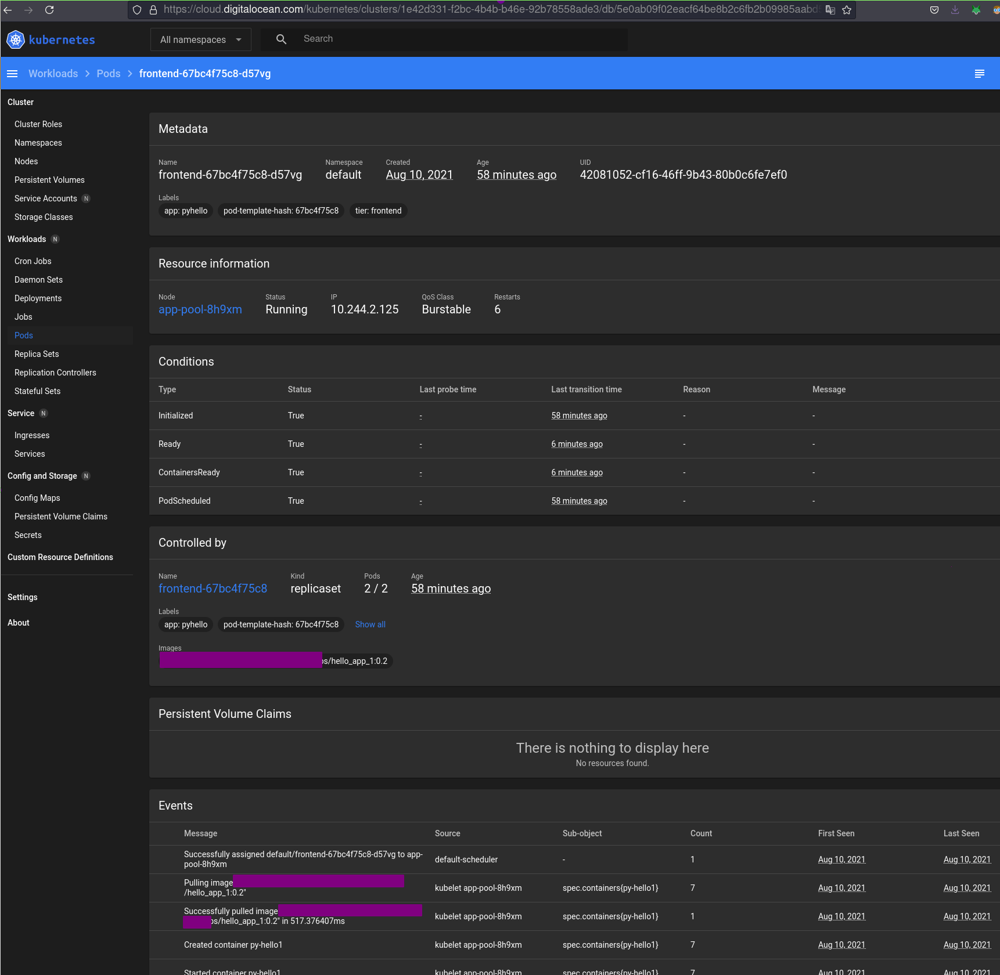

# A First Hello World Python App Run on K8s

 We create a hello world app, which we containerize, then deploy on k8s.

!!! note

    There are thousands of "better" tutorials regarding how to do this already out there since long.
    But you have to start somewhere and I wanted an automatically[^1] reproducable baseline, for the more
    complex things, we'll eventually address in other tutorials around here.

!!! tip "kubernetes playground"
    
    If you can't install a cloud kubernetes server you can test most of the stuff below using this
    playground: https://labs.play-with-k8s.com/

[^1]: All the code in this tutorial is run by a markdown preprocessor.

First example is stateless:

## Requirements

- Having a [k8s cluster and configured kubectl command](../../terraform/k8s/k8s_on_do.md), with access to our private container image registry.

<!-- id: 28213a4ccf9b72ecdcb68e77d4a2396f -->
```bash
$ kubectl get nodes      
NAME                 STATUS   ROLES    AGE   VERSION                                                   
app-pool-843wb       Ready    <none>   8h    v1.21.2                                                   
app-pool-843wr       Ready    <none>   8h    v1.21.2                                                   
default-pool-843r9   Ready    <none>   8h    v1.21.2                                                   
default-pool-843rz   Ready    <none>   8h    v1.21.2
```


```bash
$ kubectl get secrets    
NAME                  TYPE                                  DATA   AGE                                 
default-token-lzwrn   kubernetes.io/service-account-token   3      8h                                  
regcred               kubernetes.io/dockerconfigjson        1      8h
```
<!-- id: 28213a4ccf9b72ecdcb68e77d4a2396f -->

- Have the following values present (we use [`pass`](https://www.passwordstore.org/) to retrieve them):

    - `reg/domain`  domain name of your registry
    - `reg/user`    username for your registry
    - `reg/passw`   your registry password


- podman or docker and kubectl. Here we will use podman to build and push a container image.

### Preparation

<!-- id: e7032229a98c2744441b4e4581e449b9 -->

=== "Cmd"
    
    ```console
    $ type kubectl podman # asserts: podman and kubectl
    $ app="hello_app_1"       # app (container) name
    $ D="$DT_PROJECT_ROOT/tmp/clusters/DO/k8s/$app"
    $ mkdir -p "$D" || exit 1
    $ cd "$D"
    $ ls -a | xargs rm -rf 2>/dev/null
    $ git init
    $ podman rmi --force $app 2>/dev/null || true
    ```

=== "Output"

    
    <xterm />
    
        $ type kubectl podman # asserts: podman and kubectl                                                    
        kubectl is hashed (/usr/local/bin/kubectl)         
        podman is hashed (/usr/bin/podman)                 
        $ 
        $ app="hello_app_1"       # app (container) name   
        $ 
        $ D="$DT_PROJECT_ROOT/tmp/clusters/DO/k8s/$app"
        $ mkdir -p "$D" || exit 1
        $ cd "$D"
        $ ls -a | xargs rm -rf 2>/dev/null
        $ git init               
        hint: Using 'master' as the name for the initial branch. This default branch name                      
        hint: is subject to change. To configure the initial branch name to use in all                         
        hint: of your new repositories, which will suppress this warning, call:                                
        hint:                    
        hint:   git config --global init.defaultBranch <name>                                                  
        hint:                    
        hint: Names commonly chosen instead of 'master' are 'main', 'trunk' and                                
        hint: 'development'. The just-created branch can be renamed via this command:                          
        hint:                    
        hint:   git branch -m <name>                       
        Initialized empty Git repository in /home/gk/repos/blog/tmp/clusters/DO/k8s/hello_app_1/.git/
        $ podman rmi --force $app 2>/dev/null || true                                
        Untagged: localhost/hello_app_1:latest             
        Deleted: 765a3c11be956eb63f8840feb0b358592030c79cd03aac8eade81d32c60da8f9
    
    


<!-- id: e7032229a98c2744441b4e4581e449b9 -->


## Environ

As usual we create an `environ` file, which sets up our working environ, when sourced - convenient for new shells:

<!-- id: 1987592114a55299d8d4e0163071040e -->
```bash
$ cat environ
set -ae
alias k=kubectl p=podman

[[ "$0" = *bash* ]] && s=bash || s=zsh
source <(kubectl completion $s)

D="/home/gk/repos/blog/tmp/clusters/DO/k8s/hello_app_1"
namespace="devapps"                                  # namespace of our app in registry
fn_reg_auth="$XDG_RUNTIME_DIR/containers/auth.json"  # where podman stores creds
app="hello_app_1"                                    # app (container) name
ver="0.2"
cd "$D"
set +ae
```
<!-- id: 1987592114a55299d8d4e0163071040e -->

<!-- id: e9081053b0fef30de850787fcd421f9a -->

=== "Cmd"
    
    ```console
    $ source ./environ
    ```

=== "Output"

    
    <xterm />
    
        $ source ./environ
    
    


<!-- id: e9081053b0fef30de850787fcd421f9a -->

!!! tip

    === "Automatic Sourcing on `cd`"

        You can tell your shell to automatically source the environ file, when you cd into the folder, by overwritting the builtin cd function.

    === "Recipe"

        In your `.bashrc` or `.zshrc`:

        ```bash
        function cd {
            local m f d="${1:-$HOME}"
            # useful as well: cd into dir when a file is given:
            test -d "$d" || {
                test "$d" != "-" && {
                    f="$d"
                    d="$(dirname "$d")"
                    test -e "$f" && m="Is a file" || m="Not exists"
                    echo -e "\x1b[38;5;245m$m: $f - going to \x1b[0m$d"
                }
            }
            builtin cd "$d"
            test -e "./.cd.rc" && {
                echo -e "\x1b[38;5;245m$(cat "./.cd.rc")\x1b[0m"
                source "./.cd.rc"
            }
            true
        }
        ```
        Now you can add `source environ` into a `.cd.rc` file within the same folder.


## Server App

A simple webserver, returning its process environ to the client and supports getting shut down from
remote:

<!-- id: 369d0132692c58d99ebe410df2316e8d -->
```python
$ cat server.py
#!/usr/bin/env python
import os, sys, time, json as j
from http.server import HTTPServer, BaseHTTPRequestHandler as Handler

now = time.time
die = sys.exit

nfo = lambda: {'at': now(), 'env': dict(os.environ)}
rsp = lambda: j.dumps(nfo(), indent=4, sort_keys=True)


def get(h):
    h.send_response(200)
    h.send_header('Content-type', 'application/json')
    h.end_headers()
    w = lambda s, h=h: h.wfile.write(bytes(s, 'utf-8'))
    w(rsp())
    # we allow the client to stop the server via those URL paths:
    p = h.path.split('?', 1)[0]
    die(0) if p == '/stop' else die(1) if p == '/err' else 0


Handler.do_GET = get

def run(bind='0.0.0.0', port=28001):
    print(f'Starting httpd server on {bind}:{port}')
    HTTPServer((bind, port), Handler).serve_forever()

run() if __name__ == '__main__' else 0
```
<!-- id: 369d0132692c58d99ebe410df2316e8d -->


### Containerize


<!-- id: 190dbbf523584da64b62d7fb9bd93748 -->
```docker
$ cat Dockerfile
FROM         python:3.8
MAINTAINER   gk
RUN          mkdir -p /app
WORKDIR      /app
COPY         server.py /app/server.py
ENV          APP_ENV development
EXPOSE       28001
CMD          ["python", "server.py"]
```
<!-- id: 190dbbf523584da64b62d7fb9bd93748 -->

<!-- id: 607a9bdf55e10c9e70828644c1bf2e2c -->

=== "Cmd"
    
    ```console
    $ p build --quiet -t $app  .
    $ p tag "$app:latest" "$namespace/$app:$ver"
    ```

=== "Output"

    
    <xterm />
    
        $ p build --quiet -t $app  .                                                 
        084853fe41554ceb4094d20d6f202e23a14be169c1ec252abfd5111be62bc5d9
        $ p tag "$app:latest" "$namespace/$app:$ver"
    
    


<!-- id: 607a9bdf55e10c9e70828644c1bf2e2c -->

### Test

<!-- id: 0d8dd6deed60237d4078723ed9618bee -->

=== "Cmd"
    
    ```console
    $ p run -d --rm -p28001:28001 $namespace/$app:$ver
    $ wget --retry-connrefused http://localhost:28001/stop -O - # lp: asserts=PATH
    ```

=== "Output"

    
    <xterm />
    
        $ p run -d --rm -p28001:28001 $namespace/$app:$ver                           
        9d43e8ac6f67417c59023caba62d4556fe7f2b64ef85e58b429fa10962f26b35
        $ wget --retry-connrefused http://localhost:28001/stop -O -                  
        --2021-08-11 09:55:03--  http://localhost:28001/stop                                                   
        Resolving localhost (localhost)... ::1, 127.0.0.1  
        Connecting to localhost (localhost)|::1|:28001... connected.                                           
        HTTP request sent, awaiting response... 200 OK     
        Length: unspecified [application/json]             
        Saving to: ‘STDOUT’      
        
        -                             [<=>                                  ]       0  --.-KB/s               {
            "at": 1628668503.6120763,                      
            "env": {             
                "APP_ENV": "development",                  
                "GPG_KEY": "E3FF2839C048B25C084DEBE9B26995E310250568",                                         
                "HOME": "/root", 
                "HOSTNAME": "9d43e8ac6f67",                
                "LANG": "C.UTF-8",                         
                "PATH": "/usr/local/bin:/usr/local/sbin:/usr/local/bin:/usr/sbin:/usr/bin:/sbin:/bin",         
                "PYTHON_GET_PIP_SHA256": "fa6f3fb93cce234cd4e8dd2beb54a51ab9c247653b52855a48dd44e6b21ff28b",   
                "PYTHON_GET_PIP_URL": "https://github.com/pypa/get-pip/raw/c20b0cfd643cd4a19246ccf204e2997af70f6b21/public/get-pip.py", 
                "PYTHON_PIP_VERSION": "21.2.3",            
                "PYTHON_VERSION": "3.8.11",                
                "TERM": "xterm", 
                "container": "podman"                      
            }                    
        -                             [ <=>                                 ]     692  --.-KB/s    in 0s       
        
        2021-08-11 09:55:03 (27.2 MB/s) - written to stdout [692]
    
    


<!-- id: 0d8dd6deed60237d4078723ed9618bee -->

### Commit App

<!-- id: 1913561b01421aae3a8c020e6e433103 -->

=== "Cmd"
    
    ```console
    $ git add server.py Dockerfile environ
    $ git commit -am 'feat: First version of hello world server'
    ```

=== "Output"

    
    <xterm />
    
        $ git add server.py Dockerfile environ
        $ git commit -am 'feat: First version of hello world server'                 
        [master (root-commit) 10f44b1] feat: First version of hello world server                               
         3 files changed, 50 insertions(+)                 
         create mode 100644 Dockerfile                     
         create mode 100644 environ                        
         create mode 100755 server.py
    
    


<!-- id: 1913561b01421aae3a8c020e6e433103 -->

### Push to (Private) Registry


<!-- id: 23ed0b2db0dbe69c84c7a76c93ac10e5 -->

=== "Cmd"
    
    ```console
    $ p login "$(pass show reg/domain)" -u $(pass show reg/user) -p "$(pass show reg/passw)"
    $ r="docker://$(pass show reg/domain)/docker-internal/$namespace"
    $ p push --quiet --authfile=$fn_reg_auth $namespace/$app:$ver "$r/$app:$ver" && echo success # lp: assert=success
    ```

=== "Output"

    
    <xterm />
    
        $ p login "$(pass show reg/domain)" -u $(pass show reg/user) -p "$(pass show reg/passw)"              
        Login Succeeded!
        $ r="docker://$(pass show reg/domain)/docker-internal/$namespace"
        $ p push --quiet --authfile=$fn_reg_auth $namespace/$app:$ver "$r/$app:$ver" && echo success          
        success
    
    


<!-- id: 23ed0b2db0dbe69c84c7a76c93ac10e5 -->


## Cloud Deployment

Lets deploy the container using K8s' builtin weapons:

The app is stateless, so we deploy, ...well..., a ["Deployment"](https://kubernetes.io/docs/concepts/workloads/controllers/deployment/):

<!-- id: 872b0271a9b7e9c0ce92a2e6373bf6a9 -->

=== "Cmd"
    
    ```console
    $ cat << EOF > frontend-deployment.yaml
    apiVersion: apps/v1
    kind: Deployment
    metadata:
      name: frontend
    spec:
      replicas: 2
      selector:
        matchLabels:
          app: pyhello
          tier: frontend
      template:
        metadata:
          labels:
            app: pyhello
            tier: frontend
        spec:
          imagePullSecrets:
          - name: regcred
          containers:
          - name: py-hello1
            image: $(pass show reg/domain)/docker-internal/$namespace/$app:$ver
            imagePullPolicy: Always
            env:
            - name: FOO
              value: "BAR"
            ports:
            - containerPort: 28001
            resources:
              requests:
                cpu: 100m
                memory: 100Mi
    EOF
    $ k apply -f frontend-deployment.yaml
    $ sleep 1
    $ k get pods -l app=pyhello -l tier=frontend
    ```

=== "Output"

    
    <xterm />
    
        $ cat << EOF > frontend-deployment.yaml            
        > apiVersion: apps/v1    
        > kind: Deployment       
        > metadata:              
        >   name: frontend       
        > spec:                  
        >   replicas: 2          
        >   selector:            
        >     matchLabels:       
        >       app: pyhello     
        >       tier: frontend   
        >   template:            
        >     metadata:          
        >       labels:          
        >         app: pyhello   
        >         tier: frontend 
        >     spec:              
        >       imagePullSecrets:
        >       - name: regcred  
        >       containers:      
        >       - name: py-hello1
        >         image: $(pass show reg/domain)/docker-internal/$namespace/$app:$ver                          
        >         imagePullPolicy: Always                  
        >         env:           
        >         - name: FOO    
        >           value: "BAR" 
        >         ports:         
        >         - containerPort: 28001                   
        >         resources:     
        >           requests:    
        >             cpu: 100m  
        >             memory: 100Mi                        
        > EOF                    
        $ 
        $ k apply -f frontend-deployment.yaml                                        
        deployment.apps/frontend created
        $ sleep 1
        $ k get pods -l app=pyhello -l tier=frontend                                 
        NAME                        READY   STATUS              RESTARTS   AGE                                 
        frontend-67bc4f75c8-fx997   0/1     ContainerCreating   0          2s                                  
        frontend-67bc4f75c8-s92gn   0/1     ContainerCreating   0          2s
    
    


<!-- id: 872b0271a9b7e9c0ce92a2e6373bf6a9 -->


<!-- id: e353ee1d2e8916e8d96cd3bbc24a8889 -->

=== "Cmd"
    
    ```console
    $ cat << EOF > frontend-service.yaml
    apiVersion: v1
    kind: Service
    metadata:
      name: frontend
      labels:
        app: pyhello
        tier: frontend
    spec:
      type: LoadBalancer
      ports:
      - port: 28001
      selector:
        app: pyhello
        tier: frontend
    EOF
    $ k apply -f frontend-service.yaml
    $ sleep 1
    $ k get service frontend
    ```

=== "Output"

    
    <xterm />
    
        $ cat << EOF > frontend-service.yaml               
        > apiVersion: v1         
        > kind: Service          
        > metadata:              
        >   name: frontend       
        >   labels:              
        >     app: pyhello       
        >     tier: frontend     
        > spec:                  
        >   type: LoadBalancer   
        >   ports:               
        >   - port: 28001        
        >   selector:            
        >     app: pyhello       
        >     tier: frontend     
        > EOF                    
        $ 
        $ k apply -f frontend-service.yaml                                           
        service/frontend created
        $ sleep 1
        $ k get service frontend 
        NAME       TYPE           CLUSTER-IP       EXTERNAL-IP   PORT(S)           AGE                         
        frontend   LoadBalancer   10.245.144.190   <pending>     28001:32212/TCP   1s
    
    


<!-- id: e353ee1d2e8916e8d96cd3bbc24a8889 -->

On DO the loadbalancer needs a minute when you first configure one, on a *new* k8s cluster (`k describe service frontend` shows details).

Let's wait until up:

<!-- id: 4910e83df0e84788c8d333f17cb93870 -->

=== "Cmd"
    
    ```console
    $ while true; do sleep 2; k get service frontend | grep pending || break; done # lp: timeout=200
    $ k -o json get service frontend | jq .
    $ ip=$(k -o json get service frontend | jq -r .status.loadBalancer.ingress[0].ip)
    ```

=== "Output"

    
    <xterm />
    
        $ while true; do sleep 2; k get service frontend | grep pending || break; done                        
        frontend   LoadBalancer   10.245.144.190   <pending>     28001:32212/TCP   4s                          
        frontend   LoadBalancer   10.245.144.190   <pending>     28001:32212/TCP   6s                          
        frontend   LoadBalancer   10.245.144.190   <pending>     28001:32212/TCP   9s                          
        frontend   LoadBalancer   10.245.144.190   <pending>     28001:32212/TCP   11s                         
        frontend   LoadBalancer   10.245.144.190   <pending>     28001:32212/TCP   13s                         
        frontend   LoadBalancer   10.245.144.190   <pending>     28001:32212/TCP   15s                         
        frontend   LoadBalancer   10.245.144.190   <pending>     28001:32212/TCP   18s                         
        frontend   LoadBalancer   10.245.144.190   <pending>     28001:32212/TCP   20s                         
        frontend   LoadBalancer   10.245.144.190   <pending>     28001:32212/TCP   22s                         
        frontend   LoadBalancer   10.245.144.190   <pending>     28001:32212/TCP   24s                         
        frontend   LoadBalancer   10.245.144.190   <pending>     28001:32212/TCP   26s                         
        frontend   LoadBalancer   10.245.144.190   <pending>     28001:32212/TCP   28s                         
        frontend   LoadBalancer   10.245.144.190   <pending>     28001:32212/TCP   30s                         
        frontend   LoadBalancer   10.245.144.190   <pending>     28001:32212/TCP   33s                         
        frontend   LoadBalancer   10.245.144.190   <pending>     28001:32212/TCP   35s                         
        frontend   LoadBalancer   10.245.144.190   <pending>     28001:32212/TCP   37s                         
        frontend   LoadBalancer   10.245.144.190   <pending>     28001:32212/TCP   39s                         
        frontend   LoadBalancer   10.245.144.190   <pending>     28001:32212/TCP   41s                         
        frontend   LoadBalancer   10.245.144.190   <pending>     28001:32212/TCP   43s                         
        frontend   LoadBalancer   10.245.144.190   <pending>     28001:32212/TCP   45s                         
        frontend   LoadBalancer   10.245.144.190   <pending>     28001:32212/TCP   48s                         
        frontend   LoadBalancer   10.245.144.190   <pending>     28001:32212/TCP   50s                         
        frontend   LoadBalancer   10.245.144.190   <pending>     28001:32212/TCP   52s                         
        frontend   LoadBalancer   10.245.144.190   <pending>     28001:32212/TCP   54s                         
        frontend   LoadBalancer   10.245.144.190   <pending>     28001:32212/TCP   56s                         
        frontend   LoadBalancer   10.245.144.190   <pending>     28001:32212/TCP   58s                         
        frontend   LoadBalancer   10.245.144.190   <pending>     28001:32212/TCP   60s                         
        frontend   LoadBalancer   10.245.144.190   <pending>     28001:32212/TCP   63s                         
        frontend   LoadBalancer   10.245.144.190   <pending>     28001:32212/TCP   65s                         
        frontend   LoadBalancer   10.245.144.190   <pending>     28001:32212/TCP   67s
        $ k -o json get service frontend | jq .                                      
        {                        
          "apiVersion": "v1",    
          "kind": "Service",     
          "metadata": {          
            "annotations": {     
              "kubectl.kubernetes.io/last-applied-configuration": "{\"apiVersion\":\"v1\",\"kind\":\"Service\",\"metadata\":{\"annotations\":{},\"labels\":{\"app\":\"pyhello\",\"tier\":\"frontend\"},\"name\":\"frontend\",\"namespace\":\"default\"},\"spec\":{\"ports\":[{\"port\":28001}],\"selector\":{\"app\":\"pyhello\",\"tier\":\"frontend\"},\"type\":\"LoadBalancer\"}}\n",                                             
              "kubernetes.digitalocean.com/load-balancer-id": "1cecd70a-dc29-4d7d-8413-ac2c876f836b"           
            },                   
            "creationTimestamp": "2021-08-11T07:55:18Z",   
            "finalizers": [      
              "service.kubernetes.io/load-balancer-cleanup"                                                    
            ],                   
            "labels": {          
              "app": "pyhello",  
              "tier": "frontend" 
            },                   
            "name": "frontend",  
            "namespace": "default",                        
            "resourceVersion": "55667",                    
            "uid": "4a2e9014-f69d-4f89-b562-ef43becd36ae"  
          },                     
          "spec": {              
            "clusterIP": "10.245.144.190",                 
            "clusterIPs": [      
              "10.245.144.190"   
            ],                   
            "externalTrafficPolicy": "Cluster",            
            "ipFamilies": [      
              "IPv4"             
            ],                   
            "ipFamilyPolicy": "SingleStack",               
            "ports": [           
              {                  
                "nodePort": 32212,                         
                "port": 28001,   
                "protocol": "TCP",                         
                "targetPort": 28001                        
              }                  
            ],                   
            "selector": {        
              "app": "pyhello",  
              "tier": "frontend" 
            },                   
            "sessionAffinity": "None",                     
            "type": "LoadBalancer"                         
          },                     
          "status": {            
            "loadBalancer": {    
              "ingress": [       
                {                
                  "ip": "157.245.16.117"                   
                }                
              ]                  
            }                    
          }                      
        }
        $ ip=$(k -o json get service frontend | jq -r .status.loadBalancer.ingress[0].ip)
    
    


<!-- id: 4910e83df0e84788c8d333f17cb93870 -->

The pods are up now - we can access the service from the internet via `$ip`.
Loadbalancer distributes requests over pods:

<!-- id: 47f81a430ec26bb830009a63bb3d62a6 -->
<xterm />

    $ wget -q http://$ip:28001/ -O - | jq .                                      
    {                        
      "at": 1628668592.4698424,                        
      "env": {               
        "APP_ENV": "development",                      
        "FOO": "BAR",        
        "GPG_KEY": "E3FF2839C048B25C084DEBE9B26995E310250568",                                             
        "HOME": "/root",     
        "HOSTNAME": "frontend-67bc4f75c8-s92gn",       
        "KUBERNETES_PORT": "tcp://10.245.0.1:443",     
        "KUBERNETES_PORT_443_TCP": "tcp://10.245.0.1:443",                                                 
        "KUBERNETES_PORT_443_TCP_ADDR": "10.245.0.1",  
        "KUBERNETES_PORT_443_TCP_PORT": "443",         
        "KUBERNETES_PORT_443_TCP_PROTO": "tcp",        
        "KUBERNETES_SERVICE_HOST": "10.245.0.1",       
        "KUBERNETES_SERVICE_PORT": "443",              
        "KUBERNETES_SERVICE_PORT_HTTPS": "443",        
        "LANG": "C.UTF-8",   
        "PATH": "/usr/local/bin:/usr/local/sbin:/usr/local/bin:/usr/sbin:/usr/bin:/sbin:/bin",             
        "PYTHON_GET_PIP_SHA256": "fa6f3fb93cce234cd4e8dd2beb54a51ab9c247653b52855a48dd44e6b21ff28b",       
        "PYTHON_GET_PIP_URL": "https://github.com/pypa/get-pip/raw/c20b0cfd643cd4a19246ccf204e2997af70f6b21/public/get-pip.py",     
        "PYTHON_PIP_VERSION": "21.2.3",                
        "PYTHON_VERSION": "3.8.11"                     
      }                      
    }


<!-- id: 47f81a430ec26bb830009a63bb3d62a6 -->

<!-- id: de6aa5535195585fc63c0b7f289880f8 -->
```bash
$ for i in {1..10}; do wget -q http://$ip:28001/ -O - | jq -r .env.HOSTNAME; done | sort | uniq       
frontend-67bc4f75c8-fx997                          
frontend-67bc4f75c8-s92gn
```
<!-- id: de6aa5535195585fc63c0b7f289880f8 -->

Dashboard says:

[{style="max-width: 300px"}](img/k8s.png)


!!! note "K8s HA"

    === "Crashing the App"

        We can watch K8s respawning pods when we cause the service to crash:


        <!-- id: 62f43f6f857b3ba713d9805bdcc17490 -->
        ```bash
        $ for i in 1 2; do wget -qt1T1 http://$ip:28001/err -O /dev/null; done
        ```
        
        
        ```bash
        $ sleep 2
        ```
        
        
        ```bash
        $ k get pods             
        NAME                        READY   STATUS    RESTARTS   AGE                                           
        frontend-67bc4f75c8-fx997   1/1     Running   1          80s                                           
        frontend-67bc4f75c8-s92gn   1/1     Running   1          80s
        ```
        <!-- id: 62f43f6f857b3ba713d9805bdcc17490 -->

    === "Backoff Behaviour"

        When crashing it a few times in a row, K8s reacts reasonably by default:
        ```console
        $ k get pods
        NAME                        READY   STATUS   RESTARTS   AGE
        frontend-67bc4f75c8-26prb   0/1     Error    2          2m54s
        frontend-67bc4f75c8-d57vg   0/1     Error    2          2m54s
        (...)
        NAME                        READY   STATUS             RESTARTS   AGE
        frontend-67bc4f75c8-26prb   0/1     CrashLoopBackOff   2          2m54s
        frontend-67bc4f75c8-d57vg   0/1     CrashLoopBackOff   2          2m54s
        (...)
        NAME                        READY   STATUS    RESTARTS   AGE
        frontend-67bc4f75c8-26prb   1/1     Running   3          3m35s
        frontend-67bc4f75c8-d57vg   1/1     Running   3          3m35s
        ```

Bring it down again:

<!-- id: e52d27ccab1dfbb0e3084837c0ec4aa7 -->
```bash
$ k delete -f frontend-service.yaml                                          
service "frontend" deleted
```


```bash
$ k delete -f frontend-deployment.yaml                                       
deployment.apps "frontend" deleted
```
<!-- id: e52d27ccab1dfbb0e3084837c0ec4aa7 -->


<!-- id: c5c877457cd009969c6f3dbeaf57c52c -->
<xterm />

    


<!-- id: c5c877457cd009969c6f3dbeaf57c52c -->
