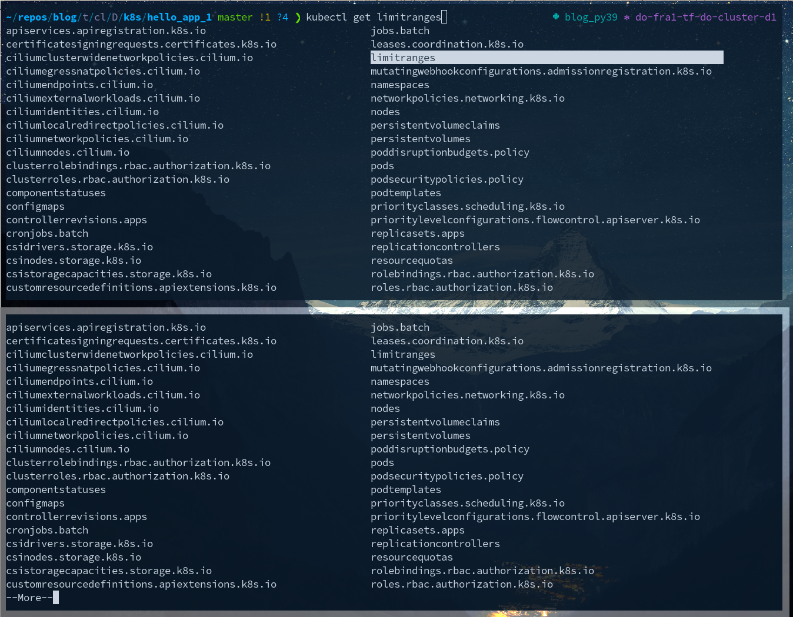

# Kubernetes Notes

Extensive subject. Small collection of notes for basic usage patterns below.

## Using `kubectl`

!!! note "Completion"
    === "About"

        TAB completion is a must to use this tool, there are so many options to certain commands.
        I recommend to use zsh here for it's better completions browsing, compared with bash. fish
        is not supported [out of the box](https://github.com/evanlucas/fish-kubectl-completions) by kubectl.

        See https://kubernetes.io/docs/tasks/tools/install-kubectl-linux/#enable-shell-autocompletion
    
    === "Comparison: zsh vs. bash" 
        
        Comparison of zsh and bash after `kubectl get<TAB><TAB>` (and some arrow navigation in zsh, which is not possible in bash):
        [{style="width:300px"](img/compl.png)

!!! note "`kubectl` actions"


    === "`get`"

        === "`-o json`"
            Ideal to pick values with jq, like `kubectl get -o json ...| jq -r .foo.somelist[0].bar`

        === "`-w` `--watch`"

             While running an apply of a stateful set in one terminal (`kubectl apply -f web.yaml`) in
             another we run get with the follow flag:
 
             ```
             $ k get pods -w -l app=nginx                           
             NAME    READY   STATUS              RESTARTS   AGE
             web-0   0/1     Pending             0          0s
             web-0   0/1     Pending             0          0s
             web-0   0/1     Pending             0          4s
             web-0   0/1     ContainerCreating   0          4s
             web-0   1/1     Running             0          19s
             web-1   0/1     Pending             0          0s
             web-1   0/1     Pending             0          0s
             web-1   0/1     Pending             0          4s
             web-1   0/1     ContainerCreating   0          4s
             web-1   1/1     Running             0          17s
             ```
            
            We can see very nicely that web-1 [waited](https://kubernetes.io/docs/concepts/workloads/pods/pod-lifecycle/#pod-phase) for web-0 to be up.

        === "`get events`"

            ```
            $ k get events 
            LAST SEEN   TYPE      REASON                   OBJECT                            MESSAGE
            59m         Normal    Scheduled                pod/frontend-67bc4f75c8-b5dbd     Successfully assigned default/frontend-67bc4f75c8-b5dbd to app-pool-8h9x7
            58m         Normal    Pulling                  pod/frontend-67bc4f75c8-b5dbd     Pulling image "my.priv.reg/docker/devapps/hello_app_1:0.2"
            59m         Normal    Pulled                   pod/frontend-67bc4f75c8-b5dbd     Successfully pulled image "my.priv.reg/docker/devapps/hello_app_1:0.2"
            in 626.890381ms
            58m         Normal    Created                  pod/frontend-67bc4f75c8-b5dbd     Created container py-hello1
            58m         Normal    Started                  pod/frontend-67bc4f75c8-b5dbd     Started container py-hello1
            58m         Normal    Pulled                   pod/frontend-67bc4f75c8-b5dbd     Successfully pulled image "my.priv.reg/docker/devapps/hello_app_1:0.2"
            in 263.573276ms
            58m         Normal    Killing                  pod/frontend-67bc4f75c8-b5dbd     Stopping container py-hello1
            59m         Normal    Scheduled                pod/frontend-67bc4f75c8-nj9xh     Successfully assigned default/frontend-67bc4f75c8-nj9xh to app-pool-8h9xm
            59m         Warning   FailedMount              pod/frontend-67bc4f75c8-nj9xh     MountVolume.SetUp failed for volume "kube-api-access-pqcnc" : failed to sync configmap cache: timed out waiting for the condition
            58m         Normal    Pulling                  pod/frontend-67bc4f75c8-nj9xh     Pulling image "my.priv.reg/docker/devapps/hello_app_1:0.2"
            59m
            ```


    === "`exec`"

        ```console
        ~/repos/blog/t/cl/D/k8s/hello_app_1 master ?3 ❯ for i in 0 1; do kubectl exec "web-$i" -- sh -c 'uname -a'; done
        Linux web-0 4.19.0-17-amd64 #1 SMP Debian 4.19.194-2 (2021-06-21) x86_64 x86_64 x86_64 GNU/Linux
        Linux web-1 4.19.0-17-amd64 #1 SMP Debian 4.19.194-2 (2021-06-21) x86_64 x86_64 x86_64 GNU/Linux
        ```


## Troubleshooting


!!! hint "Problems"

    === "`ErrImagePull`"

        - Description: At `k get pods` output.
        - Resolution: Check `k describe pod frontend`. In my case it was a an auth problem at the private registry, needed add the registry secret.
          
        ```
          >       imagePullSecrets:
          >       - name: regcred
        ```


    === "StatefulSet `Terminating` - forever."

        - Description: You cannot get rid of pods of a stateful set. Also not via the UI. Also not
          via force:

        ```
        ~/repos/blog/t/cl/D/k8s/hello_app_1 master !1 ?4 ❯ kubectl delete statefulsets web  --force --grace-period=0 --cascade=orphan
        warning: Immediate deletion does not wait for confirmation that the running resource has been terminated. The resource may continue
        to run on the cluster indefinitely.
        statefulset.apps "web" force deleted
        ~/repos/blog/t/cl/D/k8s/hello_app_1 master !1 ?4 ❯ kubectl get pods   
        NAME    READY   STATUS        RESTARTS   AGE
        web-0   0/1     Terminating   0          125m
        ```
        
        Trying to delete the claimed volume hangs:

        ```
        $ kubectl get persistentvolumes
        NAME                                       CAPACITY   ACCESS MODES   RECLAIM POLICY   STATUS        CLAIM                STORAGECLASS       REASON   AGE
        pvc-1f1102ca-fd35-40cc-bcf4-13739c4cd152   1Gi        RWO            Delete           Terminating   default/www-web-1    do-block-storage            134m
        pvc-43f476ce-ffec-49f4-b10c-0e3948ad5f29   1Gi        RWO            Delete           Terminating   default/www-web-0    do-block-storage            134m
        (...)
        $ kubectl delete persistentvolume pvc-1f1102ca-fd35-40cc-bcf4-13739c4cd152
        persistentvolume "pvc-1f1102ca-fd35-40cc-bcf4-13739c4cd152" deleted
        (hangs here)
        ```

        **Even a terraform destroy of the whole k8s cluster did not work anymore!!**

        I had to go the the cloud provider frontend and explicitely destroy all volumes outside of
        the k8s dashboard - only then I could destroy the cluster!

        - Resolution: Unknown at this time. It seems to be related to having deployed via a "double entry descriptor" like:

        ```yaml

        apiVersion: v1
        kind: Service
        metadata:
          name: nginx
          labels:
            app: nginx
        spec:
          ports:
            - port: 80
              name: web1
          clusterIP: None
          selector:
            app: nginx
        ---
        apiVersion: apps/v1
        kind: StatefulSet
        metadata:
          name: web1
        spec:
          serviceName: "nginx"
          replicas: 2
          selector:
            matchLabels:
              app: nginx
          template:
            metadata:
              labels:
                app: nginx
            spec:
              containers:
                - name: nginx
                  image: k8s.gcr.io/nginx-slim:0.8
                  tty: true
                  stdin: true
                  ports:
                    - containerPort: 80
                      name: web1
                  volumeMounts:
                    - name: www
                      mountPath: /usr/share/nginx/html
          volumeClaimTemplates:
            - metadata:
                name: www
              spec:
                accessModes: ["ReadWriteOnce"]
                resources:
                  requests:
                    storage: 1Gi
        ```

        ... and deleted via `kubectl delete -f web.yaml` both at the same time - w/o taking care of
        the volume (claims).

        **Working Procedure**: Deleting one by one - in the right order:

        ```
        kubectl delete service nginx
        kubectl delete statefulsets.apps web1
        ```

        - Then delete the pvc (persistentvolume claim)
        - Then delete the pv (persistend volumes)

        or:

        ```
        kubectl delete pod --all / pod-name
        kubectl delete pvc --all / pvc-name
        kubectl delete pv --all / pv-name
        ```


