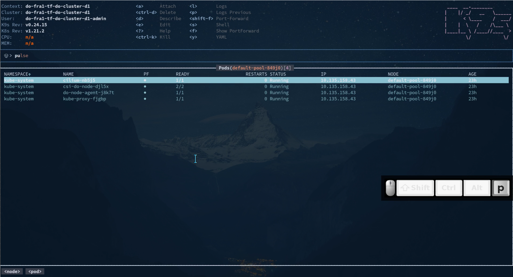

# The [K9s Tool](https://github.com/derailed/k9s)

This is an open source client, alternative to `kubectl`. Especially for beginners absolutely
fantastic, since a real terminal UI.


## Installation

This will pull a static binary into `~/.local/bin/k9s`:

```console
curl -sS https://webinstall.dev/k9s | bash
```

## Configuration

The tool will work right away if you have already `kubectl` being set up, i.e. you have a
`~/.kube/config` file.

Screencast (click on the image):
[](img/k9s1.mp4)

[](img/k9s.gif)

### Shell Access


## Resources

<iframe width="560" height="315" src="https://www.youtube.com/embed/wG8KCwDAhnw?start=100" title="YouTube video player" frameborder="0" allow="accelerometer; autoplay; clipboard-write; encrypted-media; gyroscope; picture-in-picture" allowfullscreen></iframe>

<iframe width="560" height="315" src="https://www.youtube.com/embed/boaW9odvRCc?start=100" title="YouTube video player" frameborder="0" allow="accelerometer; autoplay; clipboard-write; encrypted-media; gyroscope; picture-in-picture" allowfullscreen></iframe>