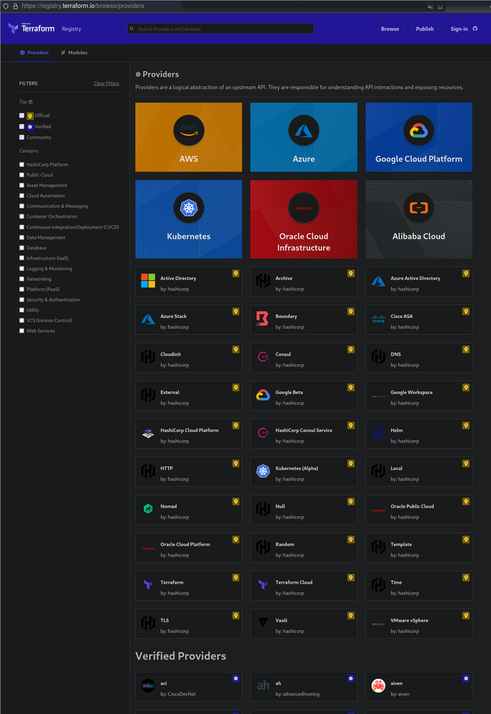

# Terraform (TF)

## Why

Case in point: The Ansible [example inventory][In] for OpenShift(OS) at the time of writing this is well over 1k lines long (but thoroughly documented). If you want to configure this to your desired setting, it would take hours.

To get an installation to be predictable, repeatable and consistent, hand-coding the inventory is the best way to *not* meet all these criteria. On the other hand, if you give a fixed set of inputs to Terraform and install the cluster from the inventory file it generated for you, you get the same result every time you run it, anywhere you run it(Provided you are using the same version of e.g. OpenShift).

Also: TF maximally abstracts away differences of cloud providers, you can easily transfer deploys
from one to the other and it even [supports hybrid deploys][hd].

In 100 seconds:

<iframe width="560" height="315" src="https://www.youtube.com/embed/tomUWcQ0P3k" title="YouTube video player" frameborder="0" allow="accelerometer; autoplay; clipboard-write; encrypted-media; gyroscope; picture-in-picture" allowfullscreen></iframe>

## Abstraction Hierarchy

### Providers

!!! quote 

    Providers are a logical abstraction of an upstream API. They are responsible for understanding API interactions and exposing resources. 

[{: style="max-height:30%" }](https://registry.terraform.io/browse/providers)


### Resources

Having configured a provider, you can then use their API via the resources abstraction.
Resources are e.g. droplets on DO or even [complete kubernetes clusters](./k8s/k8s_on_do.md) -
it only depends on the API possibilities of the provider.

Configuration is 100% declarative and in many cases enough to induce a real world change of
infrastructure by terraform, which can then be utilized by other tools like ansible or k8s
directly.

### Provisioners
    
E.g. `remote_exec` on a droplet. Basically [doing sth]() with the resources, within TF. Could be
to [run an ansible playbook](./ansible.md).


### Variables
    
Feeding concrete values into the above abstractions. Most variables do not need to be provided by
the user but are delivered by the resources or Provisioners, at apply time. 

The real power of vars is the dependency mgmt.: A var like `var.droplet.ip` will only have a value
after droplet creation -> From this terraform can build a dependency graph and deploy accordingly,
in parallel when possible but in the order required to have all values at hand, when needed (e.g. a
DB router only after the DB nodes are up and the ips are known).

## Modules

Compare with Ansible Playbooks. Those are 3rd party collections of useful arrangements of the above
abstractions, usable within your project.


## State

Main difference to ansible: https://www.terraform.io/docs/language/state/index.html

!!! quote "Designed for Very Large Deploys"

    For small infrastructures, Terraform can query your providers and sync the latest attributes
    from all your resources. This is the default behavior of Terraform: for every plan and apply,
    Terraform will sync all resources in your state.

    **For larger infrastructures, querying every resource is too slow**. Many cloud providers do not
    provide APIs to query multiple resources at once, and the round trip time for each resource is
    hundreds of milliseconds. On top of this, cloud providers almost always have API rate limiting
    so Terraform can only request a certain number of resources in a period of time. Larger users of
    Terraform make heavy use of the -refresh=false flag as well as the -target flag in order to work
    around this. In these scenarios, the cached state is treated as the record of truth.


## Variables

Powerful. Declarative built in, w/o the implementation hidden in project playbooks. See e.g. [count][count].

- Declare in Config files, with attributes like
    - default
    - type
    - sensitivity (!) (for log output)

- Use in env (`$TF_VAR_myvar`)
- Or cli: `tf apply -var myvar=...`
- Or interactively: When defined, not found and no default given it will ask you on the prompt.

Then refer to vars throughout the cluster config.

The real power of vars is the dependency mgmt.: A var like `var.droplet.ip` will only have a value
after droplet creation -> From this terraform can build a dependency graph and deploy accordingly

This is built in and does not have to be scripted like in Ansible

### Deep Introspection

Errors are caught at tf plan time:

```
    provisioner "local-exec" {
      command = "ansible-playbook -i '${digitalocean_droplet.www-example.ipv4_address}' playbook.yml"
    }


Resulting in:

~/repos/blog/t/cl/D/ansible main ⇡2 !6 ?2 ❯ tf plan                                         blog_py39
╷
│ Error: Reference to undeclared resource
│
│   on worker.tf line 20, in resource "digitalocean_droplet" "worker":
│   20:       command = "ansible-playbook -i '${digitalocean_droplet.www-example.ipv4_address}' playbook.yml"
│
│ A managed resource "digitalocean_droplet" "www-example" has not been declared in the root module.
╵
```


## Templating

[HCL](https://github.com/hashicorp/hcl).  
Clear [Win](https://github.com/hashicorp/terraform/issues/16628#issuecomment-510263706)  for Ansible (Jinja Powers).

But note:

- templatefile
- [This](https://github.com/hashicorp/terraform/issues/16628#issuecomment-510263706): 

    ```
    user_data <<-EOT
        %{ for ip in aws_instance.example.*.private_ip ~}
        server ${ip}
        %{ endfor ~}
      EOT
    ```

In the next chapters we try it out, hands on.

[In]: https://github.com/openshift/openshift-ansible/blob/release-3.11/inventory/hosts.example
[hd]: https://blog.codecentric.de/en/2018/08/terraform-multi-provider-deployment-including-a-custom-provider/
[count]: https://blog.ktz.me/terraform-0-13-count-modules/
