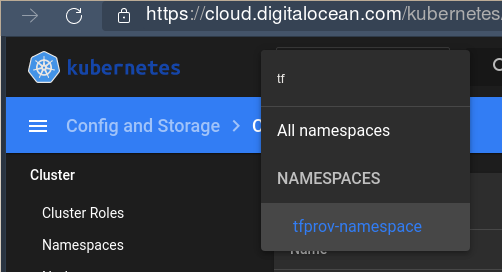

# The Terraform(TF) Kubernetes Provider

This is the terraform tool to connect to a running kubernetes cluster.


## Requirements

- The kubernetes cluster we [created](../k8s_on_do.md) on DO.
- The completed [generic k8s tutorial](../../../k8s/2_hello_mysql/index.md), with the container
  image for the app on our private registry.

<!-- id: f817b99f0c09753f77bd717193f0623d -->
```bash
$ kubectl get nodes      
NAME                 STATUS   ROLES    AGE   VERSION                                                   
app-pool-849ri       Ready    <none>   19h   v1.21.2                                                   
app-pool-849rv       Ready    <none>   19h   v1.21.2                                                   
default-pool-849j0   Ready    <none>   19h   v1.21.2                                                   
default-pool-849j1   Ready    <none>   19h   v1.21.2
```
<!-- id: f817b99f0c09753f77bd717193f0623d -->

- The cloud provider specific client tool (here doctl, which tf uses under the hood)


<!-- id: 869182556a04ecbbe33d0ea44532fbc5 -->

=== "Cmd"
    
    ```console
    $ D="$DT_PROJECT_ROOT/tmp/clusters/DO/k8s_provider"
    $ mkdir -p "$D"
    $ cd "$D" || exit 1
    $ ls -la | xargs rm -rf
    $ cat << EOF > environ
    set -ae
    namespace=devapps
    app=hello_app
    ver=0.2
    alias tf=terraform k=kubectl
    [[ "\$0" = *bash* ]] && s=bash || s=zsh
    source <(kubectl completion \$s)
    set +ae
    EOF
    $ source environ
    ```

=== "Output"

    
    <xterm />
    
        $ D="$DT_PROJECT_ROOT/tmp/clusters/DO/k8s_provider"
        $ mkdir -p "$D"
        $ cd "$D" || exit 1
        $ ls -la | xargs rm -rf                                   
        rm: invalid option -- 'w'                 
        Try 'rm --help' for more information.
        $ cat << EOF > environ                    
        > set -ae            
        > namespace=devapps  
        > app=hello_app      
        > ver=0.2            
        > alias tf=terraform k=kubectl            
        > [[ "\$0" = *bash* ]] && s=bash || s=zsh 
        > source <(kubectl completion \$s)        
        > set +ae            
        > EOF                
        $ 
        $ source environ
    
    


<!-- id: 869182556a04ecbbe33d0ea44532fbc5 -->

## Configuration

When we [did set up](../k8s_on_do.md) the kubernetes cluster on DigitalOcean(DO), we pulled the K8s
config, incl. certificates, into our local `~/.kube/config` (using the cloud infra specific tool
`doctl`: `doctl kubernetes cluster kubeconfig save "$clustername"`).

That file is being used by the TF K8s provider.

!!! note
    There are [other][tfdoc] means to connect as well. [Here](./do_k8s.md) we show how to configure
    the kubernetes provider with only the cloud provider's API token and *no* kubectl config file.


## Create Namespace

Here a basic first use case: Lets create a namespace on K8s, using TF:

<!-- id: d7e5d184d93122e8d25a884331a36562 -->
```json
$ cat namespace.tf

provider "kubernetes" {
  config_path    = "~/.kube/config"
}

resource "kubernetes_namespace" "tfprov" {
  metadata {
    name = "tfprov-namespace"
  }
}

```
<!-- id: d7e5d184d93122e8d25a884331a36562 -->

<!-- id: 01afa0718be7d20764feea7052fb3219 -->

=== "Cmd"
    
    ```console
    $ terraform init
    $ terraform apply -auto-approve # lp: asserts="Apply complete"
    ```

=== "Output"

    
    <xterm />
    
        $ terraform init         
        
        Initializing the backend...                        
        
        Initializing provider plugins...                   
        - Reusing previous version of hashicorp/kubernetes from the dependency lock file                       
        - Using previously-installed hashicorp/kubernetes v2.4.1                                               
        
        Terraform has been successfully initialized!       
        
        You may now begin working with Terraform. Try running "terraform plan" to see                          
        any changes that are required for your infrastructure. All Terraform commands                          
        should now work.         
        
        If you ever set or change modules or backend configuration for Terraform,                              
        rerun this command to reinitialize your working directory. If you forget, other                        
        commands will detect it and remind you to do so if necessary.
        $ terraform apply -auto-approve                                              
        
        Terraform used the selected providers to generate the following execution plan. Resource actions are   
        indicated with the following symbols:              
          + create               
        
        Terraform will perform the following actions:      
        
          # kubernetes_namespace.tfprov will be created    
          + resource "kubernetes_namespace" "tfprov" {     
              + id = (known after apply)                   
        
              + metadata {       
                  + generation       = (known after apply) 
                  + name             = "tfprov-namespace"  
                  + resource_version = (known after apply) 
                  + uid              = (known after apply) 
                }                
            }                    
        
        Plan: 1 to add, 0 to change, 0 to destroy.         
        kubernetes_namespace.tfprov: Creating...           
        kubernetes_namespace.tfprov: Creation complete after 0s [id=tfprov-namespace]                          
        
        Apply complete! Resources: 1 added, 0 changed, 0 destroyed.
    
    


<!-- id: 01afa0718be7d20764feea7052fb3219 -->

Resulting in a new namespace on K8s:

[](./img/ns.png)


## Deploy Stateful Application

In a previous [generic k8s tutorial](../../../k8s/2_hello_mysql/index.md), we did create a stateful
app backed by mysql, using only `kubectl` and necessary yaml files.


Lets do this now, using Terraform.


[tfdoc]: https://registry.terraform.io/providers/hashicorp/kubernetes/latest/docs