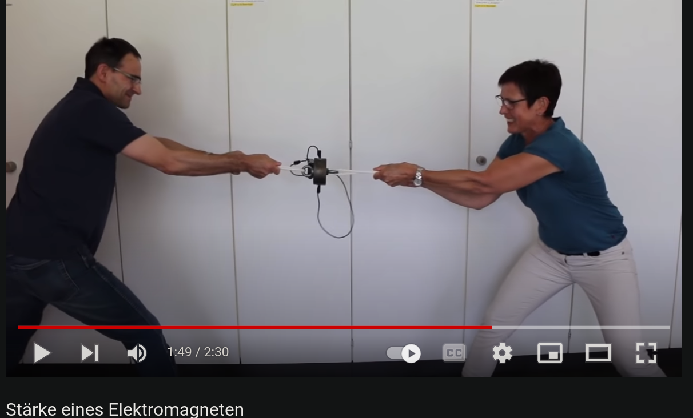

# Electromagent

(Control the Magnetic Field Directly)

Actually also a variant of: Actively setting the gear.

Reminder: `F=v B*B b*b / R`

Make the magnet

- stationary, so that area b is constant, i.e. F linearly proportional to (controlled) B^2, nothing else.
- control B, Field Strength

We can achieve this via an **electro magnet** - which creates a magnetic field through the
electrical current flowing through the coil.

No moving part - that is interesting.

Clear downside is the **constant electrical current** we have to have flowing through the coil. 

Looking at this it's plausible that the total amount we need to spend to keep it up may be low
though:

That's a 9v battery - not sure how long it lastet though - also not sure if the spinning wheel
feedbacks into the performance of the magnet.

## Plausibility - Strength

In the supermarket they sold these permanent magnets today: 

Neodym, i.e. brutally strong, that's 2.5Kg, i.e. 25Newton:

But holding it close to the wheel: Nearly no effect... a bit harder - but not much.

=> We need at least 10 times that strength for an e-magnet.

Looking at a 80kg magnet: 40Euro, 24V, 0.4A but:

??? "Checking back at the store: "

    >Unsere Elektromagnete sind der verlässliche Partner wenn es darum geht präzise Haftkräfte auf den
    >Punkt zu bringen. Unsere elektronischen Magnete sind nur nach dem Anlegen von elektrischer Spannung
    >magnetisch, danach wirkt ein sicherer Restmagnetismus von ca. 5%. Nimmt man dem Magnet also die
    >Spannung, verliert dieser umgehend wieder seinen Magnetismus. Diese schaltbaren Magnete eignen sich
    >daher speziell für den Maschinenund Vorrichtungsbau, sowie für Transport- und Handlingssysteme.
    >Features: Hohe Lebensdauer durch vergossene Spule **max. 120 Sekunden Einschaltdauer** Geringe
    >Leistungsaufnahme Anschlussspannung 24V Gleichspannung Unbeachtlicher Restmagnetismus (<5%)
    >Kabellänge beträgt standarmäßig 18cm, kann aber auch individuell für Sie produziert werden!

"Max 120 sec. power on period" -> No Go. :-(

What's this: 

https://www.maqna.de/elektromagnete/bei-strom-abschaltbar

**Same:  Max. 120 Sec Turn On Time**

I guess to get to that high field strengths, they must have an immense amount of loops in the coils,
i.e. very small wire, for the form factor. Which has a lot of resistance, i.e. heats up...

I think electromagnet is dead for now.

More realistic is another mechanical, distance controlled (this time by the computer) permanent
magnet on the other side of the wheel.

Or a generator...

