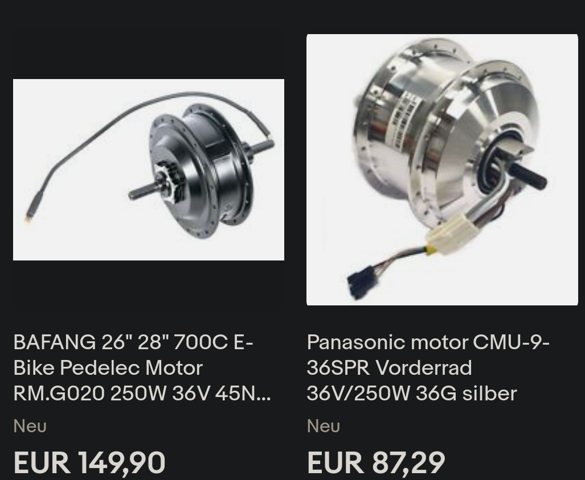

# Generating Power

It's not a totally off Idea, there are devices on the market:

First attempts with my neodym magnets and some coils were a bit ... demotivating.

But in YT University I found this guy:

https://genesgreenmachine.com/

The idea is: Buy a motor - but use it as a generator.

Components: See video above, trivial: 

Here a guy which also does it, using a bike motor: https://www.youtube.com/watch?v=7hfClQh3rxM

## which motor

Everything here: https://genesgreenmachine.com/best-design-diy-bike-trainer-pedal-generator/

     
Other design:

## Material

Possibly needed: Shaft Coupler: https://www.amazon.de/dp/B06X9RS6D6?linkCode=gs2&tag=gensgremac05-21&th=1

Motor: From an old electric drill:

Close match:

https://www.amazon.com/RS-550s-18v-Electronic-Controlled-Replacement/dp/B00TE42PME

Spec: https://m.media-amazon.com/images/I/81-5JDOeJ8L.pdf

233.725 Watts. No Idea how long, until it burns through though.

Such drills can generate a lot of torque, might be comparable to what I can
do with my legs. So, maybe it would survive, ampere wise, when I load it with my legs => Lets try it.

### Position One

Motor axis (7mm dia), directly coupled to first wheel of the drive:

At this point I get 4Volts at normal pedal speed:

Means: I'm not (yet) Robert, so I guess 100Watts is realistic => 25 Ampere... => That will kill the motor. 

Ups, actually, maybe not, see spec again, >40 amps at "stall"

### Position Two

The fly wheel is translated to around the double the speed of wheel 1, i.e. I'll get higher rpm
here - but I need a drive belt, can not directly couple 

Trying this point, using black tape as a belt:

Result: 8Volt (until the improvised "belt" ripped apart)

But that is still 12 Amps. at 100W input.

Again Spec:

Motor stall – In electric motor understanding for both AC or DC, we will meet
torque, where torque is the ability of the motor to maintain its inertia force. Stalling is when the
motor stops rotating because the load torque is greater than motor torque or breakdown torque
characteristics. In a simple explanation, motor stall means the electric motor is overloaded and the
motor can’t produce more torque to keep rotating.

Bigger problem yet: The drive belt, required at position 2.

Checked the market and I did not find thin enough belts for being able to keep the manually shifted
permanent magnet where it is mounted out of the box - at its axis some 3mm away from the flywheel:

