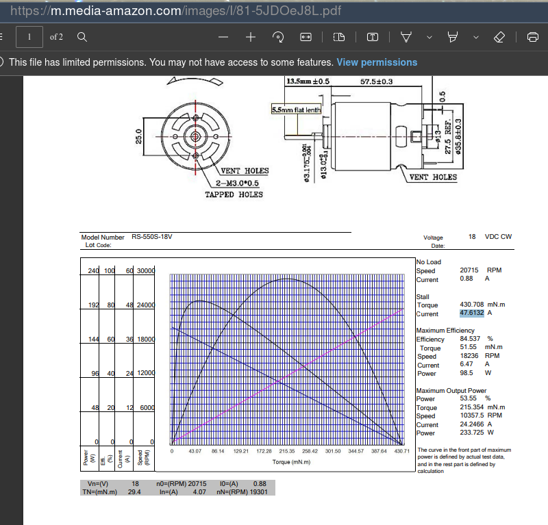

# Generating Power

It's not a totally off Idea, there are devices on the market:

First attempts with my neodym magnets and some coils were a bit ... demotivating.

But in YT University I found these:

## YT Builds

The idea is simple: Buy a **motor** - but use it as a generator. All of the YT builds I found are
doing this.

### Gene's Greenmachine

https://genesgreenmachine.com/

Components: See video above, trivial:

Everything here: https://genesgreenmachine.com/best-design-diy-bike-trainer-pedal-generator/

     

### Hyprid E-Cycle

Here a real freak, which also does it, using a bike motor: https://www.youtube.com/watch?v=7hfClQh3rxM

The actual motor for the ebike he built himeself...

### Scooter Motor Build

[Parts...](https://sites.google.com/site/debbinkbicyclegenerator/)

### 500 Watts Build

## Our Own Build

Possibly needed: Shaft Coupler: https://www.amazon.de/dp/B06X9RS6D6?linkCode=gs2&tag=gensgremac05-21&th=1

Motor: The only one available in the household was from an old electric drill:

Close match:

https://www.amazon.com/RS-550s-18v-Electronic-Controlled-Replacement/dp/B00TE42PME

Spec: https://m.media-amazon.com/images/I/81-5JDOeJ8L.pdf

233.725 Watts. No Idea how long, until it burns through though.

Such drills can generate a lot of torque, might be comparable to what I can
do with my legs. So, maybe it would survive, ampere wise, when I load it with my legs => Lets try it.

## Positioning / Coupling

That's not obvious. I tried a few alternatives:

### Position One: Wheel 1, Direct

Motor axis (7mm dia), directly coupled to first wheel of the drive:

At this point I get 4Volts at normal pedal speed:

Means: I'm not (yet) Robert, so I guess 100Watts is realistic => 25 Ampere... => That will kill the motor. 

Ups, actually, maybe not, see spec again, >40 amps at "stall"

### Position Two: Belt

The fly wheel is translated to around the double the speed of wheel 1, i.e. I'll get higher rpm
here - but I need a drive belt, can not directly couple 

Trying this point, using black tape as a belt:

Result: 8Volt (until the improvised "belt" ripped apart)

But that is still 12 Amps. at 100W input.

Again Spec:

Motor stall – In electric motor understanding for both AC or DC, we will meet
torque, where torque is the ability of the motor to maintain its inertia force. Stalling is when the
motor stops rotating because the load torque is greater than motor torque or breakdown torque
characteristics. In a simple explanation, motor stall means the electric motor is overloaded and the
motor can’t produce more torque to keep rotating.

Bigger problem yet: The drive belt, required at position 2.

Checked the market and I did not find thin enough belts for being able to keep the manually shifted
permanent magnet where it is mounted out of the box - at its axis some 3mm away from the flywheel:

### Position 3: Direct Coupling With Fly Wheel

For this one I built a prototype, in order to finally generate some real power with my
feet...

You can, at this position, not directly couple the 8mm motor axis with the flywheel because of the
radius of the motor housing colliding with the first gear wheel. I.e. you loose a lot of RPMs by
increasing the motor axis diameter.

Was relatively simple to build - only challenging thing was to drill an exact 8mm hole through the
plastic furniture roller wheel, so that it is well balanced (thanks Alex ;-) 

Material is from [here](https://www.hagebau.de/search/?q=moebelrolle&sc=&ms=1).

The white soft rubber coating coupling with the flywheel is from kitchen equipment, some sealing. I
had to connect it with the black wheel, using double-sided duct tape, so that it remains on the
wheel.

#### Findings

Good: 

- Runs supermooth. I do not feel it with my feet, while pedalling, no
  shaking or stuttering whatsoever.

- Is mechanically stable. I write this after pedalling for an hour, with high cadence. It's not degrading.
  BUT(!) there is not yet any resistor attached, I'm just turning the motor, w/o load and check the
  volts.

So so:

- Not sure if the coupler can transmitt the torque at 100 Watts..

Bad:

- RPM:

  The wheel is increasing the diameter of the axis from 8mm to 4.5 cm. Means: I loose over 5 times
  the RPMs (i.e. Voltage). When I pedal es fast as I can I get barely over 4.5 Volts. Normal cadence:
  2-3V. I won't be able to power anything w/o ruining the motor, with too high current, at say,
  100Watts.

  "Will have to check if there are motors which have their best perf at around those RPM."

  Edit: Stupid me - Think about it: How can more Volts at same RPM be done? Yes - geometry. Bigger motor...

  Wich means: Yet more distance from the flywheel....

  And the other solution, more current tolerability through fatter wires inside: Again bigger motor,
  at same amount of loops.

  Seems a principal problem at this position 3. 
  

- It's loud. Awfully loud. No comparison to the zero volume pedalling against the magnet brake.

Here is a recording:

 

The needle is at 3.8v - hard to see (why ditch a fully working multimeter, just because of digital ones better in, well, ... anything?)

Motor is only having contact with rubber:

 

-> Not much to optimize here.

 
Have to think about that.... Can I reduce that noise??

Here links to the other builds right while pedalling - they all are pretty loud:

- [gene's build](https://youtu.be/LpXRTXK_FFQ?t=576) (closest to mine, also noise wise)
- [scooter build](https://youtu.be/TX71O449AQ0?t=114) uh oh..
- [500 watts build](https://youtu.be/y_icu6yaAxM?t=154)
- [battery charger build](https://youtu.be/tQBWECQCFcQ?t=856)
- [gene different build](https://youtu.be/x1hMVqg8VZY?t=736) - the most silent so far
- [retired](https://www.youtube.com/watch?v=pFREftLkJwE) - also not that loud

I keep cycling a few days and see.

## Electronics: Which Motor is the Best Generator

YT finally realized what I'm interested in, getting good suggestions - instead of free energy
crap...

Great Scott has it all:

https://www.youtube.com/watch?v=cJ_vDA7xsGs

So there are geared motors, for my position3 problem above:

 - but lousy efficiency!

- DC Motors are the worst option (brushes => wearoff)

- Simple no worries: Stepper motor

- Complicated but professional: BLDC Motor with a gear box

