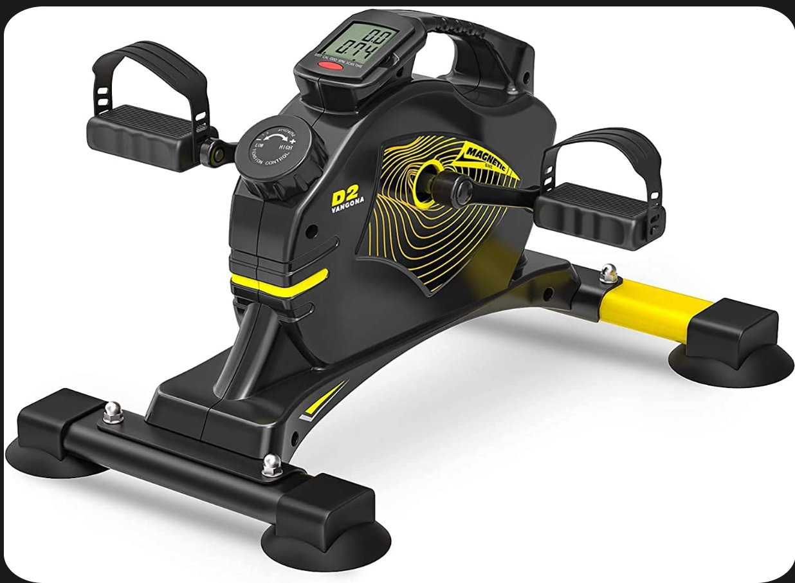
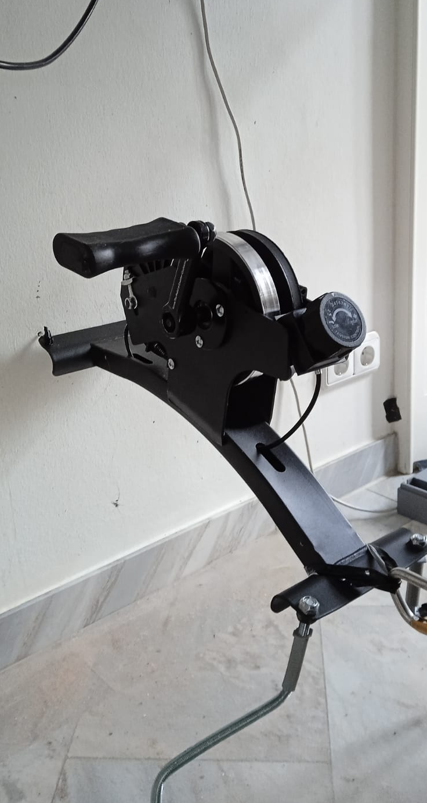
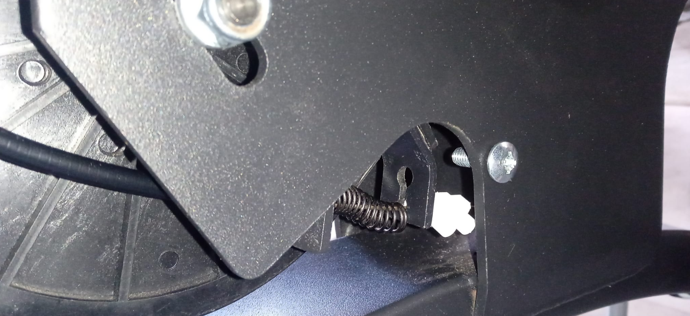
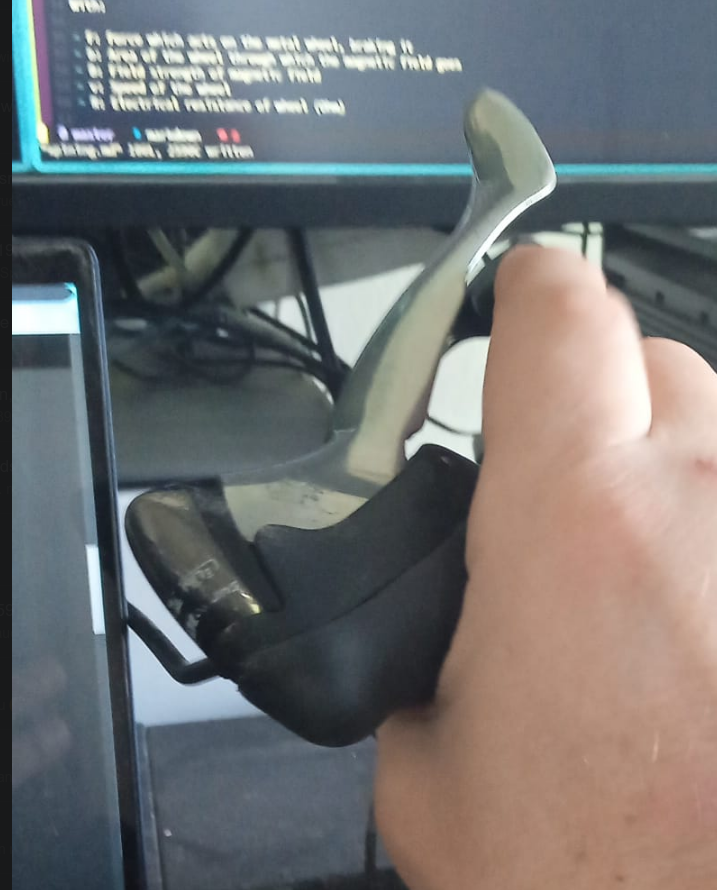
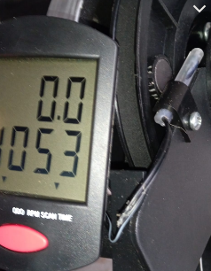
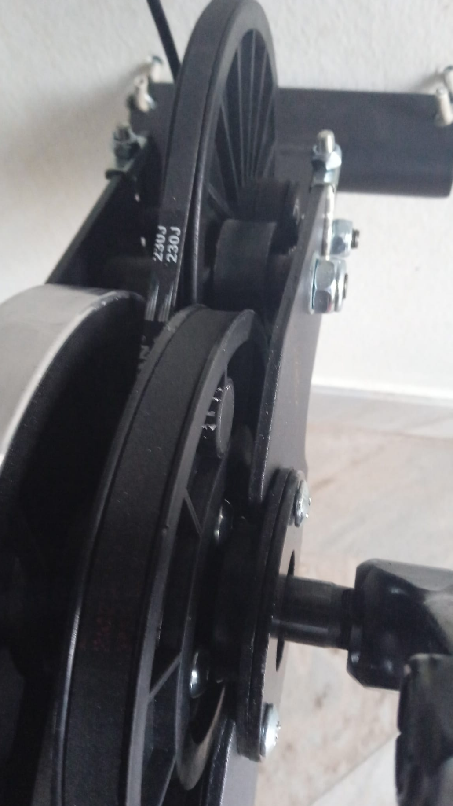
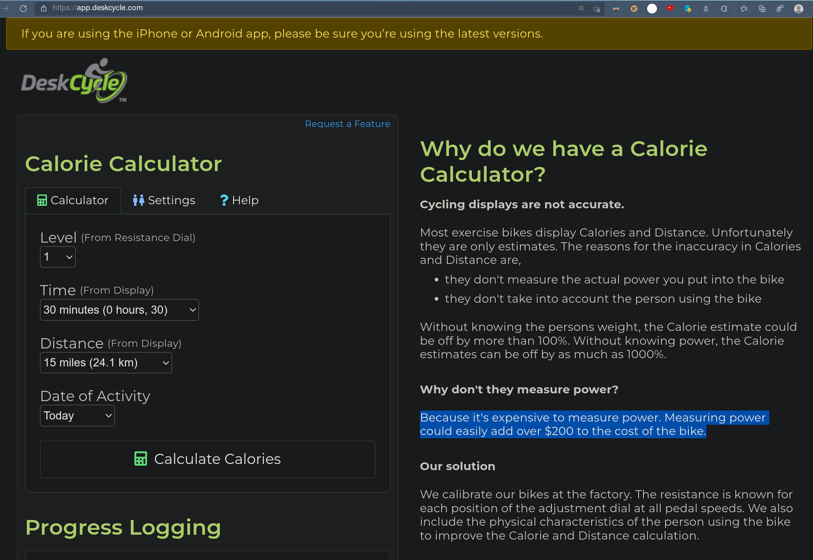
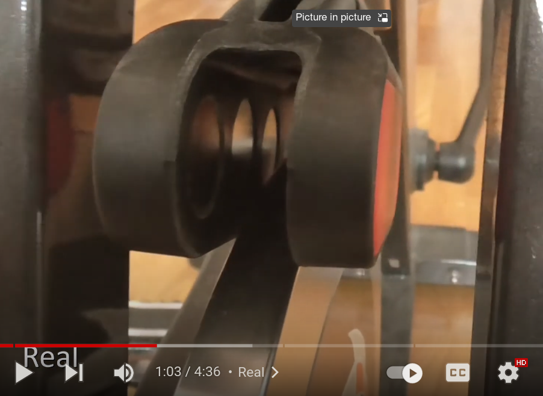
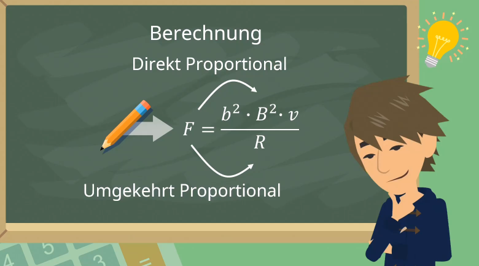

# Zwiftifying My DeskCycle


## The Device

My best buy in this century:

[](https://www.amazon.de/dp/B089397KJ1/ref=sspa_dk_detail_4)


Bought it since my knee begins to hurt when I don't move it, sitting in front of the monitor all day long - and was willing to pay the price to fix that,
i.e. for sure less focus for work when I cycle...

But then I got it and I realized:


**That thing does not at all pull focus - but to the contrary.**

Heart rate slightly up, body not in this mode of total lethargy, with only the brain working, sooner or later backfiring...

!!! hint "Deskcycles in School"

    My sister, who is a teacher, told me that the positive effect on brain activity is well
    understood and that they introduced them within their school: In the last row already 5 of
    these, where each pupil may go anytime, during lessons(!) and start cycling away tensions or
    tiredness.


## First Mechanical Mods

### Appearance, Height 

Ripping off the plastic insult around it, plus adjusting the height (like to have me legs
more horizontal when cycling - not so much need for click pedals then, with the inactive foot's
weight not on the pedal):





### Desktop Shifting, While Cycling

Next step was to reposition the shifter, which is unreachable from the desk down there and wire it up to
the desk - attaching an old Shimano Ultegra Shifter:




Material:

- Old shifting unit for the rear derailleur (any amount of gears is fine)
- Long gear or break cable 
- Luster terminal (from normal household inventory) to hold the cable - the white thing in the
  picture (you need to have open end to get the cable through a normal bicycle shifter - the
  original cable did have 2 closed ends, not feasible here)

!!! important "Shifting Gears - Basic Principle"

    **The cable, when shortened by the shifter, pulls the magnet in the picture back from the big rotating
    metal wheel, reducing the power required to turn it.**

The spring is actually not necessary, since the magnet is attracted by the wheel. 


Ok, can shift like a pro now, from the desk, w/o interrupting cycling. Nais! :sunglasses:




## The Problem

**I want to know what I achieved!**

With History and stats.

Nice to have - comparison with colleagues?

Zwift, basically...


## Zwift

Do *they* offer desk cycle support?

No:

- https://support.zwift.com/en_us/categories/what-you-need-to-ride-BJjM4TyeH
- https://support.zwift.com/en_us/indoor-bikes-rkRxp7Zgr


Their default: Mount *normal bikes* on a stand, either 'direct drive' style, where the rear wheel is
removed and the chain attached to a measurement unit - or a roll trainer, which measures trivially
the speed of the wheel.

https://www.saris.com/post/blog-smart-trainer-calibration-hot-and-cold

??? "Indoor cycles, e.g. Schwinn"

     https://www.indoorcycling.org/schwinn-mpower-echelon-ii-konsole-mit-watt-sensor.html

    "Comment: Guessing Watts by distance of magnet..."
    
     > Ob drahtlos oder verkabelt, wäre an dieser Stelle m.E. egal, denn die Konsole wird ja an/mit
     einem stationären Gerät betrieben. Dennoch finde das Echelon II maximal mittelmässig. Die
     Nachvollziehbarkeit der Watt-Anzeige ist nicht gegeben. **Hier wird anhand der Einstellung der
     Magnetbremse die Leistung eher geschätzt als real gemessen**. Die Watt-Leistung kann nicht an das
     Körpergewicht angepasst werden, somit ist die berechnete Geschwindigkeit i.d.R. deutlich zu
     hoch. Vermutlich wird die Geschwindigkeit in der Ebene berechnet und die eingestellte
     Bremswirkung bezieht sich ehe auf den Gang als auf die Steigung der Strecke. Die Daten können
     ausschließlich als csv-Daten auf einen USB-Stick gespeichert werden. Um diese Daten z.B. nach
     Strava zu übernehmen, müssen diese in tcx umgewandelt werden. Die Konsole ist besser als
     Nichts, aber für den Preis erheblich zu teuer. **Einer einseitigen Watt-Mess-Kurbel, gekoppelt an
     eine andere Konsole, würde ich deutlich datentechnisch mehr vertrauen**. Zudem schade, dass
     Echelon keine Bluetooth Schnittstelle besitzt. Ich denke, dies ist ein Auslaufprodukt, für dass
     es keinen - besseren - Nachfolger geben wird.
    

## The Vision: Ideal Solution

- We want to keep manual shifting. Can't see the benefit of shifting (only) through an app, when I can just
  grab the shifter and click.
  
- Computer knows cadence (RPM) AND current resistance - i.e. can calculate power.

- Computer can *ALSO* control resistance - but automatically.

Use case:

- Imagine watching a scenic ride YT vid on mpv, where you can control the playback speed.
- Now get the gradient data from some cycle routes database, add that to the vid - and the
  computer could increase the resistance when going uphill automatically - plus adapt the
  playback speed according to the cadence AND the current gear


Means, we need to, via Software:

- A) Know the manually selected gear
- B) Control the resistance, *additionally* to the selected gear

Calculated speed would then depend on cadence and gear but on total power, which has to overcome the
computer generated resistance as well...


## Out of the Box Sensor: RPM only

They deliver a normal magnetic tacho, to measure RPMs, i.e. cadence - and only that:



Apart from the problem that it cannot keep history: The problem is that those RPMs have not much to
do with the *power* needed, to produce them.

That power depends on the "gear" I select via the selection wheel. Which changes the distance of a magnet to
the rotating wheel. There is no mechanical Translation of RPMs into higher speeds of any wheel
inside:



Even the market leader can NOT do it better, also sensing only RPMs - so you would have to go to
their website(!) after each session,  or use their app, entering the selection wheel position, to
finally get to your power spent and calories burned:




Reminder: We are in 2022....

> Because it's expensive to measure power. Measuring power could easily add over $200 to the cost of
> the bike.

Yes, power sensors cost well over 200 (see below), if not over 1000 if you want 2 pedals.

But those are made for **real cycles**, i.e. with **tons of constraints**, which do not hold for desk
cycles:

- ultralight
- ultra low battery
- cannot simply use gear info plus rpm (uphill, downhill out there)
- wireless, apps, and and and...

> So no - it cannot be that measuring power without those restrictions must be that expensive!

Ok - how to do it.

A first attempt with our *voltmeter*, simply measuring the volts on the wheel[^1] against the magnet
did show that the voltage is simply proportional to the RPMs - but not the *power* I need to get to
those RPMS. 


We have to dig a bit deeper.

## Eddy Current Brake

German: wirbelstrombremse

[](https://youtu.be/-C8JaVssobs?t=63)


https://studyflix.de/elektrotechnik/wirbelstrombremse-1644




```math
    b^2 * B^2 * v
F = -------------
         R
```
    

With:

- F: Force which acts on the metal wheel, braking it
- b: Area of the wheel through which the magnetic field goes
- B: Field strength of magnetic field
- v: Speed of the wheel
- R: Electrical resistance of wheel (Ohm)

Facts:

- R is constant.
- v we know from the RPM sensor

B and prbly also b depend on the distance of the magnet, i.e. the current gear.


We see three possibilities:


A) Buy a [power meter](https://support.zwift.com/en_us/power-meters-Bk7hoXWlS )

B) Know current gear selected - and find the transformation to B and b through measurements

C) Keep b constant by NOT changing B mechanically - but use an electro magnet.

D) **Generate** the Watts not into heat but into (measurable) electricity


We discuss separately...


[^1]: "wheel" we denote the heavy metal wheel where the braking force is acting upon, through
  the magnet.


