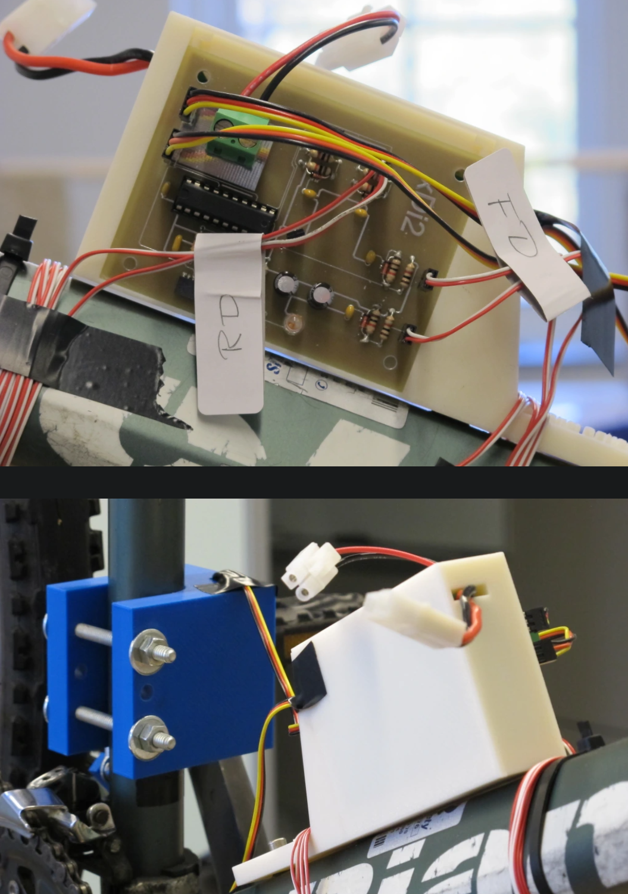

# Know the Gear Position

## Know by passively measuring it"

2 Euro [sensor](https://cdn-reichelt.de/documents/datenblatt/A300/SE054.pdf) for arduino, measuing
the strength of the magnetic field, i.e. derive "gear" from it?
  
No. Can only measure on or off.

Even *if* we can measure the different steps, e.g. by measuring the extension of a simple mechanical
spring: We can then never automatically *change* it (which would be cool to later build little
apps for recycling scenic routes with hills and stuff)
    

## Know because we actively set it

(mechanically through a motor)

Someone basically [rebuilt](https://xde90.wordpress.com/) Shimano's DI2 electronic shifter:

!!! note "Self Made DI2"

    

We would have to find the best electrical motor for the job (tons of options) and build a "simple" control circuit.

There should be arduino layouts for such a thing. 

