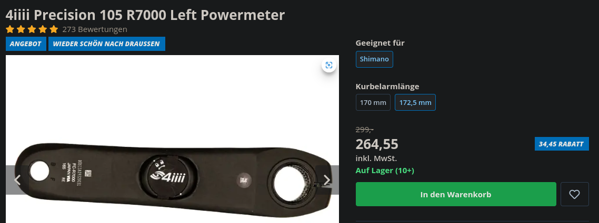

# Power Meters

## Problem 1: Those guys are freaking expensive. 4iiii seems to be the cheapest with 250$ upwards....

These are so expensive because of the constraints they have for real cycles:

- ultralight
- wireless
- energy efficient (battery)
- mobile apps on head units, e.g. garmin

All these are of no concern on a desccycle and so I have a problem spending the money.

Also: They typically come as replacement cranks - but the deskcycle cranks are shorter.

Also: On a deskcyle there are not hills, there is no headwind. Only factor between cadence and power
is the current gear.

But clear: Should this all turn out into a success, i.e. we can measure sth. meaningful, we'll
prbly. organize such a thing, in order to calibrate and compare.

## Problem 2: We can never *change* the resistance through them.
