# UnblockMe or: Depth First vs. Breadth First

[2021-12-14 11:01] 

During a longer period of illness, which bound me to my bed for a few weeks, gaming on the mobile
phone became the preferred time killer. Besides chess (which required a bit too much energy, given
my state), I became a big fan of this game:  

[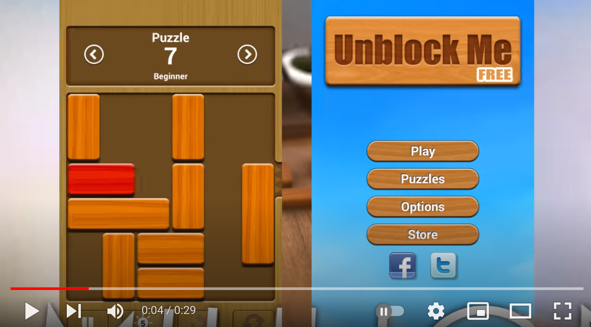][yt]

It can get surprisingly hard in export mode and you may well spend a day in finding a solution for
single puzzle (e.g.: try 605) - you often can't imagine how it could even be possible. Also having
solved one, will in no way guarantee you could do it again...

Variations are e.g. this game: 

[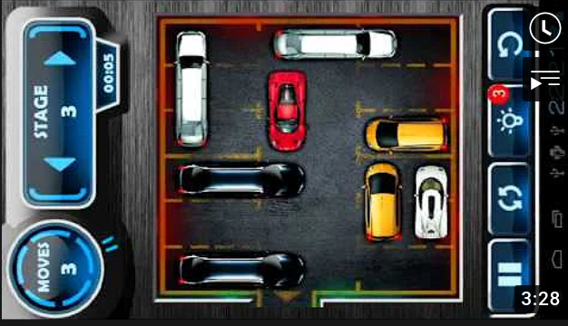][yt2]


When I somewhat recovered physically, I was looking into solver algorithms for the game.


## Source Code

Here all the programs we discuss below:

- UnblockMe, DFS is [here][umdfs]
- UnblockMe, BFS, single cell moves is [here][umbfs1]
- UnblockMe, BFS, multi cell moves is [here][umbfs2]
- Klotski DFS is [here][klotski_dfs]
- Klotski BFS is [here][klotski]


All the files can be run standalone (make them executable) and require no libs. They have to be edited in their config section, in order to configure new initial board states.

Example: 

```bash
# save the file locally, then run:
~/repos/blog/docs/ll/fun/unblockme❯ ./unblockme.py
Start State:

23444
23 56
21156
778 6
  899
 aabb

next move:  1
breadth is:  1
next move:  2
breadth is:  5
next move:  3
breadth is:  14
(...)

Solved in 32 moves (producing 3288 States). Took 4.68sec.
```

## Initial Read

Check [this][dfsbfs] for the principal difference between a dept first (DFS) and breadth first (BFS)
approach, when solving such kinds of problems.

[dfsbfs]: https://www.techiedelight.com/depth-first-search-dfs-vs-breadth-first-search-bfs

## Depth First (DFS) Approach

Not knowing how intense it will be on resources I tried first a depth first algo, since it is a low memory approach:

1. Looking at a certain board state, pick the *first possible* move, which results in a new board
   state
1. Play it, i.e. move the piece
1. Go to 1

Backtracking:

When there are NO possible moves which result in a new board state, undo the move, which led to
position at 1.

Solution:

Every NEW board state we check if it is the solution, i.e. if there is nothing between the red piece
and the exit.

Example:

Say the solution is to do the 3rd possible, then the second possible move we might end at having
tried these:

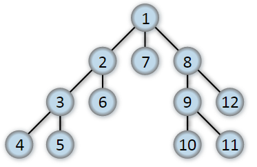

Nr 12 would be the solution in the example, where we stop, having backtracked 2 times back to the
initial config.

What do we need for such an approach:

### Ingredients

#### Config

We need a way to tell the computer the initial state. Straightforwardly we picked a 2-D Matrix, and
simply number the pieces from 1-`piece count`, where 1 must be the red piece to be freed.

From that we then can instantiate a `Piece` dataclass, for every piece found on the board:

Example:

<table>
<thead>
<tr><th>Board</th><th>Config</th><th>Parsed Pieces</th></tr>
</thead>
<tbody>
<tr><td>
    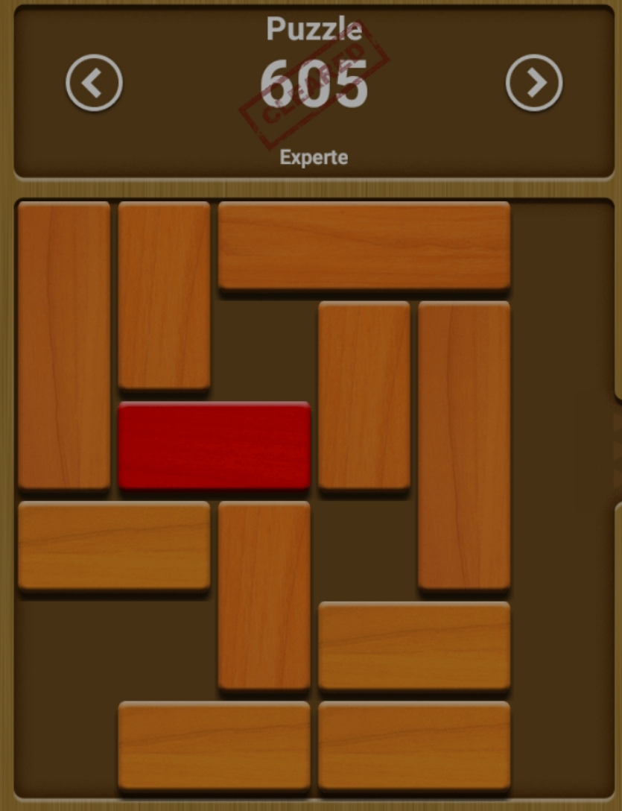
</td><td>

    ```python
    board_605 = [
        [2 , 3  , 4  , 4  , 4  , 0] ,
        [2 , 3  , 0  , 5  , 6  , 0] ,
        [2 , 1  , 1  , 5  , 6  , 0] ,
        [7 , 7  , 8  , 0  , 6  , 0] ,
        [0 , 0  , 8  , 9  , 9  , 0] ,
        [0 , 10 , 10 , 11 , 11 , 0] ,
    ]
    ```
</td><td>

```python
(Pdb) pp pieces
{1: Piece(nr=1, row=2, col=3, len=2, dir='h'),
 2: Piece(nr=2, row=0, col=0, len=2, dir='h'),
 3: Piece(nr=3, row=0, col=2, len=3, dir='v'),
 4: Piece(nr=4, row=0, col=4, len=2, dir='v'),
 5: Piece(nr=5, row=0, col=5, len=3, dir='v'),
 6: Piece(nr=6, row=3, col=4, len=2, dir='h'),
 7: Piece(nr=7, row=3, col=3, len=3, dir='v'),
 8: Piece(nr=8, row=4, col=1, len=2, dir='h'),
 9: Piece(nr=9, row=3, col=0, len=2, dir='v')}

```

</td></tr>
</tbody>
</table>


#### Main Loop


`lp:show_src delim=mainloop_deep dir=docs/ll/fun lang=python`

where next_move is like:

`lp:show_src delim=next_move dir=docs/ll/fun lang=python`


#### State Indexing

The algo depends on knowing if a board state had been reached before, i.e. all reached states have
to be kept in a set in memory, in a comparable form. 

We simply concat the top left position of the pieces into a string:

`lp:show_src delim=state dir=docs/ll/fun lang=python`

which produces states like these:

```python

(Pdb) pp states
{'121:200:301:402:513:614:730:832:943:1051:1153:',
 '121:200:301:402:523:614:730:832:943:1051:1153:',
 '121:200:301:403:513:614:730:832:943:1051:1153:',
 '121:200:301:403:523:614:730:832:943:1051:1153:', 
 ...
```

#### Tree Traversal Path

Also, in order to *backtrack*, we have to remember the moves we did up to a certain state:

This we do efficiently only by putting the moved piece into an array, e.g.

```python
(Pdb) pp moves
[4, 5, -4, 9, 4]
```

where -4 means we moved piece nr 4 left or up (dependend on if it is a horizontal or vertical
piece), while +4 means right or down. In the example (which is from the above shown board 605) we
moved piece 

- nr 4 one right
- then 5 one down
- then 4 one left
- then 9 one right
- then 4 one right

(you might already anticipate the major problem with this DFS approach)

When we have to backtrack (undo), we simply move the piece into the opposite direction, switching
off the state comparison part in `dev move`, via a global `undo_mode` boolean.

!!! note

    Any move is just moving a piece **one** cell in the matrix.


#### Printing the Board, Showing the Move

Using some ansi colors, and turning two digit piece numbers into letters (a=10, b=11, ...) we can
nicely visualize the board and the move (background color dark purple then):

Here the example from above:

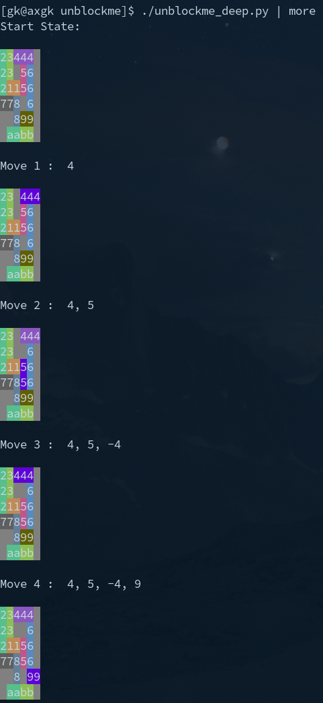


### Runtime Behaviour

#### Output
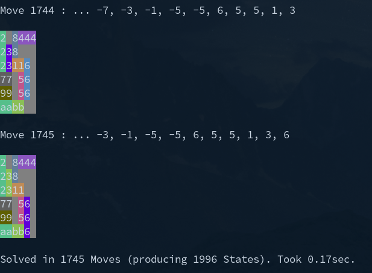

#### Discussion

Good:

- The solution is found by this algorithm.
- It is very fast
- Nearly no memory required (solely the moves array increases by an integer, per move, plus all
  indexed states)

Bad: Way too many (unnecessary) moves:


!!! note

    Here the backtracking moves are already eliminated, i.e. every single one of this 1745 moves
    produced a unique (but often unnecessary) state.

## Breadth First: Attempt 1

To find a solution with a minimum number of moves, DFS cannot work. We would have to try every
single possible path.

So we changed to algo to BFS:

1. From a given state, try *every* possible move, which produces new state
1. For *any* of these, go back to 1 (checking if solved after each move).

No backtracking involved here.

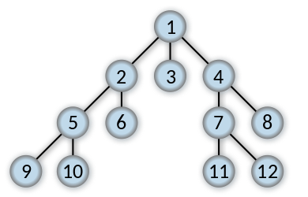


Sounds simple, is harder.

### New Ingredients

#### Main Loop

`lp:show_src delim=bfs1_mainloop dir=docs/ll/fun lang=python`

#### Printing the Solution

Since BFS should find the ideal solution we can print all moves to it at the end:

`lp:show_src delim=bfs1print dir=docs/ll/fun lang=python`

This walks the tree (with last entry the solution) like this:

- pop the last move 
- print the one, which state is referred to as prev state from the previously printed

I.e. it will print the solution moves, bottom up, starting from the solution.

Also, since in the real game, a move over TWO cells counts as ONE move (while we have only single
cell moves), we detect those multiple moves with one piece in that print out routine, adding 1 to
the move number - in the example this results in 11 eliminated multiple moves with one piece.

### Runtime Behaviour

#### Output

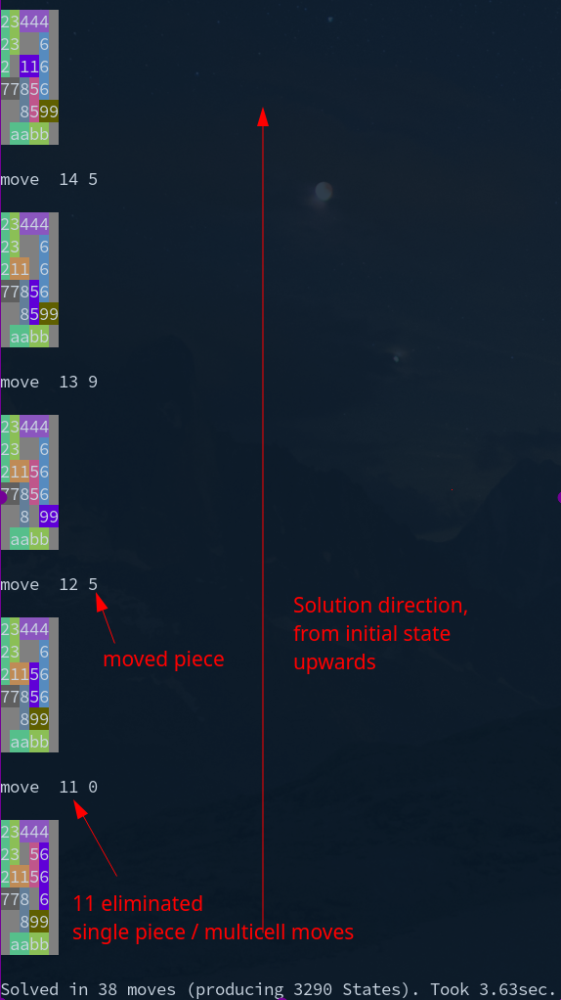

#### Discussion

Good:

- FAR less moves than DFS (38 instead of 1745).

Bad:

- Far bigger solving time (3.6 sec vs 0.17 for DFS)
- Far more memory required, since we have to now keep *all* the board configs in memory: Until the
  solution found, we do not know *which* path will be the successful one...

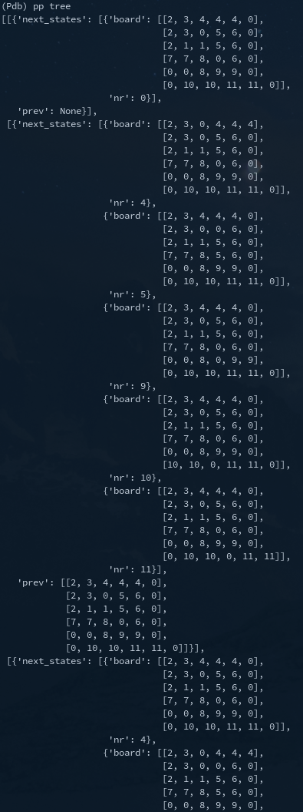

##### It is still not perfect

Trying the solution within the real game, we got only 2 stars - well done but not the perfect one
found - which is 32 and not 38 moves.

Why.

Well, looking at the first moves we see the answer. It moves 

- piece 5 down one cell
- then 9 right one cell
- then, with 9 removed from the column of 5, 5 again down one cell

which is 3 moves to a certain state in the successful path.

while moving

- *first* 9 right,  
- *then* 5 down 2 cells 

would be only 2 moves to the same state.

Why did it not find that, what prevented it.

Answer (after debugging) - check the terminal output of the solution shown above:

- In move 1 it did also register the move 9 right
- Then in move 2 it started with the board in state after 5 down one (and 9 in orig place), found 9
  right and remembered the state
- Then in move 2 it tried new moves after 9 right first, found 5 down one - and stopped. Since that
  state was already indexed. 5 down 2 cells was therefore not even tried.


So: Our single cell approach is the problem. We cannot, in the main loop, move only single cells
and then eliminate double moves only at solution printout.

We must cover multi cell moves already in the main loop.

## Breadth First: Attempt 2

This is the right approach:

`lp:show_src delim=main_loopbfs dir=docs/ll/fun lang=python`

Here, we try move to a certain direction not just one cell but as many cells as possible, on the board, for a given overall move number.

Means: This increases the width of every move yet more: E.g. in our example, for the second move,
based upon first (previous) number 9 right one cell, we have nr 5 down one AND 5 down two cells as possible single
move continuations now.

### Runtime Behaviour

#### Output

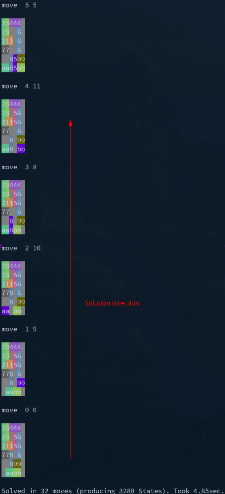

(9 right is now first move, 5 completely down only in move 5)

#### Discussion

Good:

- Finds the perfect solution, confirmed by replaying the solution in the real game.

Bad:

- Yet more CPU, we are at 4.8 sec vs 0.17 DFS) and yet more memory (breadth is even higher)


## Klotski

### Normal Version

Having the basic algo in place, we tried it on a variant of the game (actually it seems the
original):

[](https://www.y8.com/games/klotski)

Big difference to UnblockMe: Pieces can now be moved into *any* direction:

So the main loop basically identical to unblockme's optimal solution bfs:

`lp:show_src delim=main_loopklotski dir=docs/ll/fun lang=python`


#### Challenges

But the run time got huge, with a crazy high breadth. We tackled that by using another indexing
method, where a state is considered identical to another if pieces with only the same dimensions
reside on the same places - not necessarily with their piece number matching:

```python
[[2, 3, 0],
 [1, 1, 0]]

# is considered ident to

[[3, 2, 0],
 [1, 1, 0]]
```

The solution to this problem requires 91 moves(!):

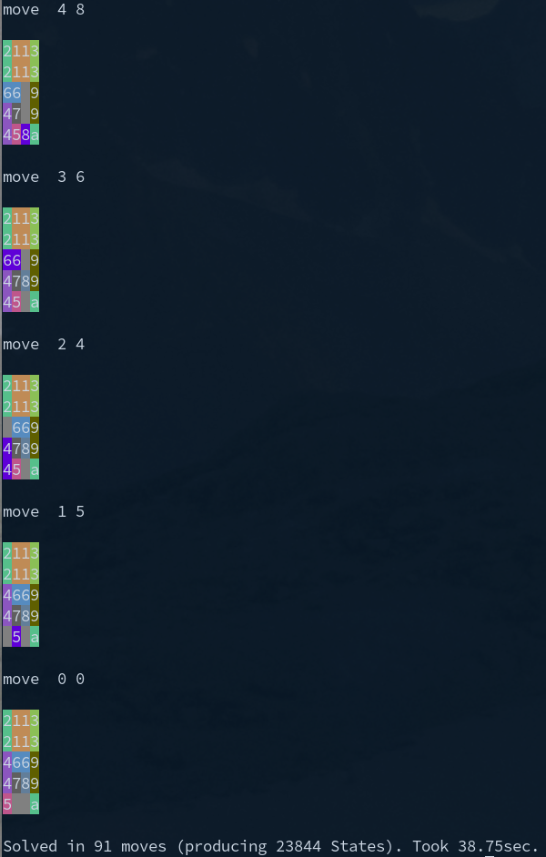

### Klotski - Hard Version

If this wasn't hard enough, there is also an expert version of the game:

[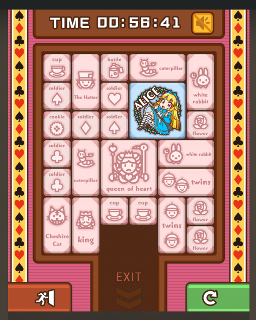](https://www.y8.com/games/klotski) 

Initial board setup varies, had also e.g. this:

```python
board_hard1 = [
    [2 , 1, 1, 3, 4, 4],
    [2 , 1, 1, 5, 6, 6],
    [7 , 8,10,11,12,13],
    [7 , 9,10,14,15,16],
    [17,17,18,19,20,16],
    [24,24,25,19,21,22],
    [24,24, 0, 0,23,22],
    ]
```

#### Challenges: BFS not feasible

The bfs [code][klotski] code in general did not need any changes, except an adjustment of
`solved_row`, `solved_col`.

Problem: Computing time was not tolerable. With so many pieces on the board, possibilities to move
them around, i.e. breadth, exploded:

```
(...)
next move:  12
breadth is:  1893
board states:  4987
time 45.87 sec
next move:  13
breadth is:  2901
board states:  7888
time 74.44 sec
next move:  14
breadth is:  4482
board states:  12370
time 117.52 sec
next move:  15
breadth is:  7062
board states:  19432
time 184.78 sec
(...)
```

We did not profile and the code is rater inefficient, grown from the pretty fast DFS algo into BFS.
But an optimization would need orders of magnitude improvement, which I did not go into. I assume I would need
to change programming language for finding that in bearable time.

Rather I tried DFS with this, in order to see if it also performs. And it did:

Result:

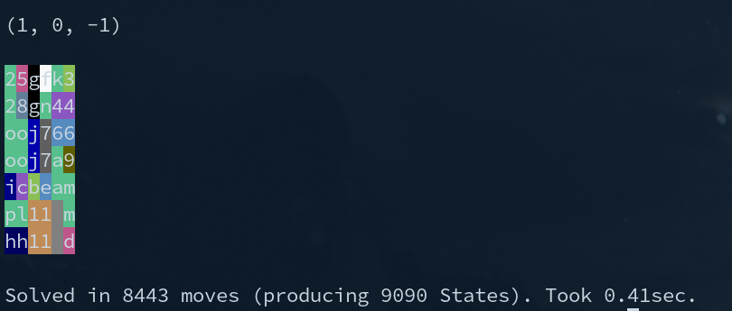

0.4 seconds - unexpectedly fast, after having to interrupt the bfs version for resource problems.

Over 8000 moves is, I assume, an order of magnitude too high, compared to the (unknown) perfect
solution (remember: the normal version had 91
for perfect, here we'll have at least 5-10 times as many).

!!! important

    In klotzki expert mode, BFS was not even feasible, while DFS found a solution in less then half a second.


## Summary

For the given class of problems **DFS** is:

- easier to program
- light on resources, i.e. super fast
- finds a solution guaranteed.
- But that solution will be FAR from the optimal one

**BFS** is *pretty* resource intense (CPU *and* memory) - but will find the *perfect* solution, given we
consider really *every* possible move, for a certain step (e.g. not just single cell moves in
UnblockMe).

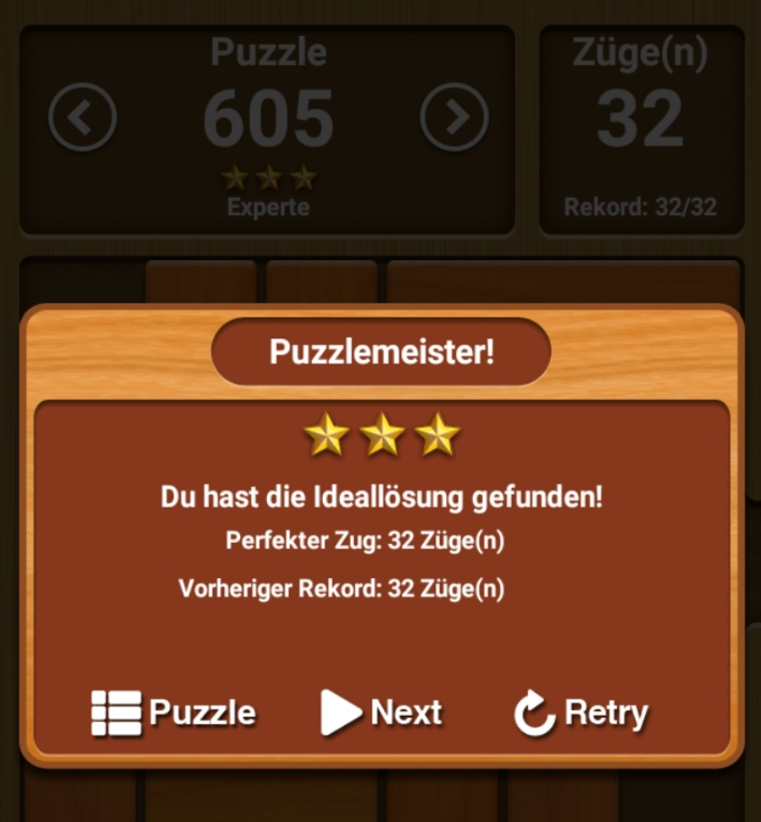{width=400}


[yt]: https://www.youtube.com/watch?v=fKMbm-KZaFU
[yt2]: https://www.youtube.com/watch?v=AXpgFNxXA2k

[umdfs]: ./unblockme_dfs.py
[umbfs1]: ./unblockme_breadth_first_single_moves.py
[umbfs2]: ./unblockme.py
[klotski]: ./klotski.py
[klotski_dfs]: ./klotski_dfs.py


