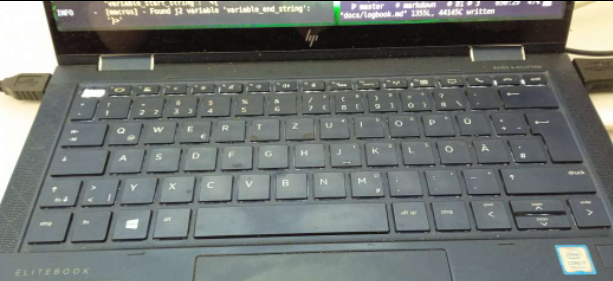

# HP Dragonfly

[2022-04-29 08:34] 

After spilling coffee over my beloved 2015 MBPro I bought a non Mac, since on Linux anyway. The HP
Dragonfly convinced me because of super small and light but also the best keyboard in the store.




##  "Esc -> Caps: Drastic Changes Require Drastic Measures"

On it I retrained myself to use caps lock for escape.

`setxkbmap -option "caps:swapescape"` 

Simply mapping the escape key was not sufficient to retrain 30years of muscle memory. I
had to physically remove the escape key!

Then me and my left pinky finger immediately (one day) learned the new position.


## "Alt-Gr -> Up: Required Low Level Approach (`xkbcomp`)"


Then a problem was the up arrow key which is physically super small and hard to reach in "vim
position" - so I remapped it to the key next to space, which I can reach with the thumb:
Alt_Gr


That was easy: xev to find keycode (108) for Alt_Gr and then remap to Up via: `xmodmap -e "keycode 108 = Up"`

But then [this](https://github.com/alacritty/alacritty/issues/4622) bit me: A bug in a rust lib:

`showkey -a` did reveal, at Alt_GR presses, in alacritty different output than in st or kitty - and
no up arrow was processed.

`xkbcomp` to the rescue: Here we modify the state of the X11 *Server* itself, regarding the layout and functioning of the physical keyboard.

1. Export the current state:

```bash
$ xkbcomp $DISPLAY output.xkb # cleartext file - but complex
```

2. Modify then upload again:

```bash
$ xkbcomp modified.xkb $DISPLAY
```

Modifications:

we have 

```
    <RALT> = 108;
    <LNFD> = 109;
    <HOME> = 110;
      <UP> = 111;
 
```

But simply saying `<UP>` = 108 did not work - the RALT is referenced in many places. Swapping 108
and 111 in the file and uploading was accepted by the server, but then we lost the real Up arrow
key.

So we did this:

1. Picked an unused X keysym (`XF86RFKill` which was at Key <I255>)
1. Swapped it with 108 (our physical Alt_GR) andthen
1. Then use xmodmap to define a keysym for this one to Up:

```diff
/tmp ❯ diff orig.xkb input.xkb                                                                                                  1m 22s
103c103
<     <RALT> = 108;
---
>     <I255> = 108;
250c250
<     <I255> = 255;
---
>     <RALT> = 255;
/tmp ❯ xkbcomp input.xkb $DISPLAY
/tmp ❯ xmodmap -e 'keysym XF86RFKill = Up'
```

Done. Up Arrow AND Alt_GR now behaving equal :-)


Refs:

- https://wiki.archlinux.org/title/X_keyboard_extension 


