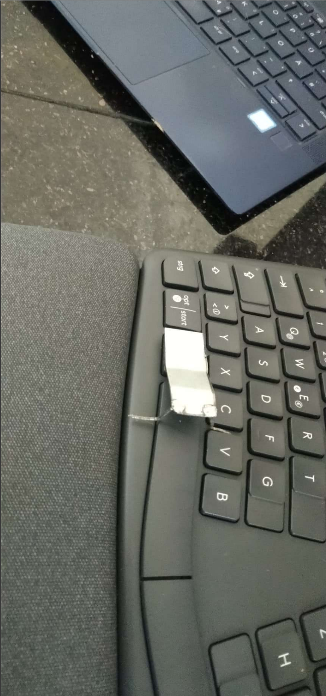
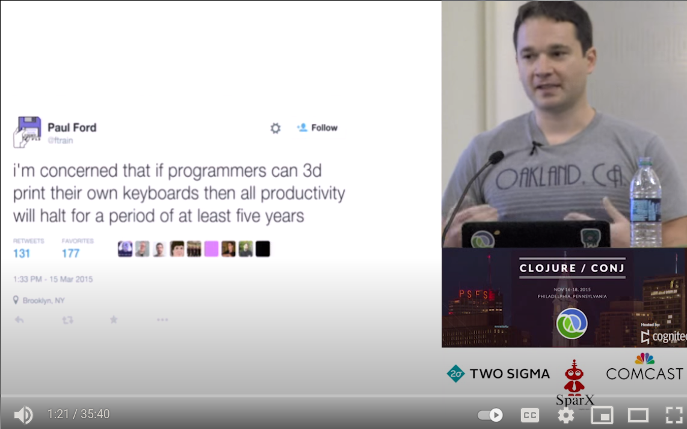
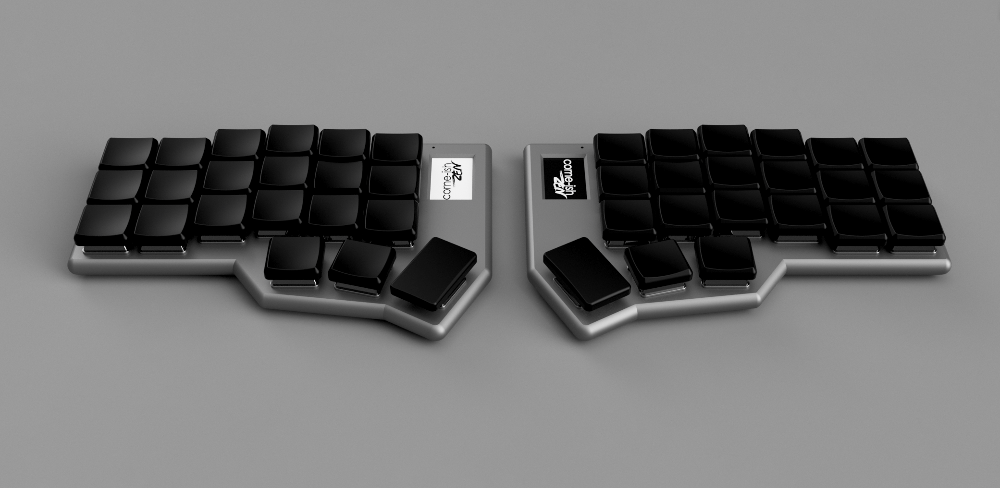
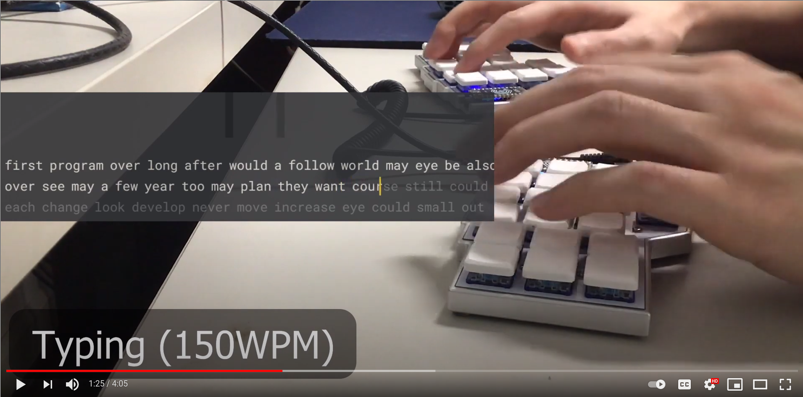
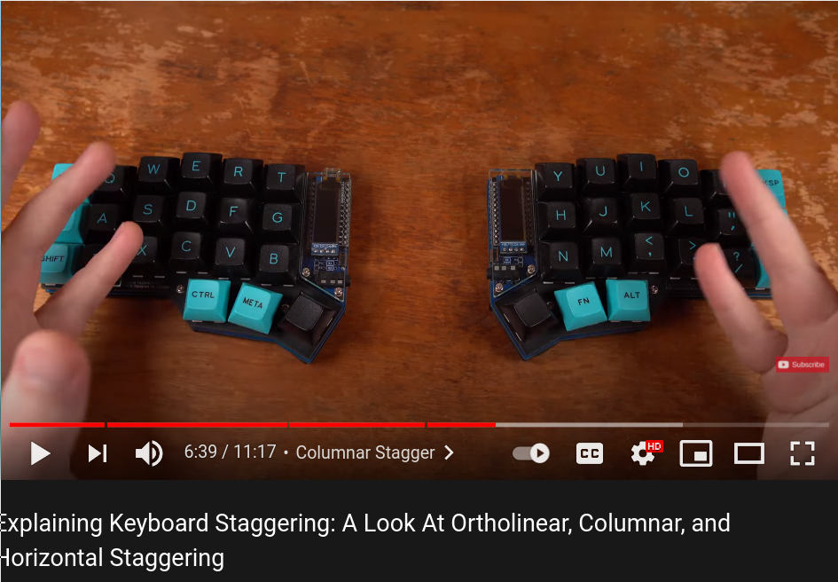
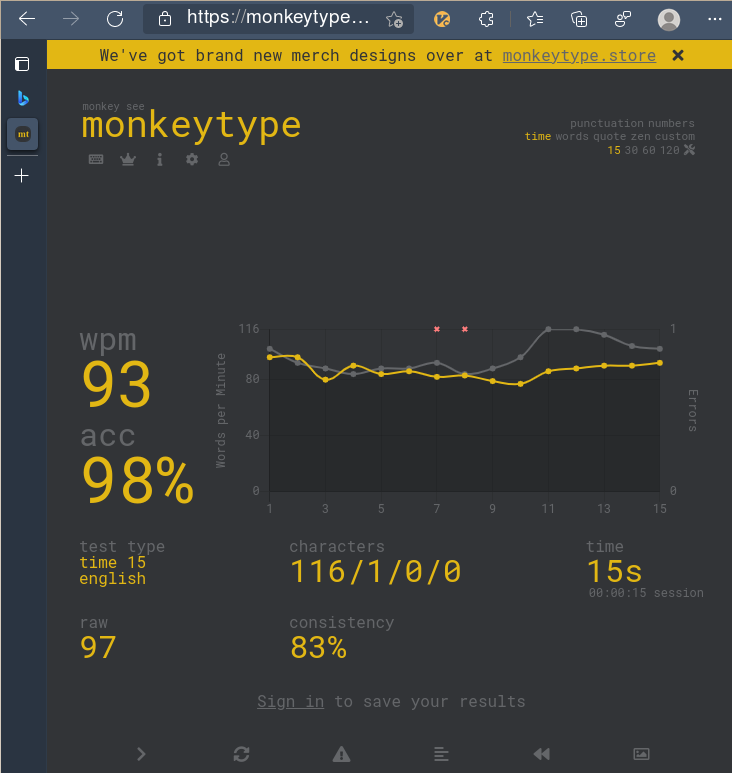

# Logitech [K860 Keyboard](https://prosupport.logi.com/hc/en-us/articles/360052679854-Getting-Started-ERGO-K860), `evtest` plus some reality distortion...


## General Notes

### Upsides

- Fits my hands very good, got a little bit of strain recently on my laptop.
- Membrane actually, but really stiff ones, feels more like I imagine a 60g mechanical keyboard
  (never typed on one. Yet. See outlook below..).
- Got it for 60:euro: (after officially confirming to the clerk that I'll professionally dispose off
  all evil killer viruses from it back home, with him, in this age of crazy, not being allowed to
  sell the last remaining piece of the store - the one on display)
- After a while with it, my laptop keyboard felt like a kids toy. Which is good sign, I guess...(?).
  You feel more like a construction worker with this, hacking into it, while on the small laptop it
  was more the watchmaker feeling... 
- usb dongle worked right away, so connectivity is given.
- has a [SYSRQ](https://www.kernel.org/doc/html/latest/admin-guide/sysrq.html) key (labelled
  'Drucken') on my German version. You only see it in `evtest`, not in `xev`, see below
- After a week I already type a bit faster than on the old one, guess the 100wpm is doable with it.

!!! note

    Many say fast typing is not required for good programmers. But, if you live, like me, by the
    motto: *Weeks of programming can save you hours of planning*, it is kinda important...


### Downsides
- Linux support is
  [zero](https://support.logi.com/hc/en-us/community/posts/360032296034-Linux-Drivers)
- Loud like hell, their marketing pictures with the colleagues in the big office excited about the
  guys' new keyboard will NOT happen. All colleagues within 20m radius will hate you.
- Big. Not sth for the backpack. I don't need the right 35% (right of enter) of it at all, since my
  hands completely rest and never move (except for mouse, see below). But yeah, I actually just need
  a 65% keyboard...
- I miss the arrow keys close to my fingers
- NO trackpad: In the shop, excited about the typing experience, I *totally forgot to think about
  the trackpad* :blush:. There is no **f...** trackpad, allthough there would be perfect space for
  it between left and right keyblocks!! :angry:.  Was looking already for something like ...a
  flexible trackpad foil, which I could glue into that area - but such a thing does not exist (yet).

  With such a huge keyboard your hands will move a kilometer each day grabbing an external mouse, no
  joke....

  Being (still, after all these years :wink:) a positively thinking human being, I try to make a feature
  out of that:

  *Really eradicating the mouse next to completely, from everything, except mouse driven apps like
  gimp, where a real mouse is anyway better than the TP. `vimium-c's excellent `f` (follow) feature
  is key for this in the browser: It works 99% of the time, even for JS generated links, like
  hitting like buttons. The rest is pretty much anyway under my fingers, in the terminal.*


- Left ++ctrl++ veeery far left, have to bend my thumb a lot to get it and that key is the most
  important hotkey. The idea to map left space to it had me start this chapter actually.... See
  below...


## Switching F-Keys

Done by hitting ++fn++++escape++


## Modifier Setyp

Old guy -> still using xmodmap:

```bash
    xset r rate 250 45
    # middle button click scroll:
    xinput set-prop 10 "libinput Scroll Method Enabled" 0, 0, 1
    # arch
    #xinput set-prop 13 307 1 # tab to click
    xinput set-prop 20 307 1 # tab to click
    # https://gist.github.com/jatcwang/ae3b7019f219b8cdc6798329108c9aee
    #setxkbmap -option ctrl:swap_lwin_lctl -option caps:escape
    #setxkbmap -option ctrl:swap_lalt_lctl -option caps:escape
    # hp keyboard with super like: ctrl-super-tab
    # external keyboard with super next to space:
    #setxkbmap -option ctrl:swap_lwin_lctl -option caps:escape
    setxkbmap -option ctrl:swap_lalt_lctl_lwin #-option caps:alt
    _() { xmodmap -e "$1"; }
    _ "keycode 94 = grave asciitilde" # left of right shift (grave is `)
    _ "keycode 66 = Alt_L"            # capslock is now alt (for vim splits)
    _ "clear Lock"
    # "remove shift = Shift_R"
    # "keycode 162 = Up" # shift right: up
    # "remove mod4 = Super_R"
    #_ "keycode 64 = XF86AudioRaiseVolume"
    #_ "keycode 133 = XF86AudioLowerVolume"
    # "keycode 169 = BackSpace"
    # better to find on the HP than arrow up:
    _ "keycode 108 = Up" # command on shell only right thumb 
    # _ "keycode 108 = Left"
    # _ "keycode 113 = Down"
    # _ "keycode 111 = Right"
    # _ "keycode 116 = Right"
}

```

## The `/dev/input` Streams

Below we analyse a bit whats there.

First find out which stream: `cat /proc/bus/input/devices`

```
(...)
I: Bus=0003 Vendor=046d Product=4088 Version=0111
N: Name="Logitech ERGO K860"
P: Phys=usb-0000:00:14.0-1/input2:1
S: Sysfs=/devices/pci0000:00/0000:00:14.0/usb1/1-1/1-1:1.2/0003:046D:C52B.0003/0003:046D:4088.000B/input/input39
U: Uniq=4088-14-3e-f8-ba
H: Handlers=sysrq kbd leds mouse0 event6
B: PROP=0
B: EV=12001f
B: KEY=3f000303ff 0 0 483ffff17aff32d bfd4444600000000 ffff0001 130ff38b17c007 ffff7bfad941dfff ffbeffdfffefffff fffffffffffffffe
B: REL=1943
B: ABS=100000000
B: MSC=10
B: LED=1f
```

Ok, event6.

So:

```python
import struct 
f = open( "/dev/input/event4", "rb" ); # Open the file in the read-binary mode
while 1:
  data = f.read(24)
  print(struct.unpack('4IHHI',data))
  ###### PRINT FORMAL = ( Time Stamp_INT , 0 , Time Stamp_DEC , 0 , 
  ######   type , code ( key pressed ) , value (press/release) )
```

Spits out all the coordinate numbers when we move the mouse. Now keyboard:


Uups, lets stop this - there is something better: **evtest**:


## Meet `evtest`

Good companion to xev. Actually better for my day to day event analysing :sunglasses:

- It keeps logging while you are in other windows, and the keys remain activeley passed into the
  system. Basically the above python program with nicer formatting.
- Terminal only, does not start an X window
- Is actually not X11 at all, works on console, i.e. all the handling of dwm or sxhkd is not active
  then.
- Works better with grep, more condensed output
- Outputs the SYSRQ key (xev not, guess my kernel has it not enabled).

Downside: Needs sudo root.

```bash
[root@axgk gk]# evtest
No device specified, trying to scan all of /dev/input/event*
Available devices:
/dev/input/event0:  Sleep Button
/dev/input/event1:  Lid Switch
/dev/input/event2:  Power Button
/dev/input/event3:  Power Button
/dev/input/event4:  AT Translated Set 2 keyboard
/dev/input/event5:  Video Bus
/dev/input/event6:  Logitech ERGO K860
/dev/input/event7:  HP Wireless hotkeys
/dev/input/event8:  Intel HID events
/dev/input/event9:  SYNA30A1:00 06CB:CD74 Mouse
/dev/input/event10: SYNA30A1:00 06CB:CD74 Touchpad
/dev/input/event11: Wacom HID 4924 Pen
/dev/input/event12: Wacom HID 4924 Finger
/dev/input/event13: HID 0461:4d03
/dev/input/event14: SynPS/2 Synaptics TouchPad
/dev/input/event15: Intel HID 5 button array
/dev/input/event16: PC Speaker
/dev/input/event17: HP WMI hotkeys
/dev/input/event18: HP HD Camera: HP HD Camera
/dev/input/event19: HP HD Camera: HP IR Camera
/dev/input/event20: sof-hda-dsp Mic
/dev/input/event21: sof-hda-dsp Headphone
/dev/input/event22: sof-hda-dsp HDMI/DP,pcm=3
/dev/input/event23: sof-hda-dsp HDMI/DP,pcm=4
/dev/input/event24: sof-hda-dsp HDMI/DP,pcm=5
/dev/input/event25: Intel HID switches
Select the device event number [0-25]:
```

Nice!


### All the keys

??? note "Startup sequence shows what we have"

    ```
    [root@axgk gk]# evtest /dev/input/event6
    Input driver version is 1.0.1
    Input device ID: bus 0x3 vendor 0x46d product 0x4088 version 0x111
    Input device name: "Logitech ERGO K860"
    Supported events:
      Event type 0 (EV_SYN)
      Event type 1 (EV_KEY)
        Event code 1 (KEY_ESC)
        Event code 2 (KEY_1)
        Event code 3 (KEY_2)
        Event code 4 (KEY_3)
        Event code 5 (KEY_4)
        Event code 6 (KEY_5)
        Event code 7 (KEY_6)
        Event code 8 (KEY_7)
        Event code 9 (KEY_8)
        Event code 10 (KEY_9)
        Event code 11 (KEY_0)
        Event code 12 (KEY_MINUS)
        Event code 13 (KEY_EQUAL)
        Event code 14 (KEY_BACKSPACE)
        Event code 15 (KEY_TAB)
        Event code 16 (KEY_Q)
        Event code 17 (KEY_W)
        Event code 18 (KEY_E)
        Event code 19 (KEY_R)
        Event code 20 (KEY_T)
        Event code 21 (KEY_Y)
        Event code 22 (KEY_U)
        Event code 23 (KEY_I)
        Event code 24 (KEY_O)
        Event code 25 (KEY_P)
        Event code 26 (KEY_LEFTBRACE)
        Event code 27 (KEY_RIGHTBRACE)
        Event code 28 (KEY_ENTER)
        Event code 29 (KEY_LEFTCTRL)
        Event code 30 (KEY_A)
        Event code 31 (KEY_S)
        Event code 32 (KEY_D)
        Event code 33 (KEY_F)
        Event code 34 (KEY_G)
        Event code 35 (KEY_H)
        Event code 36 (KEY_J)
        Event code 37 (KEY_K)
        Event code 38 (KEY_L)
        Event code 39 (KEY_SEMICOLON)
        Event code 40 (KEY_APOSTROPHE)
        Event code 41 (KEY_GRAVE)
        Event code 42 (KEY_LEFTSHIFT)
        Event code 43 (KEY_BACKSLASH)
        Event code 44 (KEY_Z)
        Event code 45 (KEY_X)
        Event code 46 (KEY_C)
        Event code 47 (KEY_V)
        Event code 48 (KEY_B)
        Event code 49 (KEY_N)
        Event code 50 (KEY_M)
        Event code 51 (KEY_COMMA)
        Event code 52 (KEY_DOT)
        Event code 53 (KEY_SLASH)
        Event code 54 (KEY_RIGHTSHIFT)
        Event code 55 (KEY_KPASTERISK)
        Event code 56 (KEY_LEFTALT)
        Event code 57 (KEY_SPACE)
        Event code 58 (KEY_CAPSLOCK)
        Event code 59 (KEY_F1)
        Event code 60 (KEY_F2)
        Event code 61 (KEY_F3)
        Event code 62 (KEY_F4)
        Event code 63 (KEY_F5)
        Event code 64 (KEY_F6)
        Event code 65 (KEY_F7)
        Event code 66 (KEY_F8)
        Event code 67 (KEY_F9)
        Event code 68 (KEY_F10)
        Event code 69 (KEY_NUMLOCK)
        Event code 70 (KEY_SCROLLLOCK)
        Event code 71 (KEY_KP7)
        Event code 72 (KEY_KP8)
        Event code 73 (KEY_KP9)
        Event code 74 (KEY_KPMINUS)
        Event code 75 (KEY_KP4)
        Event code 76 (KEY_KP5)
        Event code 77 (KEY_KP6)
        Event code 78 (KEY_KPPLUS)
        Event code 79 (KEY_KP1)
        Event code 80 (KEY_KP2)
        Event code 81 (KEY_KP3)
        Event code 82 (KEY_KP0)
        Event code 83 (KEY_KPDOT)
        Event code 85 (KEY_ZENKAKUHANKAKU)
        Event code 86 (KEY_102ND)
        Event code 87 (KEY_F11)
        Event code 88 (KEY_F12)
        Event code 89 (KEY_RO)
        Event code 90 (KEY_KATAKANA)
        Event code 91 (KEY_HIRAGANA)
        Event code 92 (KEY_HENKAN)
        Event code 93 (KEY_KATAKANAHIRAGANA)
        Event code 94 (KEY_MUHENKAN)
        Event code 95 (KEY_KPJPCOMMA)
        Event code 96 (KEY_KPENTER)
        Event code 97 (KEY_RIGHTCTRL)
        Event code 98 (KEY_KPSLASH)
        Event code 99 (KEY_SYSRQ)
        Event code 100 (KEY_RIGHTALT)
        Event code 102 (KEY_HOME)
        Event code 103 (KEY_UP)
        Event code 104 (KEY_PAGEUP)
        Event code 105 (KEY_LEFT)
        Event code 106 (KEY_RIGHT)
        Event code 107 (KEY_END)
        Event code 108 (KEY_DOWN)
        Event code 109 (KEY_PAGEDOWN)
        Event code 110 (KEY_INSERT)
        Event code 111 (KEY_DELETE)
        Event code 113 (KEY_MUTE)
        Event code 114 (KEY_VOLUMEDOWN)
        Event code 115 (KEY_VOLUMEUP)
        Event code 116 (KEY_POWER)
        Event code 117 (KEY_KPEQUAL)
        Event code 119 (KEY_PAUSE)
        Event code 120 (KEY_SCALE)
        Event code 121 (KEY_KPCOMMA)
        Event code 122 (KEY_HANGUEL)
        Event code 123 (KEY_HANJA)
        Event code 124 (KEY_YEN)
        Event code 125 (KEY_LEFTMETA)
        Event code 126 (KEY_RIGHTMETA)
        Event code 127 (KEY_COMPOSE)
        Event code 128 (KEY_STOP)
        Event code 129 (KEY_AGAIN)
        Event code 130 (KEY_PROPS)
        Event code 131 (KEY_UNDO)
        Event code 132 (KEY_FRONT)
        Event code 133 (KEY_COPY)
        Event code 134 (KEY_OPEN)
        Event code 135 (KEY_PASTE)
        Event code 136 (KEY_FIND)
        Event code 137 (KEY_CUT)
        Event code 138 (KEY_HELP)
        Event code 139 (KEY_MENU)
        Event code 140 (KEY_CALC)
        Event code 142 (KEY_SLEEP)
        Event code 143 (KEY_WAKEUP)
        Event code 144 (KEY_FILE)
        Event code 150 (KEY_WWW)
        Event code 152 (KEY_SCREENLOCK)
        Event code 155 (KEY_MAIL)
        Event code 156 (KEY_BOOKMARKS)
        Event code 158 (KEY_BACK)
        Event code 159 (KEY_FORWARD)
        Event code 161 (KEY_EJECTCD)
        Event code 163 (KEY_NEXTSONG)
        Event code 164 (KEY_PLAYPAUSE)
        Event code 165 (KEY_PREVIOUSSONG)
        Event code 166 (KEY_STOPCD)
        Event code 167 (KEY_RECORD)
        Event code 168 (KEY_REWIND)
        Event code 169 (KEY_PHONE)
        Event code 171 (KEY_CONFIG)
        Event code 172 (KEY_HOMEPAGE)
        Event code 173 (KEY_REFRESH)
        Event code 174 (KEY_EXIT)
        Event code 176 (KEY_EDIT)
        Event code 177 (KEY_SCROLLUP)
        Event code 178 (KEY_SCROLLDOWN)
        Event code 179 (KEY_KPLEFTPAREN)
        Event code 180 (KEY_KPRIGHTPAREN)
        Event code 181 (KEY_NEW)
        Event code 182 (KEY_REDO)
        Event code 183 (KEY_F13)
        Event code 184 (KEY_F14)
        Event code 185 (KEY_F15)
        Event code 186 (KEY_F16)
        Event code 187 (KEY_F17)
        Event code 188 (KEY_F18)
        Event code 189 (KEY_F19)
        Event code 190 (KEY_F20)
        Event code 191 (KEY_F21)
        Event code 192 (KEY_F22)
        Event code 193 (KEY_F23)
        Event code 194 (KEY_F24)
        Event code 206 (KEY_CLOSE)
        Event code 207 (KEY_PLAY)
        Event code 208 (KEY_FASTFORWARD)
        Event code 209 (KEY_BASSBOOST)
        Event code 210 (KEY_PRINT)
        Event code 212 (KEY_CAMERA)
        Event code 216 (KEY_CHAT)
        Event code 217 (KEY_SEARCH)
        Event code 219 (KEY_FINANCE)
        Event code 223 (KEY_CANCEL)
        Event code 224 (KEY_BRIGHTNESSDOWN)
        Event code 225 (KEY_BRIGHTNESSUP)
        Event code 228 (KEY_KBDILLUMTOGGLE)
        Event code 229 (KEY_KBDILLUMDOWN)
        Event code 230 (KEY_KBDILLUMUP)
        Event code 231 (KEY_SEND)
        Event code 232 (KEY_REPLY)
        Event code 233 (KEY_FORWARDMAIL)
        Event code 234 (KEY_SAVE)
        Event code 235 (KEY_DOCUMENTS)
        Event code 240 (KEY_UNKNOWN)
        Event code 241 (KEY_VIDEO_NEXT)
        Event code 244 (KEY_BRIGHTNESS_ZERO)
        Event code 256 (BTN_0)
        Event code 272 (BTN_LEFT)
        Event code 273 (BTN_RIGHT)
        Event code 274 (BTN_MIDDLE)
        Event code 275 (BTN_SIDE)
        Event code 276 (BTN_EXTRA)
        Event code 277 (BTN_FORWARD)
        Event code 278 (BTN_BACK)
        Event code 279 (BTN_TASK)
        Event code 280 (?)
        Event code 281 (?)
        Event code 282 (?)
        Event code 283 (?)
        Event code 284 (?)
        Event code 285 (?)
        Event code 286 (?)
        Event code 287 (?)
        Event code 353 (KEY_SELECT)
        Event code 354 (KEY_GOTO)
        Event code 358 (KEY_INFO)
        Event code 362 (KEY_PROGRAM)
        Event code 366 (KEY_PVR)
        Event code 370 (KEY_SUBTITLE)
        Event code 372 (KEY_ZOOM)
        Event code 374 (KEY_KEYBOARD)
        Event code 375 (KEY_SCREEN)
        Event code 376 (KEY_PC)
        Event code 377 (KEY_TV)
        Event code 378 (KEY_TV2)
        Event code 379 (KEY_VCR)
        Event code 380 (KEY_VCR2)
        Event code 381 (KEY_SAT)
        Event code 383 (KEY_CD)
        Event code 384 (KEY_TAPE)
        Event code 386 (KEY_TUNER)
        Event code 387 (KEY_PLAYER)
        Event code 389 (KEY_DVD)
        Event code 392 (KEY_AUDIO)
        Event code 393 (KEY_VIDEO)
        Event code 396 (KEY_MEMO)
        Event code 397 (KEY_CALENDAR)
        Event code 398 (KEY_RED)
        Event code 399 (KEY_GREEN)
        Event code 400 (KEY_YELLOW)
        Event code 401 (KEY_BLUE)
        Event code 402 (KEY_CHANNELUP)
        Event code 403 (KEY_CHANNELDOWN)
        Event code 405 (KEY_LAST)
        Event code 407 (KEY_NEXT)
        Event code 408 (KEY_RESTART)
        Event code 409 (KEY_SLOW)
        Event code 410 (KEY_SHUFFLE)
        Event code 412 (KEY_PREVIOUS)
        Event code 416 (KEY_VIDEOPHONE)
        Event code 417 (KEY_GAMES)
        Event code 418 (KEY_ZOOMIN)
        Event code 419 (KEY_ZOOMOUT)
        Event code 420 (KEY_ZOOMRESET)
        Event code 421 (KEY_WORDPROCESSOR)
        Event code 422 (KEY_EDITOR)
        Event code 423 (KEY_SPREADSHEET)
        Event code 424 (KEY_GRAPHICSEDITOR)
        Event code 425 (KEY_PRESENTATION)
        Event code 426 (KEY_DATABASE)
        Event code 427 (KEY_NEWS)
        Event code 428 (KEY_VOICEMAIL)
        Event code 429 (KEY_ADDRESSBOOK)
        Event code 430 (KEY_MESSENGER)
        Event code 431 (KEY_DISPLAYTOGGLE)
        Event code 432 (KEY_SPELLCHECK)
        Event code 433 (KEY_LOGOFF)
        Event code 439 (KEY_MEDIA_REPEAT)
        Event code 442 (KEY_IMAGES)
        Event code 576 (KEY_BUTTONCONFIG)
        Event code 577 (KEY_TASKMANAGER)
        Event code 578 (KEY_JOURNAL)
        Event code 579 (KEY_CONTROLPANEL)
        Event code 580 (KEY_APPSELECT)
        Event code 581 (KEY_SCREENSAVER)
        Event code 582 (KEY_VOICECOMMAND)
        Event code 583 (KEY_ASSISTANT)
        Event code 584 (?)
        Event code 585 (?)
        Event code 592 (KEY_BRIGHTNESS_MIN)
        Event code 593 (KEY_BRIGHTNESS_MAX)
        Event code 608 (KEY_KBDINPUTASSIST_PREV)
        Event code 609 (KEY_KBDINPUTASSIST_NEXT)
        Event code 610 (KEY_KBDINPUTASSIST_PREVGROUP)
        Event code 611 (KEY_KBDINPUTASSIST_NEXTGROUP)
        Event code 612 (KEY_KBDINPUTASSIST_ACCEPT)
        Event code 613 (KEY_KBDINPUTASSIST_CANCEL)
      Event type 2 (EV_REL)
        Event code 0 (REL_X)
        Event code 1 (REL_Y)
        Event code 6 (REL_HWHEEL)
        Event code 8 (REL_WHEEL)
        Event code 11 (REL_WHEEL_HI_RES)
        Event code 12 (REL_HWHEEL_HI_RES)
      Event type 3 (EV_ABS)
        Event code 32 (ABS_VOLUME)
          Value      0
          Min        1
          Max      767
      Event type 4 (EV_MSC)
        Event code 4 (MSC_SCAN)
      Event type 17 (EV_LED)
        Event code 0 (LED_NUML) state 0
        Event code 1 (LED_CAPSL) state 0
        Event code 2 (LED_SCROLLL) state 0
        Event code 3 (LED_COMPOSE) state 0
        Event code 4 (LED_KANA) state 0
    Key repeat handling:
      Repeat type 20 (EV_REP)
        Repeat code 0 (REP_DELAY)
          Value    250
        Repeat code 1 (REP_PERIOD)
          Value     33
    Properties:
    Testing ... (interrupt to exit)
    Event: time 1629535373.850302, type 4 (EV_MSC), code 4 (MSC_SCAN), value 70028
    ```

    So we see what we have on this keyboard.

## Analysing Keys with evtest


```
# evtest /dev/input/event6
(...) # hit `a` key and release:

Event: time 1629534855.673060, type 4 (EV_MSC), code 4 (MSC_SCAN), value 70004
Event: time 1629534855.673060, type 1 (EV_KEY), code 30 (KEY_A), value 1
Event: time 1629534855.673060, -------------- SYN_REPORT ------------
aEvent: time 1629534855.732866, type 4 (EV_MSC), code 4 (MSC_SCAN), value 70004
Event: time 1629534855.732866, type 1 (EV_KEY), code 30 (KEY_A), value 0
Event: time 1629534855.732866, -------------- SYN_REPORT ------------
```

Ok - same information than with xev. Seems I cannot get lower level than xev, at least in user
space.

### Function Keys


Difference of F1 with and w/o mapping via ++fn++++escape++:

```
Event: time 1629537329.711790, type 4 (EV_MSC), code 4 (MSC_SCAN), value c0070
Event: time 1629537329.711790, type 1 (EV_KEY), code 224 (KEY_BRIGHTNESSDOWN), value 1
Event: time 1629537329.711790, -------------- SYN_REPORT ------------
Event: time 1629537329.793754, type 4 (EV_MSC), code 4 (MSC_SCAN), value c0070
Event: time 1629537329.793754, type 1 (EV_KEY), code 224 (KEY_BRIGHTNESSDOWN), value 0
Event: time 1629537329.793754, -------------- SYN_REPORT ------------
Event: time 1629537365.448250, type 4 (EV_MSC), code 4 (MSC_SCAN), value 7003a
Event: time 1629537365.448250, type 1 (EV_KEY), code 59 (KEY_F1), value 1
Event: time 1629537365.448250, -------------- SYN_REPORT ------------
^[OPEvent: time 1629537365.507912, type 4 (EV_MSC), code 4 (MSC_SCAN), value 7003a
Event: time 1629537365.507912, type 1 (EV_KEY), code 59 (KEY_F1), value 0
Event: time 1629537365.507912, -------------- SYN_REPORT ------------
```


Whole top row (except ++esc++):

As F keys:

```
[root@axgk gk]# evtest /dev/input/event6 2>/dev/stdout | grep 'value 1'
Event: time 1629537819.065829, type 1 (EV_KEY), code 59 (KEY_F1), value 1
Event: time 1629537820.117328, type 1 (EV_KEY), code 60 (KEY_F2), value 1
Event: time 1629537822.113826, type 1 (EV_KEY), code 61 (KEY_F3), value 1
Event: time 1629537823.607815, type 1 (EV_KEY), code 62 (KEY_F4), value 1
Event: time 1629537824.677735, type 1 (EV_KEY), code 63 (KEY_F5), value 1
Event: time 1629537825.083824, type 1 (EV_KEY), code 64 (KEY_F6), value 1
Event: time 1629537825.739721, type 1 (EV_KEY), code 65 (KEY_F7), value 1
Event: time 1629537826.149820, type 1 (EV_KEY), code 66 (KEY_F8), value 1
Event: time 1629537826.539719, type 1 (EV_KEY), code 67 (KEY_F9), value 1
Event: time 1629537826.953821, type 1 (EV_KEY), code 68 (KEY_F10), value 1
Event: time 1629537827.423323, type 1 (EV_KEY), code 87 (KEY_F11), value 1
Event: time 1629537828.475800, type 1 (EV_KEY), code 88 (KEY_F12), value 1
Event: time 1629537830.907825, type 1 (EV_KEY), code 99 (KEY_SYSRQ), value 1
Event: time 1629537835.157371, type 1 (EV_KEY), code 14 (KEY_BACKSPACE), value 1
```


As HW keys:

```
Event: time 1629538347.650795, type 1 (EV_KEY), code 224 (KEY_BRIGHTNESSDOWN), value 1

Event: time 1629538349.570790, type 1 (EV_KEY), code 225 (KEY_BRIGHTNESSUP), value 1

Event: time 1629538350.412467, type 1 (EV_KEY), code 125 (KEY_LEFTMETA), value 1
Event: time 1629538350.432337, type 1 (EV_KEY), code 15 (KEY_TAB), value 1

Event: time 1629538351.120662, type 1 (EV_KEY), code 56 (KEY_LEFTALT), value 1
Event: time 1629538351.142333, type 1 (EV_KEY), code 15 (KEY_TAB), value 1

Event: time 1629538352.616769, type 1 (EV_KEY), code 125 (KEY_LEFTMETA), value 1
Event: time 1629538352.636569, type 1 (EV_KEY), code 32 (KEY_D), value 1

Event: time 1629538359.010758, type 1 (EV_KEY), code 56 (KEY_LEFTALT), value 1
Event: time 1629538359.030545, type 1 (EV_KEY), code 15 (KEY_TAB), value 1

Event: time 1629538362.328761, type 1 (EV_KEY), code 125 (KEY_LEFTMETA), value 1
Event: time 1629538362.348518, type 1 (EV_KEY), code 15 (KEY_TAB), value 1

Event: time 1629538363.394770, type 1 (EV_KEY), code 28 (KEY_ENTER), value 1

Event: time 1629538366.286312, type 1 (EV_KEY), code 125 (KEY_LEFTMETA), value 1
Event: time 1629538366.306539, type 1 (EV_KEY), code 15 (KEY_TAB), value 1

Event: time 1629538373.300251, type 1 (EV_KEY), code 225 (KEY_BRIGHTNESSUP), value 1

Event: time 1629538380.390755, type 1 (EV_KEY), code 125 (KEY_LEFTMETA), value 1
Event: time 1629538380.410556, type 1 (EV_KEY), code 15 (KEY_TAB), value 1

Event: time 1629538398.492733, type 1 (EV_KEY), code 56 (KEY_LEFTALT), value 1
Event: time 1629538398.512522, type 1 (EV_KEY), code 15 (KEY_TAB), value 1

Event: time 1629538404.368718, type 1 (EV_KEY), code 125 (KEY_LEFTMETA), value 1
Event: time 1629538404.388443, type 1 (EV_KEY), code 32 (KEY_D), value 1

Event: time 1629538419.146689, type 1 (EV_KEY), code 217 (KEY_SEARCH), value 1

Event: time 1629538422.486386, type 1 (EV_KEY), code 165 (KEY_PREVIOUSSONG), value 1

Event: time 1629538425.354181, type 1 (EV_KEY), code 164 (KEY_PLAYPAUSE), value 1

Event: time 1629538426.758626, type 1 (EV_KEY), code 163 (KEY_NEXTSONG), value 1

Event: time 1629538428.122631, type 1 (EV_KEY), code 113 (KEY_MUTE), value 1

Event: time 1629538429.874379, type 1 (EV_KEY), code 114 (KEY_VOLUMEDOWN), value 1

Event: time 1629538431.502425, type 1 (EV_KEY), code 115 (KEY_VOLUMEUP), value 1

Event: time 1629538434.682160, type 1 (EV_KEY), code 99 (KEY_SYSRQ), value 1
[root@axgk gk]#

```

Strange that it sends double keystrokes for certain hw keys, e.g. ++alt++++d++ when hitting ++f5++.

I guess I stay with the F keys as default ;-)

### Space Left vs Right

Space keys seem not distingishable - at least in user space, no difference between left and right:

Space left - release - space right - release:

```
Event: time 1629535046.403063, type 4 (EV_MSC), code 4 (MSC_SCAN), value 7002c
Event: time 1629535046.403063, type 1 (EV_KEY), code 57 (KEY_SPACE), value 1
Event: time 1629535046.403063, -------------- SYN_REPORT ------------
Event: time 1629535051.341160, type 4 (EV_MSC), code 4 (MSC_SCAN), value 7002c
Event: time 1629535051.341160, type 1 (EV_KEY), code 57 (KEY_SPACE), value 1
Event: time 1629535051.341160, -------------- SYN_REPORT ------------
```

guess I have to find sth else for better ctrl reach.

I have to go to the physical layer:


## Hacking Real World

Me and my inability to accept reality constraints made me hack the solution for the ctrl key on
layer 0:

??? warning "Disturbing Pictures Ahead"

    !!! note
        This is **NOT** German Engineering!   
        I'm a theoretical phycisist by eductione, no engineer :smile:

    

    ??? danger "Well, we did not stop there..."

        

        Hitting a ++ctrl++ key combi by just lowering the left hand is fun, that's the lego branch of that little innovation.


So yeah. It works well for my big hands. Plus, sliding from my new thumbrest a bit to the
right I even have a left spacekey :wink:. And hey, maybe I'll invest into some black color for the
optics, some day.

Lastly: No. I did *not* (yet) ruin that new keyboard - was just using (strong) adhesive tape on that ctrl key,
could remove.

*If you think this is borderline insanity, then [check out this](https://www.youtube.com/watch?v=LgEkusmH-9k) guy...*

Or this:

[](https://www.youtube.com/watch?v=uk3A41U0iO4&t=0s) 

## Outlook

**THIS**



[](https://www.youtube.com/watch?v=Y9-WdsX-xAA)


----

After 30 years on laptop keyboards, checking out a "real" one seriously got me intrigued a
little into the matter. Next time in the city I might visit a retail store with mechanical
keyboards, plus I'm really interested into trying ortholinear ones. The [ergodox split][ed]
keyboard really seems to be something you have to try... 

See also this [overview of the different keyboards out there](https://www.youtube.com/watch?v=SkNGxM4LRKQ).

Spoiler: Yes, pretty much everybody of these freaks seems to consolidate on a 40% ortholinear keyboard,
often split. And often with staggered columns. 


!!! quote
    Move the keys to your fingers(using layers) - not your fingers to the keys.

!!! quote
    That (heavily customized) keyboard becomes more a part of you, than of the machine.

Really want to try one, I understand more and more how wrong classic keyboard layout actually is.

### A Week Later: That Space Bar...

Looking at those huge spacebar(s): It is a joke, and I understand now that this is not a must-accept.

The thumbs could do so much more than just hitting one huge space bar. It seems
to me having a lot of thumb activated layer modifiers in place would be super
ergonomic.

Example: Left Thumb down  -> arrow keys on hjkl, instead of leaving home row
all the time => big win, e.g. for `fzf`, where selection must be bound to arrrows due to filtering active at the same time.

I tried to mock layers, by xmodset-ing the keyboard layout when I hit e.g.
capslock - but it is all hacks. For example you can never have the arrow keys on
hjkl while a modifier is still pressed.

While on those programmable ones, it's
all IN the keyboard - and would work with any computer. See
https://ergodox-ez.com/pages/customize-planck regarding the most accessible way
of "programming" them and what you can do: Layer2 activated on modifier press,
while pressed, or single shot... Not possible with software in the OS. 

It is even possible to have upper case when the letter is pressed longer than x milliseconds - erradicating the need for a shift key... - again, not possible (without mega hacks) via the OS.

### Horizontal Staggering

The row staggering, [total joke](https://www.youtube.com/watch?v=Ho_CFfdsmc8), actually, its
stupid and only there because in the past the hammers could not move when the keys where not offset
from each other, horizontally... avoided jamming.

[](https://www.youtube.com/watch?v=L4AGag10gxk)

Btw: The arrangement of the number pad actually says it all, they did that when we were in computer
age. [Grid](https://www.youtube.com/watch?v=L4AGag10gxk). Simple and easy.


## Resources

### Guides

- [how to look into /dev/input](https://thehackerdiary.wordpress.com/2017/04/21/exploring-devinput-1/#:~:text=This%20is%20the%20directory%20in%20Linux%20that%20contains,such%20as%20mouse%2C%20keyboard%2C%20joystick%20and%20so%20on.)

- This guy's journey towards flat split column staggered:

    <iframe width="560" height="315" src="https://www.youtube.com/embed/sI-a64EVPPU" title="YouTube video player" frameborder="0" allow="accelerometer; autoplay; clipboard-write; encrypted-media; gyroscope; picture-in-picture" allowfullscreen></iframe>

### Typing

- Best typing speed tester (for me): https://monkeytype.com
    

### Building

#### Programming

- [QMK Configurator](https://config.qmk.fm/#/tender/macrowo_pad/LAYOUT) (to create the firmware)
- [Guide](https://www.schrankmonster.de/2021/05/01/building-a-corne-split-keyboard/)

### Shops, Lists

- Here a list of [split keyboards](https://awesomeopensource.com/project/diimdeep/awesome-split-keyboards).
- Best Shop: [boardsource](https://boardsource.xyz/store/5f2efc462902de7151495057)
- Alternative: https://splitkb.com/
- Corne: https://reallifeprogramming.com/corne-mx-3-0-keyboard-build-guide-9b5c7eff4178


[ed]: https://www.youtube.com/watch?v=ipgHlpAdmjQ
