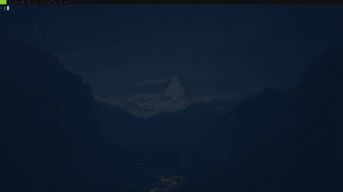
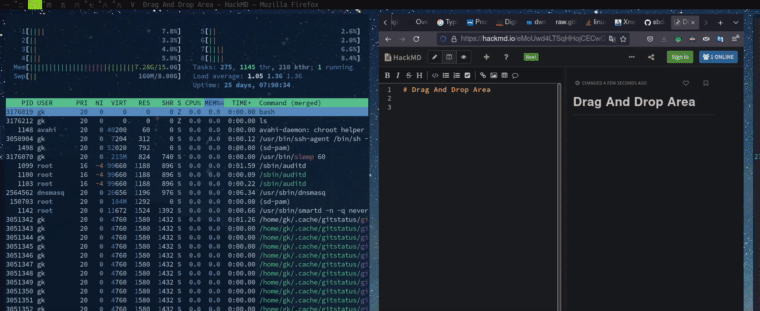
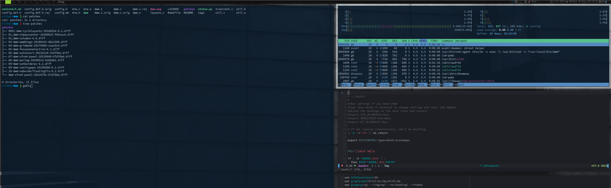

# DWM

## Patches

These are my current patches:

<!-- id: 4cc34837afb34c09b699865f9d0a78eb -->
```bash
$ tree ~/.config/dwm/patches
/home/gk/.config/dwm/patches
├── 0001-dwm-cyclelayouts-20180524-6.2.diff
├── 01_dwm-alwayscenter-20200625-f04cac6.diff
├── 02_dwm-columns-6.0.diff
├── 03-dwm-ewmhtags-20180101-db22360.diff
├── 04-dwm-gridmode-20170909-ceac8c9.diff
├── 05-dwm-focusonnetactive-6.2.diff
├── 06-dwm-autostart-20210120-cb3f58a.diff
├── 07-dwm-xfce4-panel-20210606-67d76bd.diff
├── 08-dwm-pertag-20200914-61bb8b2.diff
├── 09-dwm-setborderpx-6.2.diff
├── 09-dwm-vanitygaps-20190508-6.2.diff
├── 10-dwm-noborderfloatingfix-6.2.diff
└── dwm-xfce4-panel-20210701-67d76bd.diff

0 directories, 13 files
```
<!-- id: 4cc34837afb34c09b699865f9d0a78eb -->

### xfce4-panel

The statusbar is from myself, [got accepted](https://dwm.suckless.org/patches/xfce4-panel/) by the
suckless guys as official patch (hooray). 


I made it because

- I wanted a systray but the official [systray patch](https://dwm.suckless.org/patches/systray/) is
  massive and collided with other patches, e.g. statuscolors if I remember correctly
- Also statuscolors made dwm eat CPU, strangely, became often visible in htop - which is not
  suckless.

#### Design

It works by simple starting the panel as a normal window - but detecting it by window class name and moving it to the top
right position, plus preventing it showing up in the tag indicators and at cyclewindow actions.
See the diff [here](https://dwm.suckless.org/patches/xfce4-panel/).


## Hacking DWM: Xephyr

[xnest/Xephyr](https://www.linuxtoday.com/blog/xnest-tutorial/) is totally amazing and one of the many reasons I prefer X11.

!!! important
    Using Xephyr you can test all dwm patches w/o having to restart the actual one. This is far more
    convenient than switching back and forth between different Xsessions.


This

<!-- id: 622fb26a213c26837d8a4d9d8fca6ed1 -->
```bash
$ cat /home/gk/bin/xnest
#!/usr/bin/env bash
Xephyr -br -ac -noreset -screen 1800x1000 :1 &
sleep 1
DISPLAY=:1 "${1:-dwm}"

```
<!-- id: 622fb26a213c26837d8a4d9d8fca6ed1 -->

allows to start the full Xserver with window manager in a window - and with ctrl-shift it gets ALL
keyboard events, incl. shortcuts of the outer DWM.

Only things not working

- picom - but this you can test anyway nicely outside, did not dig into getting it up
- xfce4-panel - unless I kill it outside before starting xnest:

[](img/xnest.gif)


## Drag and Drop

Not using a Desktop Environment but Window Manager only requires some integration for drag and drop,
which you need all the time in the age of web based services.

[dragon](https://github.com/mwh/dragon) is the solution, together with a little
[xdotool/scrot](https://unix.stackexchange.com/a/557100/123121) hack of mine:


[](img/drag_into.gif)

Here the script:
<!-- id: 01d6f4fba3e7ae02aae725e90a24ae07 -->

=== "Cmd"
    
    ```console
    $ bat -f /home/gk/bin/drag_into
    ```

=== "Output"

    
    <xterm />
    
        $ bat -f /home/gk/bin/drag_into
        ───────┬────────────────────────────────────────────────────────────────────────
               │ File: /home/gk/bin/drag_into
        ───────┼────────────────────────────────────────────────────────────────────────
           1   │ #!/usr/bin/env bash
           2   │ set -x
           3   │ doc="$0 <filename|'shot'>
           4   │ 
           5   │ Drags a given file to where the mouse is using dragon. Click to drop it (anywere).
           6   │ If filename is 'shot' then the file will be a shot of a an area to be selected.
           7   │ "
           8   │ 
           9   │ cmd_shot="shot"
          10   │ file=
          11   │ 
          12   │ exit_help () { echo -e "$doc"; exit 1; }
          13   │ 
          14   │ select_shot_area () {
          15   │     # create screen shot    
          16   │     notify-send "Select area - we'll shoot it and drag to where the mouse is."
          17   │     cd "$HOME/Pictures/shots/" || exit 1
          18   │     rm -f "latest.png"
          19   │     # the cp we do to have convenient cp of always same files into images dirs:
          20   │     scrot -s '%Y-%m-%d_$wx$h_scrot.png' -e 'ln -s $f latest.png; cp $f last.png'
          21   │     file="`readlink latest.png`"
          22   │ }
          23   │ 
          24   │ main () {
          25   │     test "$1" == '-t' && {
          26   │         notify-send "Sleeping $2 seconds before shot..."
          27   │         sleep $2
          28   │         shift 2
          29   │     }
          30   │     file="$1"
          31   │     test -z "$file" -o "$file" == "-h" && exit_help
          32   │     eval "$(xdotool getmouselocation --shell)" # into $X and $Y
          33   │     test "$file" == "$cmd_shot" && { select_shot_area || return 1; }
          34   │     set -x
          35   │     killall dragon 2>/dev/null # No accidential drops of wrong items ...
          36   │     #dragon --and-exit "$file" &
          37   │     dragon  "$file" & # when the target is not visible we have a hard time
          38   │     # wait for dragon window to show up:
          39   │     while true; do
          40   │         xid="$(xdotool search --onlyvisible --class  dragon | head -n 2)"
          41   │         test -z "$xid" || break
          42   │         sleep 0.05
          43   │     done
          44   │     # now click the dragon window and stay on the button:
          45   │     xdotool mousemove --sync -w "$xid" 1 1 mousedown 1 mousemove $X $Y 
          46   │     notify-send "Click to drop $file or hit escape. We will kill the dragon window in a minute... "
          47   │     ( sleep 60; xkill -id "$xid" ) &
          48   │ }
          49   │ 
          50   │ main "$@"
          51   │ 
        ───────┴────────────────────────────────────────────────────────────────────────
    
    


<!-- id: 01d6f4fba3e7ae02aae725e90a24ae07 -->

I.e.: Hotkey to start script -> select area -> click into drop area. Done.


It uses scrot to make a screenshot of a selected area, then dragon to create a drag window top left,
then xdotool to click and drag that to the point where you click.


## Services

Via the autostart patch I start these:

<!-- id: 6dadac2ce6fc53cc92f9df459d63f7a0 -->

=== "Cmd"
    
    ```console
    $ bat -f /home/gk/.config/dwm/autostart.sh
    ```

=== "Output"

    
    <xterm />
    
        $ bat -f /home/gk/.config/dwm/autostart.sh
        ───────┬────────────────────────────────────────────────────────────────────────
               │ File: /home/gk/.config/dwm/autostart.sh
        ───────┼────────────────────────────────────────────────────────────────────────
           1   │ #!/bin/bash
           2   │ here="$(builtin cd "$(dirname ${BASH_SOURCE[0]})"; pwd)"
           3   │ 
           4   │ function run {
           5   │   if ! pgrep "$(basename "$1")" ;
           6   │   then
           7   │     $@&
           8   │   fi
           9   │ }
          10   │ 
          11   │ $HOME/bin/X11_setup.sh
          12   │ 
          13   │ #run "dex $HOME/.config/autostart/arcolinux-welcome-app.desktop"
          14   │ #run "xrandr --output VGA-1 --primary --mode 1360x768 --pos 0x0 --rotate normal"
          15   │ #run "xrandr --output HDMI2 --mode 1920x1080 --pos 1920x0 --rotate normal --output HDMI1 --primary --mode 1920x1080 --pos 0x0 --rotate normal --output VIRTUAL1 --off"
          16   │ #run xrandr --output eDP-1 --primary --mode 1368x768 --pos 0x0 --rotate normal --output DP-1 --off --output HDMI-1 --off --output DP-2 --off --output HDMI-2 --off
          17   │ #run xrandr --output LVDS1 --mode 1366x768 --output DP3 --mode 1920x1080 --right-of LVDS1
          18   │ #run xrandr --output DVI-I-0 --right-of HDMI-0 --auto
          19   │ #run xrandr --output DVI-1 --right-of DVI-0 --auto
          20   │ #run xrandr --output DVI-D-1 --right-of DVI-I-1 --auto
          21   │ #run xrandr --output HDMI2 --right-of HDMI1 --auto
          22   │ 
          23   │ #run "pasystray"
          24   │ run "nm-applet"
          25   │ run "pamac-tray"
          26   │ run "variety"
          27   │ run "xfce4-power-manager"
          28   │ #run "blueberry-tray"
          29   │ run "/usr/lib/xfce4/notifyd/xfce4-notifyd"
          30   │ run "/usr/lib/polkit-gnome/polkit-gnome-authentication-agent-1"
          31   │ run "numlockx on"
          32   │ run "$here/cpu_mon.py"
          33   │ #run "volumeicon"
          34   │ #run "$HOME/.config/dwm/status.py" # restarting:
          35   │ run sxhkd
          36   │ #run st
          37   │ run $here/panel.sh
          38   │ run picom
          39   │ run /usr/lib64/xfce4/notifyd/xfce4-notifyd
          40   │ # collides with panel setup when overlapping in time:
          41   │ ( sleep 4; xrdb -load .config/st_theme/Xresources; )
          42   │ #picom -b  --config ~/.config/arco-dwm/picom.conf &
          43   │ #run "nitrogen --restore"
          44   │ 
          45   │ # this is run every second!
          46   │ #( while true; do sleep 4; copyq; done ) & # our clip board science
          47   │ # run "copyq" # autostarts 
          48   │ #run "conky -c $HOME/.config/dwm/system-overview-conky"
          49   │ #you can set wallpapers in themes as well
          50   │ #feh --bg-fill /usr/share/backgrounds/arcolinux/arco-wallpaper.jpg &
          51   │ 
          52   │ #run applications from startup
          53   │ 
          54   │ #run "insync start"
          55   │ #run "spotify"
          56   │ #run "ckb-next -b"
          57   │ #run "discord"
          58   │ #run "telegram-desktop"
        ───────┴────────────────────────────────────────────────────────────────────────
    
    


<!-- id: 6dadac2ce6fc53cc92f9df459d63f7a0 -->


## No Gaps - but Gaps

Vanitygaps is bloated plus I wanted a prominent active window indicator.

Solution: I simply use thick borders and have them black for the non active window and white for the active one via dwm, then set them to 0.7 transparent via picom:


    # Opacity of window titlebars and borders. (0.1 - 1.0, disabled by default)
    # frame-opacity = 1.0
    frame-opacity = 0.7;


=> That effects black far more than white.

I.e. there are actually no gaps - but the illusion is given.

[](img/dwmgaps.png)


## Config

For varying shortcuts I don't recompile dwm but use sxhkdrc:

<!-- id: c346ef744e162afdfdc93f293b32997d -->

=== "Cmd"
    
    ```console
    $ bat -f /home/gk/.config/sxhkd/sxhkdrc
    ```

=== "Output"

    
    <xterm />
    
        $ bat -f /home/gk/.config/sxhkd/sxhkdrc
        ───────┬────────────────────────────────────────────────────────────────────────
               │ File: /home/gk/.config/sxhkd/sxhkdrc
        ───────┼────────────────────────────────────────────────────────────────────────
           1   │ #################################################################
           2   │ # KEYBOARD BINDINGS FOR ANY TWM
           3   │ #################################################################
           4   │ 
           5   │ #################################################################
           6   │ # SUPER + FUNCTION KEYS
           7   │ #################################################################
           8   │ # Vivaldi
           9   │ super + F1
          10   │     vivaldi-stable
          11   │ 
          12   │ # Atom
          13   │ super + F2
          14   │     atom
          15   │ 
          16   │ #Inkscape
          17   │ super + F3
          18   │     inkscape
          19   │ 
          20   │ #Gimp
          21   │ super + F4
          22   │     gimp
          23   │ 
          24   │ #Meld
          25   │ super + F5
          26   │     meld
          27   │ 
          28   │ #Vlc
          29   │ super + F6
          30   │     vlc --video-on-top
          31   │ 
          32   │ #Virtualbox
          33   │ super + F7
          34   │     virtualbox
          35   │ 
          36   │ #Thunar
          37   │ super + F8
          38   │     thunar
          39   │ 
          40   │ #Evolution
          41   │ super + F9
          42   │     evolution
          43   │ 
          44   │ #Spotify
          45   │ super + F10
          46   │     spotify
          47   │ 
          48   │ #Rofi Fullscreen
          49   │ super + F11
          50   │     rofi -show run -fullscreen
          51   │ 
          52   │ #Rofi
          53   │ super + F12
          54   │     rofi -show run
          55   │ 
          56   │ #################################################################
          57   │ # SUPER + ... KEYS
          58   │ #################################################################
          59   │ 
          60   │ #Atom
          61   │ super + e
          62   │     atom
          63   │ 
          64   │ #Browser
          65   │ super + w
          66   │     vivaldi-stable
          67   │ 
          68   │ #Conky-toggle
          69   │ super + c
          70   │     conky-toggle
          71   │ 
          72   │ #Htop
          73   │ #super + h
          74   │ #    urxvt 'htop task manager' -e htop
          75   │ 
          76   │ #arcolinux-logout
          77   │ super + x
          78   │     arcolinux-logout
          79   │ 
          80   │ #Rofi theme selector
          81   │ super + r
          82   │     rofi-theme-selector
          83   │ 
          84   │ #Urxvt
          85   │ #super + t
          86   │ #    urxvt
          87   │ 
          88   │ #Pavucontrol
          89   │ super + v
          90   │     pavucontrol
          91   │ 
          92   │ #Pragha
          93   │ #super + m
          94   │ #    pragha
          95   │ 
          96   │ #Termite
          97   │ super + Return
          98   │     termite
          99   │ 
         100   │ #Xkill
         101   │ super + Escape
         102   │     xkill
         103   │ 
         104   │ #Keyboard dependent
         105   │ #termite
         106   │ super + KP_Enter
         107   │     termite
         108   │ 
         109   │ #################################################################
         110   │ # SUPER + SHIFT KEYS
         111   │ #################################################################
         112   │ 
         113   │ #File-Manager
         114   │ super + shift + Return
         115   │     thunar
         116   │ 
         117   │ #Keyboard dependent
         118   │ #File-Manager
         119   │ super + shift + KP_Enter
         120   │     thunar
         121   │ 
         122   │ #dmenu
         123   │ super + shift + d
         124   │     dmenu_run -i -nb '#191919' -nf '#fea63c' -sb '#fea63c' -sf '#191919' -fn 'NotoMonoRegular:bold:pixelsize=14'
         125   │ 
         126   │ #reload sxhkd:
         127   │ super + shift + s
         128   │     pkill -USR1 -x sxhkd; notify-send -u critical "sxhkd config reloaded"
         129   │ 
         130   │ 
         131   │ #################################################################
         132   │ # CONTROL + ALT KEYS
         133   │ #################################################################
         134   │ 
         135   │ #arcolinux-welcome-app
         136   │ ctrl + alt + w
         137   │      arcolinux-welcome-app
         138   │ 
         139   │ #arcolinux-tweak-tool
         140   │ ctrl + alt + e
         141   │     arcolinux-tweak-tool
         142   │ 
         143   │ #conky-rotate
         144   │ ctrl + alt + Next
         145   │      conky-rotate -n
         146   │ 
         147   │ #conky-rotate
         148   │ ctrl + alt + Prior
         149   │     conky-rotate -p
         150   │ 
         151   │ #File-Manager
         152   │ ctrl + alt + b
         153   │      thunar
         154   │ 
         155   │ #Catfish
         156   │ ctrl + alt + c
         157   │      catfish
         158   │ 
         159   │ #Chromium
         160   │ ctrl + alt + g
         161   │     chromium -no-default-browser-check
         162   │ 
         163   │ #Firefox
         164   │ ctrl + alt + f
         165   │      firefox
         166   │ 
         167   │ #Nitrogen
         168   │ ctrl + alt + i
         169   │      nitrogen
         170   │ 
         171   │ #arcolinux-logout
         172   │ ctrl + alt + k
         173   │      arcolinux-logout
         174   │ 
         175   │ #arcolinux-logout
         176   │ ctrl + alt + l
         177   │     arcolinux-logout
         178   │ 
         179   │ #Pamac-manager
         180   │ ctrl + alt + p
         181   │     pamac-manager
         182   │ 
         183   │ #Xfce4-settings-manager
         184   │ ctrl + alt + m
         185   │      xfce4-settings-manager
         186   │ 
         187   │ #Pulse Audio Control
         188   │ ctrl + alt + u
         189   │      pavucontrol
         190   │ 
         191   │ #Rofi theme selector
         192   │ ctrl + alt + r
         193   │   rofi-theme-selector
         194   │ 
         195   │ #Spotify
         196   │ ctrl + alt + s
         197   │    spotify
         198   │ 
         199   │ #Termite
         200   │ ctrl + alt + Return
         201   │     st
         202   │ 
         203   │ #termite
         204   │ ctrl + alt + t
         205   │     termite
         206   │ 
         207   │ #Vivaldi
         208   │ ctrl + alt + v
         209   │     vivaldi-stable
         210   │ 
         211   │ #Xfce4-appfinder
         212   │ ctrl + alt + a
         213   │     xfce4-appfinder
         214   │ 
         215   │ #Keyboard dependent
         216   │ #termite
         217   │ #ctrl + alt + KP_Enter
         218   │ #     termite
         219   │ 
         220   │ 
         221   │ #################################################################
         222   │ # ALT + ... KEYS
         223   │ #################################################################
         224   │ 
         225   │ ##Wallpaper trash
         226   │ #alt + t
         227   │ #    variety -t
         228   │ 
         229   │ ##Wallpaper next
         230   │ #alt + n
         231   │ #    variety -n
         232   │ 
         233   │ ##Wallpaper previous
         234   │ #alt + p
         235   │ #    variety -p
         236   │ 
         237   │ ##Wallpaper favorite
         238   │ #alt + f
         239   │ #    variety -f
         240   │ 
         241   │ ##Wallpaper previous
         242   │ #alt + Left
         243   │ #    variety -p
         244   │ 
         245   │ ##Wallpaper next
         246   │ #alt + Right
         247   │ #    variety -n
         248   │ 
         249   │ ##Wallpaper toggle-pause
         250   │ #alt + Up
         251   │ #    variety --toggle-pause
         252   │ 
         253   │ ##Wallpaper resume
         254   │ #alt + Down
         255   │ #    variety --resume
         256   │ 
         257   │ ##Gmrun
         258   │ #alt + F2
         259   │ #    gmrun
         260   │ 
         261   │ ##Xfce4-appfinder
         262   │ #alt + F3
         263   │ #    xfce4-appfinder
         264   │ 
         265   │ 
         266   │ #################################################################
         267   │ #VARIETY KEYS WITH PYWAL
         268   │ #################################################################
         269   │ 
         270   │ #Wallpaper trash
         271   │ alt + shift + w
         272   │     variety --selector 
         273   │ 
         274   │ #Wallpaper next
         275   │ alt + shift + n
         276   │     variety -n && wal -i $(cat $HOME/.config/variety/wallpaper/wallpaper.jpg.txt)&
         277   │ 
         278   │ #Wallpaper previous
         279   │ alt + shift + p
         280   │     variety -p && wal -i $(cat $HOME/.config/variety/wallpaper/wallpaper.jpg.txt)&
         281   │ 
         282   │ #Wallpaper favorite
         283   │ alt + shift + f
         284   │     variety -f && wal -i $(cat $HOME/.config/variety/wallpaper/wallpaper.jpg.txt)&
         285   │ 
         286   │ #Wallpaper update
         287   │ alt + shift + u
         288   │     wal -i $(cat $HOME/.config/variety/wallpaper/wallpaper.jpg.txt)&
         289   │ 
         290   │ #################################################################
         291   │ # CONTROL + SHIFT KEYS
         292   │ #################################################################
         293   │ 
         294   │ #Xcfe4-TaskManager
         295   │ ctrl + shift + Escape
         296   │     xfce4-taskmanager
         297   │ 
         298   │ 
         299   │ #################################################################
         300   │ #     SCREENSHOTS
         301   │ #################################################################
         302   │ 
         303   │ #Scrot
         304   │ Print
         305   │     scrot 'ArcoLinux-%Y-%m-%d-%s_screenshot_$wx$h.jpg' -e 'mv $f $$(xdg-user-dir PICTURES)'
         306   │ 
         307   │ #screeenshooter
         308   │ ctrl + Print
         309   │      xfce4-screenshooter
         310   │ 
         311   │ #Gnome-Screenshot
         312   │ ctrl + shift + Print
         313   │      gnome-screenshot -i
         314   │ 
         315   │ 
         316   │ #################################################################
         317   │ #     FUNCTION KEYS
         318   │ #################################################################
         319   │ 
         320   │ #xfce4-terminal dropdown
         321   │ F12
         322   │     xfce4-terminal --drop-down
         323   │ 
         324   │ #Delete
         325   │ ctrl + Delete
         326   │     /usr/bin/python /usr/lib/arcologout/arcologout.py
         327   │ 
         328   │ 
         329   │ #################################################################
         330   │ #     MULTIMEDIA KEYS
         331   │ #################################################################
         332   │ 
         333   │ #Raises volume
         334   │ XF86AudioRaiseVolume
         335   │     /home/gk/bin/hw audioraise
         336   │     #amixer set Master 10%+
         337   │ 
         338   │ #Lowers volume
         339   │ XF86AudioLowerVolume
         340   │     /home/gk/bin/hw audiolower
         341   │     #amixer set Master 10%-
         342   │ 
         343   │ #Mute
         344   │ XF86AudioMute
         345   │     /home/gk/bin/hw audiomute
         346   │     #amixer -D pulse set Master 1+ toggle
         347   │ 
         348   │ XF86Display
         349   │     /home/gk/bin/hw display
         350   │ #Playerctl works for Pragha, Spotify and others
         351   │ #Delete the line for playerctl if you want to use mpc
         352   │ #and replace it with the corresponding code
         353   │ #mpc works for e.g.ncmpcpp
         354   │ #mpc toggle
         355   │ #mpc next
         356   │ #mpc prev
         357   │ #mpc stop
         358   │ 
         359   │ #PLAY
         360   │ XF86AudioPlay
         361   │     playerctl play-pause
         362   │ 
         363   │ #Next
         364   │ XF86AudioNext
         365   │     playerctl next
         366   │ 
         367   │ #previous
         368   │ XF86AudioPrev
         369   │     playerctl previous
         370   │ 
         371   │ #Stop
         372   │ XF86AudioStop
         373   │     playerctl stop
         374   │ 
         375   │ #Brightness up
         376   │ #XF86MonBrightnessUp
         377   │ #    xbacklight -inc 10
         378   │ 
         379   │ ##Brightness down
         380   │ #XF86MonBrightnessDown
         381   │ #    xbacklight -dec 10
         382   │ 
         383   │ 
         384   │ #################################################################
         385   │ #################################################################
         386   │ ##################   DESKTOP SPECIFIC    ########################
         387   │ #################################################################
         388   │ #################################################################
         389   │ 
         390   │ #################################################################
         391   │ # CTRL + ALT KEYS
         392   │ #################################################################
         393   │ 
         394   │ ctrl + alt + + super + f
         395   │         /home/gk/bin/find_and_type_file
         396   │ #Picom Toggle
         397   │ ctrl + alt + o
         398   │     ~/bin/picom-toggle.sh
        ───────┴────────────────────────────────────────────────────────────────────────
    
    


<!-- id: c346ef744e162afdfdc93f293b32997d -->


This is my full config

<!-- id: 62fd440c0f9cead450d8de46b49de8ba -->
```c
$ cat /home/gk/.config/dwm/config.h
/* See LICENSE file for copyright and license details. */

// clang-format off

#include <X11/XF86keysym.h>
/* appearance */

static const unsigned int borderpx       = 12  ; /* border pixel of windows */
static const unsigned int snap           = 32  ; /* snap pixel */


/*static const int bar_right_offset      = 180 ; offset from the right -depends on color tags used in dwmbar. increase if you use more of them, 0 would be correct w/o any color tag */
static const int bar_right_offset        = 0   ; /* offset from the right -depends on color tags used in dwmbar. increase if you use more of them, 0 would be correct w/o any color tag */
static const int showbar                 = 1   ; /* 0 means no bar */
static const int topbar                  = 1   ; /* 0 means bottom bar */

/* We get those all from .Xresources, dynmaically:
static const char *fonts[]          = { "monospace:size=10" };
static const char dmenufont[]       = "monospace:size=10";
static const char col_gray1[]       = "#222222";
static const char col_gray2[]       = "#444444";
static const char col_gray3[]       = "#bbbbbb";
static const char col_gray4[]       = "#eeeeee";
static const char col_cyan[]        = "#005577";
static const char *colors[][3]      = {
    [SchemeNorm] = { col_gray3, col_gray1, col_gray2 },
    [SchemeSel]  = { col_gray4, col_cyan,  col_cyan  },
};

static const char *tags[] = { "1", "2", "3", "4", "5", "6", "7", "8", "9" };
static const char *fonts[]            = { "unifont:size = 13" };
*/
static const char *fonts[] = { "Hack:size=13" };

static const char panel[][20] = { "xfce4-panel", "Xfce4-panel" };

static const unsigned int baralpha    = 0x10;
static const unsigned int borderalpha = 0x10;
/*
 * See https://github.com/jgrar/dwm-patches/tree/master/statuscolors, regarding how to close gaps in progrss meters
 * and this regarind how to really make it fancy:
  https://www.reddit.com/r/unixporn/comments/8hrkt3/dwm_powerline_themed_status_bar
    [SchemeSel]    = { "#999999", "#111111", "#88b7c1" },
 * */
static const char *colors[][4]        = {
    /*               fg         bg         border   */
    [SchemeNorm]   = { "#555555", "#111111", "#000" },
    [SchemeSel]    = { "#999999", "#111111", "#999" },
    [SchemeAX]     = { "#bbb"   , "#8bd124", "#666" },
};
/* statuscolors not required anymore, we have xfce4-panel
    [SchemeWarn]   = { "#eeee00", "#111111", "#666" },
    [SchemeUrgent] = { "#ee0000", "#111111", "#666" },
    [SchemeGood]   = { "#8bd124", "#111111", "#666" },
    [SchemeGray]   = { "#999"   , "#111111", "#666" },
};
*/
/*
static const unsigned int alphas[][3]      = {
    *               fg      bg        border     *
    [SchemeNorm] = { OPAQUE, baralpha, borderalpha },
    [SchemeSel]  = { OPAQUE, baralpha, borderalpha },
};
*/

/* tagging
static const char *tags[] = { "1", "2", "3", "4", "5", "6", "7", "8", "9" };
*/
static char *tags[] = { "一", "二", "三", "四", "五", "六", "七", "八", "九" };

static char dmenumon[2] = "0"; /* component of dmenucmd, manipulated in spawn() */
static const char *dmenucmd[] = { "bin/rofi_utils_select", "startup", NULL };

static const Rule rules[] = {
    /* xprop(1):
     *    WM_CLASS(STRING) = instance, class
     *    WM_NAME(STRING) = title
     */
    /* class                  instance    title       tags mask ,    isfloating   monitor */
    { "Arcologout.py",        NULL,       NULL,       0,                1,           -1 },
    { "SimpleScreenRecorder", NULL,       NULL,       0,                1,           -1 },
    { panel[1],               NULL,       NULL, (1 << 9) - 1,           0,           -1 },
    { "Xfce4-appfinder",      NULL,       NULL, (1 << 9) - 1,           1,           -1 },
    { "Xfrun4",               NULL,       NULL, (1 << 9) - 1,           1,           -1 },
    { "Peek",                 NULL,       NULL,       0,                1,           -1 },
    { "Dragon",               NULL,       NULL, (1 << 9) - 1,           1,           -1 },
    { "flameshot",            NULL,       NULL, (1 << 9) - 1,           1,           -1 },
    { "Variety",              NULL,       NULL,       0,                1,           -1 },
    { NULL,                   "HUD",      NULL,       0,                1,           -1 },
    { "HUD",                  NULL,       NULL,       0,                1,           -1 },
    { "HUDALL",               NULL,       NULL,  (1 << 9) - 1,          1,           -1 },
    { "Firefox",              NULL,       NULL,       0,                0,           -1 },
};

/* layout(s) */
static const float mfact     = 0.55; /* factor of master area size [0.05..0.95] */
static const int nmaster     = 1;    /* number of clients in master area */
static const int resizehints = 1;    /* 1 means respect size hints in tiled resizals */


#include "layouts.c"
static const Layout layouts[] = {
    /* symbol     arrange function */
    { "T",      tile },    /* first entry is default */
    { "F",      NULL },    /* no layout function means floating behavior */
    { "M",      monocle },
    { "G",      grid },
    { "V",      col },
};

/* key definitions */
#define MODKEY Mod4Mask
/*
#define TAGKEYS(KEY,TAG) \
    { MODKEY,                       KEY,      view,           {.ui = 1 << TAG} }, \
    { MODKEY|ControlMask,           KEY,      toggleview,     {.ui = 1 << TAG} }, \
    { MODKEY|ShiftMask,             KEY,      tag,            {.ui = 1 << TAG} }, \
    { MODKEY|ControlMask|ShiftMask, KEY,      toggletag,      {.ui = 1 << TAG} },
*/
#define TAGKEYS(KEY,TAG) \
    { ControlMask                  , KEY , view       , {.ui = 1 << TAG} } , \
    { MODKEY|ControlMask           , KEY , toggleview , {.ui = 1 << TAG} } , \
    { ControlMask|ShiftMask        , KEY , tag        , {.ui = 1 << TAG} } , \
    { MODKEY|ControlMask|ShiftMask , KEY , toggletag  , {.ui = 1 << TAG} } ,


/* helper for spawning shell commands in the pre dwm-5.0 fashion */
#define SHCMD(cmd) { .v = (const char*[]){ "/bin/sh", "-c", cmd, NULL } }


/* commands */
/*static const char *dmenucmd[] = { "dmenu_run", "-m", dmenumon, "-fn", dmenufont, "-nb", col_gray1, "-nf", col_gray3, "-sb", col_cyan, "-sf", col_gray4, NULL };
static const char *copyq_menucmd[] = { "copyq", "menu", NULL };
static const char *insert_date  [] = { "/home/gk/bin/type_date_into_window", NULL };
static const char *volumemute[]    = { "amixer", "set", "Master", "toggle"         , ";", "/home/gk/bin/refbar", NULL };

    { ControlMask                       , XK_c                     , spawn          , {.v = signtcmd                               }   } ,  this is control key on my keyboard (swapped)
    { ControlMask                       , XK_d                     , spawn          , {.v = sigdtcmd                               }   } ,  this is control key on my keyboard (swapped)
*/

static Key keys[] = {
    
    /* modifier                     key        function        argument */

    /* { ControlMask                    , XK_space  , spawn   , SHCMD("/home/gk/bin/st_hud" ) }                    , */
    /* { ControlMask|ShiftMask|Mod4Mask , XK_3      , spawn   , SHCMD("sleep 1s;/home/gk/bin/shot_selected") }     , */
    /* { ControlMask|ShiftMask          , XK_b      , spawn   , SHCMD("/home/gk/bin/clipctrl previous_item") }     , */
    /* { MODKEY|ControlMask             , XK_d      , spawn   , SHCMD("/home/gk/bin/type_date_into_window"     ) } , */
    /* { Mod4Mask                       , XK_Return , zoom    , { 0                  }}                            , * swap focus when gtk keys swapped*/
    /*{ ControlMask                     , XK_Left   , lasttag , {.i =  1} }                                        , */
    
       { MODKEY|ShiftMask , XK_1       , togglebar    , { .i = 1 } }                       ,
       { MODKEY|ShiftMask , XK_minus       , setborderpx    , { .i = -1 } }                       ,
       { MODKEY|ShiftMask , XK_equal       , setborderpx    , { .i = +1 } }                       ,
       { ControlMask      , XK_BackSpace   , killclient     , { 0                  }}             ,
       { ControlMask      , XK_q           , killclient     , { 0                  }}             ,
       { ControlMask      , XK_Return      , zoom           , { 0                  }}             , /* swap focus*/
       { ControlMask      , XK_space       , spawn          , SHCMD("/usr/bin/ulauncher" ) }      , /* faster than sxk */
       { ControlMask      , XK_Tab         , spawn          , SHCMD("/usr/bin/skippy-xd") }       ,
       { ControlMask      , XK_n           , spawn          , SHCMD("st") }                       ,
       { MODKEY|ShiftMask , XK_b           , togglebar      , { 0                  }}             ,
       { ControlMask      , XK_j           , focusstack     , { .i = -1            }}             ,
       { ControlMask      , XK_k           , focusstack     , { .i = +1            }}             ,
       { ControlMask      , XK_m           , focusmon       , { .i = -1            }}             ,
    /* { ControlMask      , XK_l           , focusmon       , { .i = +1            }}             , h is enough we have just 2 or 3 mons. l is for browser location*/
       { MODKEY|ShiftMask , XK_h           , spawn          , SHCMD("/home/gk/bin/tagmon -1" ) }  ,
       { MODKEY|ShiftMask , XK_l           , spawn          , SHCMD("/home/gk/bin/tagmon  1" ) }  ,
       { MODKEY|ShiftMask , XK_comma       , tagmon         , { .i = -1            }}             ,
       { MODKEY|ShiftMask , XK_period      , tagmon         , { .i = +1            }}             ,
       { MODKEY           , XK_i           , incnmaster     , { .i = +1            }}             ,
       { MODKEY           , XK_d           , incnmaster     , { .i = -1            }}             ,
       { Mod1Mask         , XK_h           , setmfact       , { .f = -0.05         }}             ,
       { Mod1Mask         , XK_l           , setmfact       , { .f = +0.05         }}             ,
    /* { MODKEY           , XK_Tab         , view           , { 0                  }}             , */
       { MODKEY           , XK_t           , setlayout      , { .v = &layouts[0]   }}             ,
       { MODKEY           , XK_f           , setlayout      , { .v = &layouts[1]   }}             ,
       { MODKEY           , XK_m           , setlayout      , { .v = &layouts[2]   }}             ,
       { MODKEY           , XK_g           , setlayout      , { .v = &layouts[3]   }}             ,
       { MODKEY           , XK_v           , setlayout      , { .v = &layouts[4]   }}             ,
       { MODKEY|ShiftMask , XK_period      , cyclelayout    , { .i = +1 } }                       ,
    /* { MODKEY|ShiftMask , XK_space       , setlayout      , { 0                  }}             , */
       { MODKEY|ShiftMask , XK_space       , togglefloating , { 0                  }}             ,
       { MODKEY           , XK_0           , view           , { .ui = ~0           }}             ,
       { MODKEY|ShiftMask , XK_0           , tag            , { .ui = ~0           }}             ,
       { MODKEY|ShiftMask , XK_q           , quit           , { 0                  }}             ,
       { 0                , XF86XK_Display , spawn          , SHCMD("/home/gk/bin/hw display" ) } ,

    /* xev is your friend to find those */
    /* { 0,                     XF86XK_LaunchA           , spawn,           SHCMD("/home/gk/bin/hw launcha" ) }, */
    /* { 0,                     XF86XK_MonBrightnessDown , spawn,           SHCMD("/home/gk/bin/hw monbrightdown" ) }, */
    /* { 0,                     XF86XK_MonBrightnessUp   , spawn,           SHCMD("/home/gk/bin/hw monbrightup" ) }, */
    /* { 0,                     XF86XK_AudioMute         , spawn,           SHCMD("/home/gk/bin/hw audiomute" ) }, */
    /* { 0,                     XF86XK_AudioLowerVolume  , spawn,           SHCMD("/home/gk/bin/hw audiolower" ) }, */
    /* { 0,                     XF86XK_AudioRaiseVolume  , spawn,           SHCMD("/home/gk/bin/hw audioraise" ) }, */
    /* { 0,                     XF86XK_RFKill            , spawn,           SHCMD("/home/gk/bin/hw rfkill" ) }, */
    /* { ControlMask,           XF86XK_Eject             , killclient     , {0                  }} , */
    /* { 0                  , XF86XK_Eject             , spawn,           SHCMD("/home/gk/bin/hw eject" ) }, */
    /* { 0                     , XK_F1           , spawn,           SHCMD("/home/gk/bin/hw F1" ) }, */
    /* { 0                     , XK_F2           , spawn,           SHCMD("/home/gk/bin/hw F2" ) }, */
    /* { 0                     , XK_F3           , spawn,           SHCMD("/home/gk/bin/hw F3" ) }, */
    /* { 0                     , XK_F4           , spawn,           SHCMD("/home/gk/bin/hw F4" ) }, */
    /* { 0                     , XK_F5           , spawn,           SHCMD("/home/gk/bin/hw F5" ) }, */
    /* { 0                     , XK_F6           , spawn,           SHCMD("/home/gk/bin/hw F6" ) }, */
    /* { 0                     , XK_F7           , spawn,           SHCMD("/home/gk/bin/hw F7" ) }, */
    /* { 0                     , XK_F8           , spawn,           SHCMD("/home/gk/bin/hw F8" ) }, */
    /* { 0                     , XK_F9           , spawn,           SHCMD("/home/gk/bin/hw F9" ) }, */
    /* { 0                     , XK_F10          , spawn,           SHCMD("/home/gk/bin/hw F10" ) }, */
    /* { 0                     , XK_F11          , spawn,           SHCMD("/home/gk/bin/hw F11" ) }, */
    /* { 0                     , XK_F12          , spawn,           SHCMD("/home/gk/bin/hw F12" ) }, */

    /* { ControlMask,           XK_Delete       , spawn,           SHCMD("/home/gk/bin/hw ctrl_del" ) }, */

    /* /1* Keyboard Backlight *1/ */
    /* { ControlMask        , XF86XK_MonBrightnessDown , spawn          , {.v = F13           }} , */
    /* { ControlMask        , XF86XK_MonBrightnessUp   , spawn          , {.v = F14           }} , */
    /* { 0                  , XF86XK_LaunchA           , spawn          , {.v = F03           }} , */
    /* { 0                  , XF86XK_LaunchB           , spawn          , {.v = F04           }} , */
    /* { 0                  , XF86XK_AudioPrev         , spawn          , {.v = F07           }} , */
    /* { 0                  , XF86XK_AudioPlay         , spawn          , {.v = F08           }} , */
    /* { 0                  , XF86XK_AudioNext         , spawn          , {.v = F09           }} , */
    /* { ControlMask        , XF86XK_Eject             , spawn          , {.v = pow           }} , */
    /* { ControlMask        , XF86XK_PowerOff          , spawn          , {.v = pow           }} , */
    /* { ControlMask        , XF86XK_Suspend           , spawn          , {.v = pow           }} , */

    /* {MODKEY|ControlMask|ShiftMask , XK_l            , spawn ,           SHCMD("/home/gk/bin/hw lock" ) }, */

    TAGKEYS ( XK_1 , 0)
    TAGKEYS ( XK_2 , 1)
    TAGKEYS ( XK_3 , 2)
    TAGKEYS ( XK_4 , 3)
    TAGKEYS ( XK_5 , 4)
    TAGKEYS ( XK_6 , 5)
    TAGKEYS ( XK_7 , 6)
    TAGKEYS ( XK_8 , 7)
    TAGKEYS ( XK_9 , 8)

};

/* button definitions */
/* click can be ClkTagBar, ClkLtSymbol, ClkStatusText, ClkWinTitle, ClkClientWin, or ClkRootWin */
static Button buttons[] = {
    /* click                event mask      button          function        argument */
    { ClkLtSymbol,          0,              Button1,        setlayout,      {0} },
    { ClkLtSymbol,          0,              Button3,        setlayout,      {.v = &layouts[2]} },
    { ClkWinTitle,          0,              Button2,        zoom,           {0} },
    { ClkStatusText,        0,              Button2,        spawn,          SHCMD("st") },
    { ClkClientWin,         MODKEY,         Button1,        movemouse,      {0} },
    { ClkClientWin,         MODKEY,         Button2,        togglefloating, {0} },
    { ClkClientWin,         MODKEY,         Button3,        resizemouse,    {0} },
    { ClkTagBar,            0,              Button1,        view,           {0} },
    { ClkTagBar,            0,              Button3,        toggleview,     {0} },
    { ClkTagBar,            MODKEY,         Button1,        tag,            {0} },
    { ClkTagBar,            MODKEY,         Button3,        toggletag,      {0} },
};


```
<!-- id: 62fd440c0f9cead450d8de46b49de8ba -->
