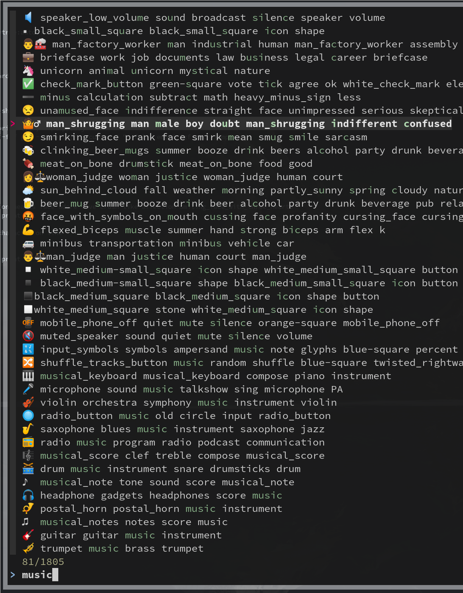

# Why I Love st

The suckless terminal for me is freedom. My C is pretty much not existing but the imperative code changes I need to do
I can look up - so I have a terminal emulator which does what *I* want.

There is no other one where I would dare to hack into, plus tool chains are usually massive (ever tried to compile vte
based one?). With st I can mess around, have an `~/.config/st ❯ ls | entr bash -c 'sudo make clean install'` running
elsewhere and a second later I have a shiny new terminal - or not, when it crashes ;-)

Bigger add ones up to now where the [theme-picker](https://www.bing.com/search?q=github+suckless-add-ons), which I heavily use to
differentiate terminals from each other, by changing their color themes.

Or the emulation of iterm2's ctrl-k, clear the buffer, which was trivial.

Here is another one:

## Call external helper with pid of terminal, when Ctrl-Clicking


config.h:

```

MouseKey mkeys[] = {
	/* button               mask            function        argument */
    /* no idea why selpaste  (e.g. from mouse sel. in surf) was not working in luke's patch w/o that: */
	{ Button3,              ControlMask,    extcmd,         {.v =  "$HOME/.config/st/ctrl_click"} },
    (...)	
```

x.c:

```C

static void extcmd(const Arg *);

(...)

void
extcmd(const Arg *extcmd)
{
    // run external command giving it our pid
    char cmd[100];
    snprintf(cmd, sizeof(cmd), "%s %d", *extcmd, getpid()); // puts string into buffer
    system(cmd);
}


```

That's it, any ctrl click is now running the external command, with the pid of st as argument (`notify-send "pid is $1"` works)


In the external program we can now do wilder stuff, using pid -> windowid ...

## The Color Emoji Crash

st crashes due to an xft bug, when displaying color Emojis.
Details from Luke: https://www.youtube.com/watch?v=f9qNXV01yzg

Fix via adding a patch to libxft. 

On Fedora:


```bash
git clone https://gitlab.freedesktop.org/xorg/lib/libxft.git
cd libxft
wget https://gitlab.freedesktop.org/xorg/lib/libxft/-/merge_requests/1.patch
patch -p1 < 1.patch
sudo dnf install xorg-x11-util-macros
sh autogen.sh --sysconfdir=/etc --prefix=/usr --mandir=/usr/share/man
make
make install
```

And finally you have your "black female police officer" emoji:

[](./img/emoji.png)


