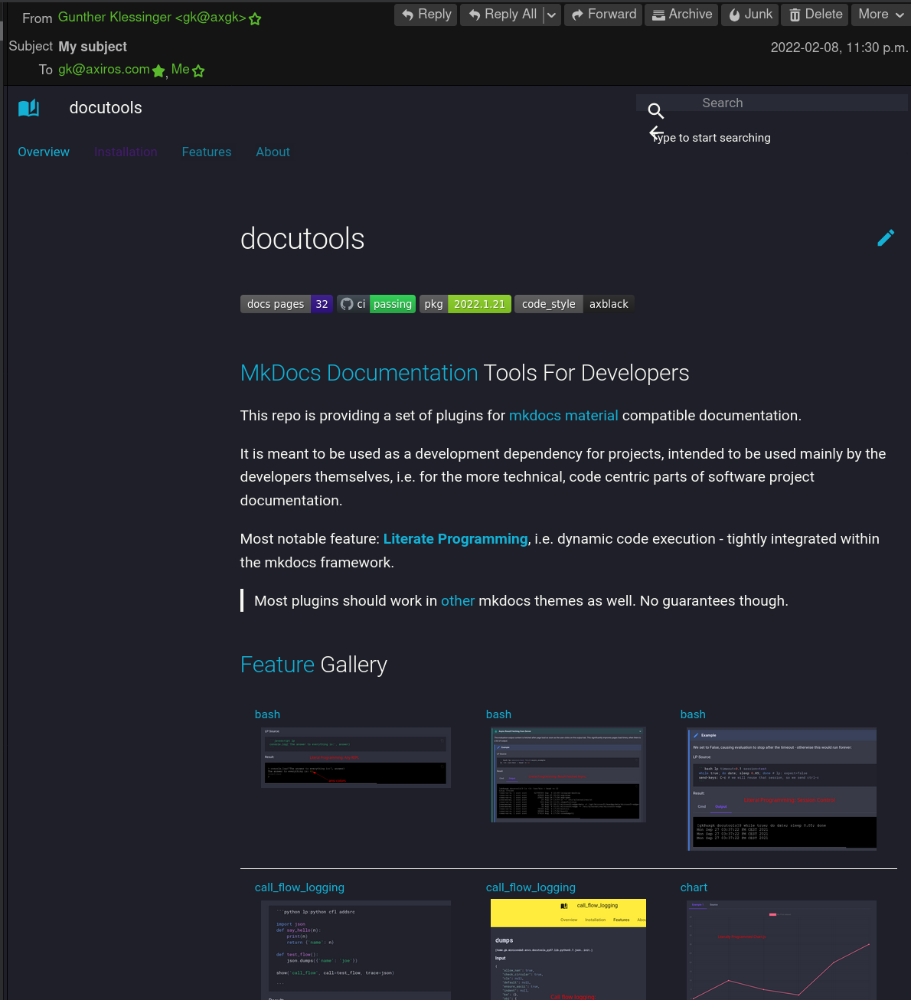

# Thoughts About Writing HTML in vim

Email with inline pictures is very unconvenient in Thunderbird.

Why not write in vim.

- CTRL-E -> [tb-edit](https://github.com/muk-git/tb-my-editor.git) transfers content to external editor

- This sends result via mutt, as html:

    mutt  -e 'set content_type=text/html' -s 'My subject' -e 'set from = "user@domain.com"' -e 'set realname = "Realname of the user"' 'gk@axiros.com,gunther.klessinger@axiros.com'  < email.html\n

- This also: https://pypi.org/project/sender/

- [This](https://github.com/gildas-lormeau/SingleFile/tree/master/companion) downloads a web page
  into a single file, with only required / minimum CSS  (see Settings of the chrome plugin)

  edge://extensions/?options=mpiodijhokgodhhofbcjdecpffjipkle

  Beauty: the external images are uuencoded and put into the html, so email clients will show them

  

- MDPreview to render from vim

