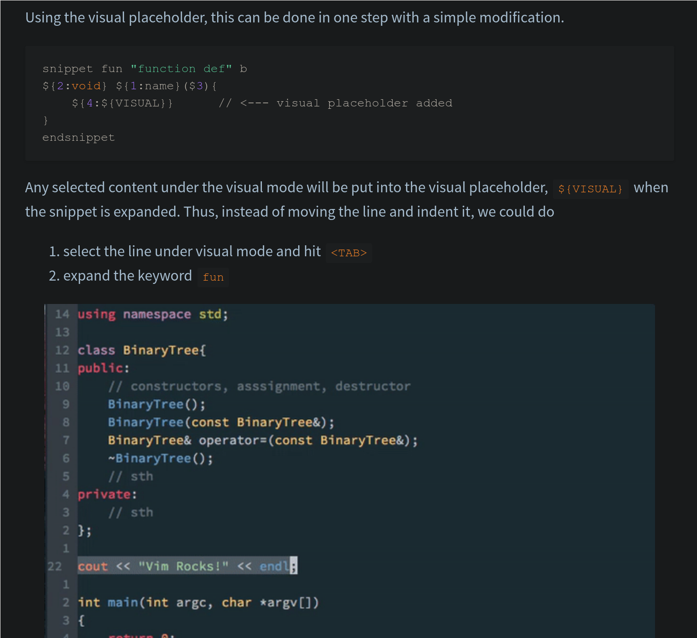

# Ultisnips

```lua
        -- the machinery
        use "SirVer/ultisnips"
        -- tons of language snippets
        use "honza/vim-snippets"
```

## Navigation: Tab only (i.e. you jump e.g. back via Shift-Tab):
```vim
let g:UltiSnipsSnippetsDir = "~/.config/nvim/ultisnips"
let g:UltiSnipsExpandTrigger="<tab>"
let g:UltiSnipsJumpForwardTrigger="<tab>"
let g:UltiSnipsJumpBackwardTrigger="<s-tab>" 
```

## Options

- w: Only expand when its a full word
- b: Only at beginning of line
- A: Autoexpand when expansion crits are met

## Cool Stuffs

- `:Snippets` in vim and you get an FZF list of all snippets defined for the current buffer
    TODO: Add the content...
- for html its pure joy: any tagname -> TAB -> done

## Gotchas

!!! danger "configure in init.vim not in lua"
    [2021-08-18 00:55]  
    See [ultisnips page](./ll/vim/ultisnips.md)

    Drove me crazy that lua based config in packer did only work ...50%, e.g. the second parameter
    never hightlighted, jumps wrong, tab not working. GRR.

    Simple solution:

    Do this:

    ```vim
        let g:SuperTabDefaultCompletionType = "<c-n>"
        let g:UltiSnipsSnippetsDir = "~/.config/nvim/ultisnips"
        let g:UltiSnipsExpandTrigger="<tab>"
        let g:UltiSnipsJumpForwardTrigger="<tab>"
        let g:UltiSnipsJumpBackwardTrigger="<s-tab>" 
    ```

    instead of:

    ```lua
        use "SirVer/ultisnips"
            config = function()
                vim.g.UltiSnipsSnippetsDir = "~/.config/nvim/ultisnips"
                vim.g.UltiSnipsSnippetDirectories = {"ultisnips"}
                vim.g.UltiSnipsJumpForwardTrigger = {"<tab>"}
            end
        }
    ```

    and it works like a charm.

## Advanced

- [Dynamic Tabstop Generation][a1] - in general: how to modify the body programmatically, incl
  variables you set at invokation

- See also the [logbook](<{ config.site_url }>/logbook)


[a1]: https://github.com/SirVer/ultisnips/blob/master/doc/examples/tabstop-generation/README.md

## Resources


!!! note "[tutorial](https://yufanlu.net/2016/10/30/ultisnips/)"
    [](img/ustut1.png)

!!! note "Youtube"

    [Taking Advantage of Using Snippets with UltiSnips and Vim-Snippets](https://www.youtube.com/watch?v=Co4S_uJYb1o)
    ```
    0:00 -- What we'll cover in this video
    0:49 -- Adding a div + paragraph with and without using snippets
    2:08 -- Using snippets from multiple file types in the same file
    4:06 -- Dealing with multiple snippets that have the same name
    4:58 -- Using snippets in a Python file
    5:56 -- Fuzzy finding available snippets using Vim FZF
    7:36 -- Skimming the README file for UltiSnips and vim-snippets
    8:41 -- Installing both Vim plugins with Vim Plug
    9:38 -- Looking at a few Markdown / podcast related custom snippets
    12:29 -- Looking at few more Markdown / blog related custom snippets
    14:07 -- Defining your own custom snippets
    16:31 -- Why I prefer using snippets over using language servers
    ```
