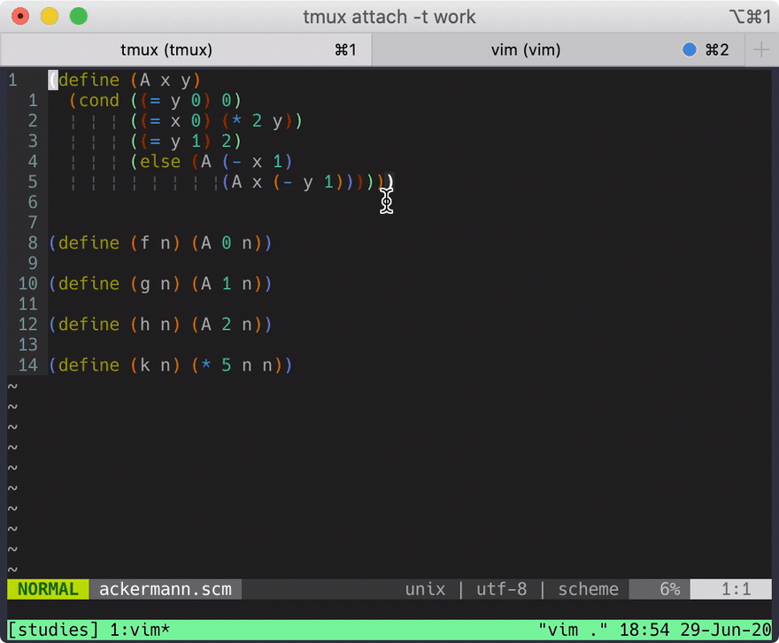
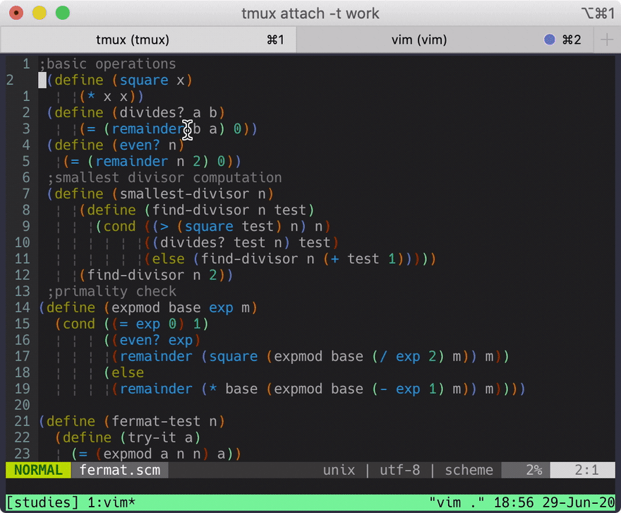
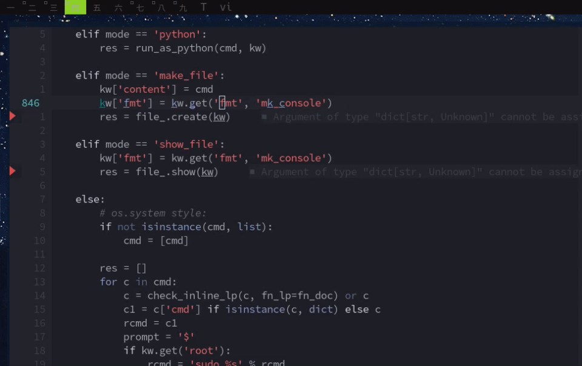
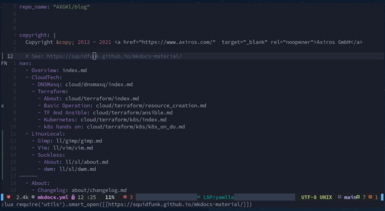
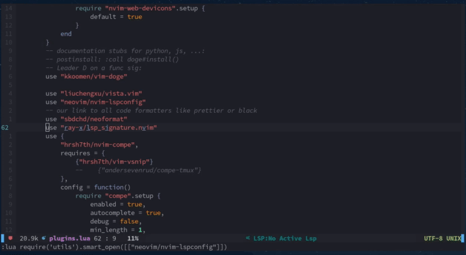

# (Neo)Vim

After a few intense rounds with emacs and vscode I'm back to vim, specifically NeoVim.

For publishing papers I'd stick to doom emacs and org -> latex -> pdf, but for the rest I'm in vim.

There are two game changers why I think: vim is not "better" than emacs - but there are no killer
features for normal text editing left, available only in emacs.

## Game Changers


### [fzf-vim](https://github.com/junegunn/fzf.vim)



fzf really simplifies tons of operations involving lists: Matching files, commits, colorschemes,
buffers, ripgrep results, whatever - it all is now at your fingertips in a convenient, lighting fast, fuzzy finding interface.

Meanwhile there is an alternative with Telescope - but for me FZF is still the better working tool.
Battle proven.

### [Lua](https://github.com/nanotee/nvim-lua-guide)

The big plus for emacs was that elisp >> vimscript. But now with lua that changed. We have a real
programming language now and integration with vim is first class!

## Hacks

I won't discuss all my config, just a few hacks of myself, maybe of interest to others.

### Python

<!-- id: 17296c72315edf4effcb7aedd855cc63 -->

=== "Cmd"
    
    ```console
    $ bat -f --terminal-width=200 ~/.config/nvim/ftplugin/python.vim
    ```

=== "Output"

    
    <xterm />
    
        $ bat -f --terminal-width=200 ~/.config/nvim/ftplugin/python.vim
        ───────┬────────────────────────────────────────────────────────────────────────────────────────────────────────────────────────────────────────────────────────────────────────────────────────────────
               │ File: /home/gk/.config/nvim/ftplugin/python.vim
        ───────┼────────────────────────────────────────────────────────────────────────────────────────────────────────────────────────────────────────────────────────────────────────────────────────────────
           1   │ setlocal textwidth=88
           2   │ setlocal foldmethod=indent
           3   │ setlocal foldlevel=99
           4   │ let g:SimpylFold_docstring_preview = 1
           5   │ map ,b Obreakpoint() # FIXME BREAKPOINT<C-c>
           6   │ map ,e   Otry:<Esc>j^i<TAB><Esc>oexcept Exception as ex:<CR>print('breakpoint set')<CR>breakpoint()<CR>keep_ctx=True<Esc>^
           7   │ setlocal expandtab
           8   │ setlocal shiftwidth=4
           9   │ setlocal softtabstop=4
          10   │ " on demand, pyright LSP is just the right amount of information for me:
          11   │ :ALEDisable
          12   │ 
          13   │ 
          14   │ 
        ───────┴────────────────────────────────────────────────────────────────────────────────────────────────────────────────────────────────────────────────────────────────────────────────────────────────
    
    


<!-- id: 17296c72315edf4effcb7aedd855cc63 -->

Wrapping of code into try except blocks:



### [(AX)Black](https://pypi.org/project/axblack/)

Simple running [axblack](https://pypi.org/project/axblack/) as external program on the current buffer, e.g. at save (`,w`) has a big
downside: All your jump marks are gone.

First I solved this by using [efm-lsp](https://github.com/mattn/efm-langserver) and [Lukas Reineke's approach](https://www.reddit.com/r/neovim/comments/jvisg5/lets_talk_formatting_again/).

But I found that [NeoFormat](https://github.com/sbdchd/neoformat) does the job quite well, they trick nvim into a line by line mode when
formatting - so all marks are preserved and single-transaction undos can also be made working via a
modified undojoin:

```lua
--vim.cmd [[autocmd BufWritePre * undojoin | Neoformat]] --but https://github.com/sbdchd/neoformat/issues/134
vim.cmd [[ au BufWritePre * try | undojoin | Neoformat | catch /^Vim\%((\a\+)\)\=:E790/ | finally | silent Neoformat | endtry ]]
```

Here I set a mark (`b`), show LSP completion, then write a double quoted value. Then reformat (on save), then jump back to the mark. Then I undo all
transactions:


Neoformat's approach also works for other language formatters, clear. See their [list](https://github.com/sbdchd/neoformat) of supported
formatters.

### Useful(?) in General

#### Color Picker

This is my version - scans all available colorschemes and toggles transparency as well:


When set as default it writes a file which is sourced by `init.vim`.

<!-- id: 5f06b847b2ed7ae776fe3da1808778f4 -->

=== "Cmd"
    
    ```console
    $ bat -f  /home/gk/.config/nvim/lua/colorpicker.lua
    ```

=== "Output"

    
    <xterm />
    
        $ bat -f  /home/gk/.config/nvim/lua/colorpicker.lua
        ───────┬────────────────────────────────────────────────────────────────────────
               │ File: /home/gk/.config/nvim/lua/colorpicker.lua
        ───────┼────────────────────────────────────────────────────────────────────────
           1   │ local fzf = require "fzf".fzf
           2   │ local action = require "fzf.actions".action
           3   │ require "os"
           4   │ 
           5   │ vim.g.bg_is_transp = false
           6   │ 
           7   │ local function get_colorschemes()
           8   │     local colorscheme_vim_files = vim.fn.globpath(vim.o.rtp, "colors/*.vim", true, true)
           9   │     local colorschemes = {}
          10   │     table.insert(colorschemes, vim.g.colors_name) -- first one selected
          11   │     for _, colorscheme_file in ipairs(colorscheme_vim_files) do
          12   │         local colorscheme = vim.fn.fnamemodify(colorscheme_file, ":t:r")
          13   │         table.insert(colorschemes, colorscheme)
          14   │     end
          15   │     return colorschemes
          16   │ end
          17   │ 
          18   │ local function toggle_background_transparency(toggle)
          19   │     -- when toggle is set we change, otherwise we set it transparent when it should be (required after colorscheme change)
          20   │     if vim.g.bg_is_transp == true then
          21   │         --os.execute("notify-send toggle")
          22   │         vim.g.bg_is_transp = false
          23   │         vim.cmd("colorscheme " .. get_current_colorscheme())
          24   │     else
          25   │         vim.g.bg_is_transp = true
          26   │         vim.cmd("hi Normal guibg=NONE ctermbg=NONE")
          27   │     end
          28   │ end
          29   │ 
          30   │ function get_current_colorscheme()
          31   │     if vim.g.colors_name then
          32   │         return vim.g.colors_name
          33   │     else
          34   │         return "default" --not all have the colors_name exposed
          35   │     end
          36   │ end
          37   │ 
          38   │ function set_color_scheme(name)
          39   │     vim.cmd("colorscheme " .. name)
          40   │     if vim.g.bg_is_transp == true then
          41   │         vim.cmd("hi Normal guibg=NONE ctermbg=NONE")
          42   │     end
          43   │ end
          44   │ 
          45   │ coroutine.wrap(
          46   │     function()
          47   │         local preview_function =
          48   │             action(
          49   │             function(args)
          50   │                 if args then
          51   │                     set_color_scheme(args[1])
          52   │                 end
          53   │             end
          54   │         )
          55   │         while (1 == 1) do
          56   │             local current_colorscheme = get_current_colorscheme()
          57   │             -- os.execute ('notify-send ' .. current_colorscheme)
          58   │             local choices =
          59   │                 fzf(
          60   │                 get_colorschemes(),
          61   │                 "--header='b to toggle transp\nD: set as default' --preview=" ..
          62   │                     preview_function .. " --preview-window right:0 --bind=j:down,k:up,q:abort --expect=b --expect=D",
          63   │                 {height = vim.o.lines - 10, width = 30, row = 1}
          64   │             )
          65   │             if not choices then
          66   │                 vim.cmd("colorscheme " .. current_colorscheme)
          67   │                 break
          68   │             else
          69   │                 if choices[1] == "b" then
          70   │                     toggle_background_transparency()
          71   │                 elseif choices[1] == "D" then
          72   │                     local fn = "/home/gk/.config/nvim/cur_colorscheme.vim"
          73   │                     local file = io.open(fn, "w")
          74   │                     file:write("colorscheme " .. choices[2])
          75   │                     file:close()
          76   │                     os.execute("notify-send 'colorscheme written " .. choices[2] .. "' '" .. fn .. "'")
          77   │                     set_color_scheme(choices[2])
          78   │                     break
          79   │                 else
          80   │                     set_color_scheme(choices[2])
          81   │                     break
          82   │                 end
          83   │             end
          84   │         end
          85   │     end
          86   │ )()
        ───────┴────────────────────────────────────────────────────────────────────────
    
    


<!-- id: 5f06b847b2ed7ae776fe3da1808778f4 -->


#### Smart Goto

Example use case: We want to open the preprocessing source files for markdown, as soon as `,g` is
invoked on a link to its rendering result, e.g. in `mkdocs.yml`'s nav section. The file can be anywhere in the whole subtree, i.e. in
the docs folder...

When the selection is URL or a file not findable in the subtree we open in the browser:



- Cursor over word or visual selection
- `,g` => open in nvim or browser

!!! note "Functioning"

    Result: A python script gets the word under cursor or visual selection and can decide if to open the
    word as a new vim buffer or send it to the browser as URL or as google search string.

That can naturally be all done in lua but I wanted to quickly change the decisioning process - and
I'm not fit enough in lua to do that on the fly.

So there is the following lua python integration: In lua we use the vim api to get the current word
/ URL or vis selection, write that to a file, syncronously call a python  subprocess and read back
what it wrote into that file, than open it in vim. If there was nothing written, then we do nothing.
The latter happens, when python already calls the browser.


=== "vim hotkey"
    ```vim
    " Universal scriptable file or browser opener over word:
    nmap ,g viW"ay:lua require('utils').smart_open([[<C-R>a]])<CR><CR>
    vmap ,g :lua require('utils').smart_open([[visualsel]])<CR><CR>
    ```


=== "LUA"
    ```lua

    local function visual_selection_range()
        local _, csrow, cscol, _ = unpack(vim.fn.getpos("'<"))
        local _, cerow, cecol, _ = unpack(vim.fn.getpos("'>"))
        if csrow < cerow or (csrow == cerow and cscol <= cecol) then
            return csrow - 1, cscol - 1, cerow - 1, cecol
        else
            return cerow - 1, cecol - 1, csrow - 1, cscol
        end
    end

    M.smart_open = function(arg)
        -- gf opens anything openable. Calls a python app, which writes back if vim should open it
        -- we have a vmap of ,g to this with arg "visualsel" -> get that selection from the buffer:
        if arg == "visualsel" then
            local csrow, cscol, cerow, cecol = visual_selection_range()
            local l = vim.api.nvim_buf_get_lines(vim.api.nvim_get_current_buf(), csrow, csrow + 1, true)
            arg = l[1]
            arg = arg:sub(cscol, cecol)
        end
        local fn = "/tmp/smartopen"
        local file = io.open(fn, "w")
        io.output(file)
        io.write(arg)
        io.close(file)
        os.execute(os.getenv("HOME") .. "/.config/nvim/smart_vi_open")

        --local pth = arg --:gsub('"', "")
        --pth = pth:gsub("'", "")
        --pth = string.gsub(pth, "'", "")
        file = io.open(fn, "r")
        if file ~= nil then
            io.input(file)
            local s = io.read()
            io.close(file)
            os.execute("notify-send 'vi: " .. s .. "'")
            vim.cmd("edit " .. s)
        end
        return ""
    end
    ```

=== "Python"

    <!-- id: d8096758f10de05e3acc163498f4578a -->
            ```python
            $ cat /home/gk/.config/nvim/smart_vi_open
            #!/usr/bin/env python
            """
            triggered from vim, by gf on a word
            """
            import os
            import sys
            
            exists = os.path.exists
            # http://heise.de
            from html import escape
            
            log = lambda s: open('/tmp/smartopen.log', 'a').write(
                '\ncwd: %s; %s\n' % (os.getcwd(), s)
            )
            
            # 'foo/bar'
            
            fn_from_lua = '/tmp/smartopen'
            #'/etc/hosts'
            
            
            def send(fn):
                log('sending back: %s' % fn)
                with open(fn_from_lua, 'w') as fd:
                    fd.write(fn)
                sys.exit(0)
            
            
            def try_fd(s):
                if s.startswith('.'):
                    s = s.rsplit('/', 1)[-1]
                if s.endswith('.md'):
                    if try_fd(s + '.lp'):
                        return True
            
                cmd = 'fd --max-results=1 "%s$"' % s
                log('got cmd: %s' % cmd)
                fn = os.popen(cmd).read()
                log('got fn: %s' % fn)
                if exists(fn.strip()):
                    send(fn)
                    return True
            
            
            def main():
                with open(fn_from_lua) as fd:
                    s = fd.read().strip()
                log('got string: ' + s)
                os.unlink(fn_from_lua)
                # resolves "[title](./file.md)": ( before [:
                for k in "''", '""', '()', '[]', '{}':
                    s = s.replace(k, '')
                    while k[0] in s:
                        # log(k + s)
                        s = s.split(k[0], 1)[1]
                        s = s.split(k[1], 1)[0]
            
                # log('done:' + s)
                for d in '', './docs/':
                    # open the file in nvim:
                    fn = d + s
                    if exists(fn):
                        if os.path.isdir(fn):
                            for k in 'index.md', 'README.md', '__init__.py':
                                if exists(fn + '/' + k):
                                    fn = fn + '/' + k
                        if '/docs/' in d and exists(fn + '.lp'):
                            fn = fn + '.lp'
                        return send(fn)
                if try_fd(s):
                    return
            
                if 'http' in s:
                    s = 'http' + s.split('http', 1)[1]
                elif len(s.split('/')) == 2:
                    s = 'https://github.com/' + s
                else:
                    o = s
                    s = 'https://www.google.com/search?client=firefox-b-d&q=' + s
                    os.system('notify-send "Not found: %s" "Opening %s"' % (o, s))
            
                # else:
                #     os.system('notify-send "Not found: %s" "%s"' % (s, __file__))
                #     return
                os.system('firefox "%s" &' % s)
            
            
            if __name__ == '__main__':
                main()
            
            ```
           
       
    <!-- id: d8096758f10de05e3acc163498f4578a -->

Other use case:

When the word under cursor is "foo/bar" we search github for a repo and open in browser:




## Favorite Plugins


| Tool | What
| - | -
| [folke/which-key.nvim](https://github.com/folke/which-key.nvim)                                                 | Absolutely amazing tool. Shows me all possible keybindings. Closes a huge gap to emacs.                                                    
| [voldikss/vim-floatterm](https://github.com/voldikss/vim-floaterm)                                              | Shell integration key.
| [wbthomason/packer.nvim](https://github.com/wbthomason/packer.nvim)                                             | Current Plugin Manager. Not sure if better than vim-plug. But as good.                                                 
| [liuchengxu/vista.vim](https://github.com/liuchengxu/vista.vim)                                                 | View and search LSP symbols, tags in Vim/NeoVim.                                                                       
| [neovim/nvim-lspconfig](https://github.com/neovim/nvim-lspconfig)                                               | LSP default, no more coc. Coc was good though.                                                                         
| [sbdchd/neoformat](https://github.com/sbdchd/neoformat)                                                         | Formatting via external tools but w/o breaking marks                                                                   
| [glepnir/lspsaga.nvim](https://github.com/glepnir/lspsaga.nvim)                                                 | LSP Features like rename and reference lookups                                                                         
| [nvim-treesitter/nvim-treesitter-refactor](https://github.com/nvim-treesitter/nvim-treesitter-refactor)         | --shows current scope usages and can rename symbol in buffer Not in use, breaks sometimes indentation. Waiting for fix.
| [vijaymarupudi/nvim-fzf](https://github.com/vijaymarupudi/nvim-fzf)                                             | --lua bindings.                                                                                                        
| [kdheepak/lazygit.nvim](https://github.com/kdheepak/lazygit.nvim)                                               | lazygit integration                                                                                                    
| [tpope/vim-commentary](https://github.com/tpope/vim-commentary)                                                 |                                                                                                                        
| [tpope/vim-rhubarb](https://github.com/tpope/vim-rhubarb)                                                       | -- :Gbrowse -> open browser in current gh repo. also autocompletes issues ...                                          
| [tpope/vim-surround](https://github.com/tpope/vim-surround)                                                     | -- ysiw* -> foo -> *foo*                                                                                               
| [tpope/vim-repeat](https://github.com/tpope/vim-repeat)                                                         |                                                                                                                        
| [tpope/vim-eunuch](https://github.com/tpope/vim-eunuch)                                                         | --:Rename  :Move  :Delete                                                                                              
| [tpope/vim-obsession](https://github.com/tpope/vim-obsession)                                                   | -- :mksession                                                                                                          
| [tpope/vim-sleuth](https://github.com/tpope/vim-sleuth)                                                         | -- automatically adjusts 'shiftwidth' and 'expandtab' heuristically based on the current file,                         
| [krisajenkins/vim-projectlocal](https://github.com/krisajenkins/vim-projectlocal)                               | --project local .vimrc files                                                                                           
| [godlygeek/tabular](https://github.com/godlygeek/tabular)                                                       | Smart alignment                                                                                                        
| [dense-analysis/ale](https://github.com/dense-analysis/ale)                                                     | currently mainly for bash scripting, overwhelming in python, while coding                                              
| [folke/trouble.nvim](https://github.com/folke/trouble.nvim)                                                     | Fix all troubled code places.                                                                                          
| [folke/lsp-colors.nvim](https://github.com/folke/lsp-colors.nvim)                                               | Tons of new colors for LSP related situations                                                                          
| [iamcco/markdown-preview.nvim](https://github.com/iamcco/markdown-preview.nvim)                                 | Real time markdown previewer                                                                                           
| [farmergreg/vim-lastplace](https://github.com/farmergreg/vim-lastplace)                                         | Stores last edit location perfectly                                                                                    
Here all plugins in my nvim:


<!-- id: aa8d474da8224444cc3646bdee17d83a -->

=== "Cmd"
    
    ```console
    $ bat -f --terminal-width=200 /home/gk/.config/nvim/lua/plugins.lua
    ```

=== "Output"

    
    <xterm />
    
        $ bat -f --terminal-width=200 /home/gk/.config/nvim/lua/plugins.lua
        ───────┬────────────────────────────────────────────────────────────────────────────────────────────────────────────────────────────────────────────────────────────────────────────────────────────────
               │ File: /home/gk/.config/nvim/lua/plugins.lua
        ───────┼────────────────────────────────────────────────────────────────────────────────────────────────────────────────────────────────────────────────────────────────────────────────────────────────
           1   │ -- plugins with keymappings
           2   │ -- gh  shortcut opens the links
           3   │ local map = require "utils".map
           4   │ local leader = "<space>"
           5   │ 
           6   │ --vim.g.loaded_netrwPlugin = false  (gk: why did he have that - prevents gx?)
           7   │ vim.cmd [[packadd cfilter]]
           8   │ 
           9   │ require("packer").startup(
          10   │     function()
          11   │         use "wbthomason/packer.nvim"
          12   │ 
          13   │         -- use {
          14   │         --     "haya14busa/incsearch.vim",
          15   │         --     config = function()
          16   │         --         vim.g["incsearch#auto_nohlsearch"] = true
          17   │         --         vim.g["incsearch#magic"] = "\\v"
          18   │         --         vim.g["incsearch#consistent_n_direction"] = true
          19   │         --         vim.g["incsearch#do_not_save_error_message_history"] = true
          20   │         --     end
          21   │         -- }
          22   │ 
          23   │         -- Color scheme
          24   │         use {
          25   │             "AlessandroYorba/Despacio",
          26   │             "arcticicestudio/nord-vim",
          27   │             "chriskempson/vim-tomorrow-theme",
          28   │             "cocopon/iceberg.vim",
          29   │             "mg979/vim-studio-dark", --" , :colorscheme vsark
          30   │             "navarasu/onedark.nvim",
          31   │             "nightsense/cosmic_latte",
          32   │             "nightsense/snow",
          33   │             "nightsense/stellarized",
          34   │             "sainnhe/gruvbox-material",
          35   │             "sheerun/vim-wombat-scheme",
          36   │             "sjl/badwolf",
          37   │             "tomasiser/vim-code-dark",
          38   │             "tomasr/molokai",
          39   │             "tyrannicaltoucan/vim-deep-space",
          40   │             "w0ng/vim-hybrid",
          41   │             "yashguptaz/calvera-dark.nvim",
          42   │             "yuttie/hydrangea-vim"
          43   │         }
          44   │ 
          45   │         use {
          46   │             "kyazdani42/nvim-web-devicons",
          47   │             config = function()
          48   │                 require "nvim-web-devicons".setup {
          49   │                     default = true
          50   │                 }
          51   │             end
          52   │         }
          53   │         -- documentation stubs for python, js, ...:
          54   │         -- postinstall: :call doge#install()
          55   │         -- Leader D on a func sig:
          56   │         use "kkoomen/vim-doge"
          57   │ 
          58   │         use "liuchengxu/vista.vim"
          59   │         use "neovim/nvim-lspconfig"
          60   │         -- our link to all code formatters like prettier or black
          61   │         use "sbdchd/neoformat"
          62   │         use "ray-x/lsp_signature.nvim"
          63   │         use {
          64   │             "hrsh7th/nvim-compe",
          65   │             requires = {
          66   │                 {"hrsh7th/vim-vsnip"}
          67   │                 --    {"andersevenrud/compe-tmux"}
          68   │             },
          69   │             config = function()
          70   │                 require "compe".setup {
          71   │                     enabled = true,
          72   │                     autocomplete = true,
          73   │                     debug = false,
          74   │                     min_length = 1,
          75   │                     preselect = "enable",
          76   │                     throttle_time = 80,
          77   │                     source_timeout = 200,
          78   │                     resolve_timeout = 800,
          79   │                     incomplete_delay = 400,
          80   │                     max_abbr_width = 100,
          81   │                     max_kind_width = 100,
          82   │                     max_menu_width = 100,
          83   │                     documentation = {
          84   │                         border = {"", "", "", " ", "", "", "", " "}, -- the border option is the same as `|help nvim_open_win|`
          85   │                         winhighlight = "NormalFloat:CompeDocumentation,FloatBorder:CompeDocumentationBorder",
          86   │                         max_width = 120,
          87   │                         min_width = 60,
          88   │                         max_height = math.floor(vim.o.lines * 0.3),
          89   │                         min_height = 1
          90   │                     },
          91   │                     source = {
          92   │                         path = true,
          93   │                         buffer = true,
          94   │                         calc = true,
          95   │                         nvim_lsp = true,
          96   │                         nvim_lua = true,
          97   │                         --vsnip = true,
          98   │                         ultisnips = true
          99   │                         --luasnip = true
         100   │                     }
         101   │                 }
         102   │             end
         103   │         }
         104   │         use "jose-elias-alvarez/nvim-lsp-ts-utils"
         105   │         use "glepnir/lspsaga.nvim"
         106   │         -- could not switch off indentation bug for python, e.g. when brackets are in the context before
         107   │         -- use {
         108   │         --     "nvim-treesitter/nvim-treesitter",
         109   │         --     run = ":TSUpdate",
         110   │         --     config = function()
         111   │         --         require "nvim-treesitter.configs".setup {
         112   │         --             ensure_installed = "all",
         113   │         --             highlight = {
         114   │         --                 enable = true,
         115   │         --                 language_tree = true
         116   │         --             },
         117   │         --             indent = {
         118   │         --                 enable = false -- kills python indent on return
         119   │         --             },
         120   │         --             refactor = {
         121   │         --                 highlight_definitions = {
         122   │         --                     enable = true
         123   │         --                 }
         124   │         --             },
         125   │         --             autotag = {
         126   │         --                 enable = true
         127   │         --             },
         128   │         --             -- context_commentstring = {
         129   │         --             --     enable = true
         130   │         --             -- },
         131   │         --             textobjects = {
         132   │         --                 select = {
         133   │         --                     enable = true,
         134   │         --                     keymaps = {
         135   │         --                         ["af"] = "@function.outer",
         136   │         --                         ["if"] = "@function.inner",
         137   │         --                         ["ac"] = "@class.outer", --vac: visual select whole class
         138   │         --                         ["ic"] = "@class.inner"
         139   │         --                     }
         140   │         --                 }
         141   │         --             }
         142   │         --         }
         143   │         --     end
         144   │         -- }
         145   │         -- use "nvim-treesitter/nvim-treesitter-refactor" --shows current scope usages and can rename symbol in buffer
         146   │         -- use "nvim-treesitter/nvim-treesitter-textobjects" -- allows to select e.g. class
         147   │         -- use "JoosepAlviste/nvim-ts-context-commentstring" --different commenting styles in one file
         148   │         --
         149   │         --use "windwp/nvim-ts-autotag" --renames current html tag. requires treesitter
         150   │ 
         151   │         use {
         152   │             "junegunn/fzf.vim",
         153   │             requires = {
         154   │                 {"junegunn/fzf"}
         155   │             },
         156   │             config = function()
         157   │                 vim.g.fzf_buffers_jump = true
         158   │                 vim.g.fzf_layout = {window = {width = 0.9, height = 0.99, yoffset = 0.1}}
         159   │                 vim.cmd [[let $FZF_DEFAULT_OPTS=$FZF_DEFAULT_OPTS . ' --reverse --ansi']]
         160   │             end
         161   │         }
         162   │         use "vijaymarupudi/nvim-fzf" --lua bindings. see mappings
         163   │ 
         164   │         use "tpope/vim-commentary" -- gc, gcc
         165   │         --use "tpope/vim-fugitive"
         166   │         use "kdheepak/lazygit.nvim"
         167   │         use "tpope/vim-rhubarb" -- :Gbrowse -> open browser in current gh repo. also autocompletes issues ...
         168   │         use "tpope/vim-surround" -- ysiw* -> foo -> *foo*
         169   │         use "tpope/vim-repeat"
         170   │         use "tpope/vim-eunuch" --:Rename  :Move  :Delete
         171   │         use "tpope/vim-obsession" -- :mksession
         172   │         -- problem in boxes.py (mdv): shiftwdith set to 3
         173   │         --use "tpope/vim-sleuth" -- automatically adjusts 'shiftwidth' and 'expandtab' heuristically based on the current file,
         174   │         use "tmhedberg/SimpylFold" -- fold python only on class def (indent)
         175   │ 
         176   │         -- Projects / Git
         177   │         use "krisajenkins/vim-projectlocal" --project local .vimrc files
         178   │ 
         179   │         use {
         180   │             "airblade/vim-gitgutter", --tons of features for hunks commits
         181   │             config = function()
         182   │                 vim.g.gitgutter_map_keys = false
         183   │                 vim.g.gitgutter_sign_added = "│"
         184   │                 vim.g.gitgutter_sign_modified = "│"
         185   │                 vim.g.gitgutter_sign_removed = "│"
         186   │                 vim.g.gitgutter_sign_removed_first_line = "│"
         187   │                 vim.g.gitgutter_sign_removed_above_and_below = "│"
         188   │                 vim.g.gitgutter_sign_modified_removed = "│"
         189   │             end
         190   │         }
         191   │ 
         192   │         use "wincent/vcs-jump" --puts stuff into quickfix list, like hunks. See his old settings.lua to navigate that list
         193   │ 
         194   │         use {
         195   │             -- HOLY MOLY. Github w/o the browser. Everything! Uses gh command
         196   │             "pwntester/octo.nvim",
         197   │             requires = {
         198   │                 {"nvim-lua/plenary.nvim"},
         199   │                 {"nvim-lua/popup.nvim"},
         200   │                 {"nvim-telescope/telescope.nvim"}
         201   │             }
         202   │         }
         203   │ 
         204   │         -- online help for , and <SPC> completions
         205   │         use {"folke/which-key.nvim"}
         206   │ 
         207   │         use {
         208   │             "voldikss/vim-floaterm",
         209   │             config = function()
         210   │                 vim.g.floaterm_autoclosg = 2
         211   │             end
         212   │         } -- open term at  cwd:
         213   │         use {
         214   │             "rhysd/git-messenger.vim", --leader gm -> git commit with that change
         215   │             config = function()
         216   │                 vim.g.git_messenger_floating_win_opts = {border = vim.g.floating_window_border_dark}
         217   │             end
         218   │         }
         219   │ 
         220   │         -- file explorer
         221   │         use {
         222   │             "Shougo/defx.nvim",
         223   │             run = ":UpdateRemotePlugins",
         224   │             requires = {
         225   │                 {"kristijanhusak/defx-git"},
         226   │                 {"kristijanhusak/defx-icons"}
         227   │             },
         228   │             config = function()
         229   │                 vim.g.defx_icons_root_opened_tree_icon = "├"
         230   │                 vim.g.defx_icons_nested_opened_tree_icon = "├"
         231   │                 vim.g.defx_icons_nested_closed_tree_icon = "│"
         232   │                 vim.g.defx_icons_directory_icon = "│"
         233   │                 vim.g.defx_icons_parent_icon = "├"
         234   │ 
         235   │                 vim.fn["defx#custom#column"](
         236   │                     "mark",
         237   │                     {
         238   │                         ["readonly_icon"] = "◆",
         239   │                         ["selected_icon"] = "■"
         240   │                     }
         241   │                 )
         242   │ 
         243   │                 vim.fn["defx#custom#column"](
         244   │                     "indent",
         245   │                     {
         246   │                         ["indent"] = "    "
         247   │                     }
         248   │                 )
         249   │ 
         250   │                 vim.fn["defx#custom#option"](
         251   │                     "_",
         252   │                     {
         253   │                         ["columns"] = "indent:mark:icons:git:filename"
         254   │                     }
         255   │                 )
         256   │ 
         257   │                 vim.fn["defx#custom#column"](
         258   │                     "git",
         259   │                     "indicators",
         260   │                     {
         261   │                         ["Modified"] = "◉",
         262   │                         ["Staged"] = "✚",
         263   │                         ["Untracked"] = "◈",
         264   │                         ["Renamed"] = "➜",
         265   │                         ["Unmerged"] = "═",
         266   │                         ["Ignored"] = "▨",
         267   │                         ["Deleted"] = "✖",
         268   │                         ["Unknown"] = "?"
         269   │                     }
         270   │                 )
         271   │             end
         272   │         }
         273   │ 
         274   │         --navigate between splits and panes (tmux)
         275   │         use {
         276   │             "numToStr/Navigator.nvim",
         277   │             config = function()
         278   │                 require("Navigator").setup()
         279   │             end
         280   │         }
         281   │ 
         282   │         use {
         283   │             "SirVer/ultisnips",
         284   │             config = function()
         285   │                 vim.g.UltiSnipsSnippetsDir = "~/.config/nvim/ultisnips"
         286   │                 vim.g.UltiSnipsSnippetDirectories = {"ultisnips"}
         287   │             end
         288   │         }
         289   │ 
         290   │         -- auto parens (with repeat by dot:)
         291   │         -- use {
         292   │         --     "cohama/lexima.vim",
         293   │         --     config = function()
         294   │         --         vim.g.lexima_no_default_rules = true
         295   │         --         vim.fn["lexima#set_default_rules"]()
         296   │         --         vim.g.completion_confirm_key = ""
         297   │         --     end
         298   │         -- }
         299   │         -- -- super for python: textobjects based on indent level: dai dii (inner indent) or daI dII (with line below)
         300   │         use "michaeljsmith/vim-indent-object"
         301   │         use "godlygeek/tabular"
         302   │         -- again textobjects: cin( jumps into next bracket, changing.
         303   │         use "wellle/targets.vim"
         304   │         -- show colors over color code:
         305   │         use {
         306   │             "rrethy/vim-hexokinase",
         307   │             run = "make hexokinase",
         308   │             config = function()
         309   │                 vim.g.Hexokinase_optInPatterns = "full_hex,rgb,rgba,hsl,hsla"
         310   │             end
         311   │         }
         312   │         -- yy -> gcp -> inserts characterwise, w/o the new lines. and much more
         313   │         use "vim-scripts/UnconditionalPaste"
         314   │ 
         315   │         -- incremental searching. hefty
         316   │ 
         317   │         -- use {
         318   │         --     "haya14busa/incsearch.vim",
         319   │         --     config = function()
         320   │         --         vim.g["incsearch#auto_nohlsearch"] = true
         321   │         --         vim.g["incsearch#magic"] = "\\v"
         322   │         --         vim.g["incsearch#consistent_n_direction"] = true
         323   │         --         vim.g["incsearch#do_not_save_error_message_history"] = true
         324   │         --     end
         325   │         -- }
         326   │ 
         327   │         -- e.g. /foo<C>P -> completes in commandline from buffer
         328   │         use "vim-scripts/CmdlineComplete"
         329   │ 
         330   │         -- like rg but matches remain in buffer split: :Ack foo
         331   │         use {
         332   │             "mileszs/ack.vim",
         333   │             config = function()
         334   │                 vim.g.ackprg = "rg --vimgrep --no-heading --hidden --smart-case"
         335   │             end
         336   │         }
         337   │         use {
         338   │             "romainl/vim-qf",
         339   │             config = function()
         340   │                 vim.g.qf_nowrap = false
         341   │                 vim.g.qf_max_height = 20
         342   │             end
         343   │         }
         344   │ 
         345   │         use "machakann/vim-sandwich" -- operate on textobjects
         346   │ 
         347   │         use "bounceme/poppy.vim" -- highlite parens
         348   │ 
         349   │         --         use {
         350   │         --             "vimwiki/vimwiki",
         351   │         --             branch = "dev",
         352   │         --             requires = {{"inkarkat/vim-SyntaxRange"}},
         353   │         --             config = function()
         354   │         --                 vim.g.vimwiki_list = {
         355   │         --                     {
         356   │         --                         path = "~/vimwiki/",
         357   │         --                         auto_tags = 1,
         358   │         --                         auto_generate_links = 1,
         359   │         --                         auto_generate_tags = 1,
         360   │         --                         links_space_char = "-"
         361   │         --                     }
         362   │         --                 }
         363   │         --                 vim.g.vimwiki_folding = "custom"
         364   │         --                 vim.g.vimwiki_use_calendar = 0
         365   │         --                 vim.g.vimwiki_global_ext = 0
         366   │         --                 vim.g.vimwiki_valid_html_tags = "b,i,s,u,sub,sup,kbd,br,hr,span"
         367   │ 
         368   │         --                 vim.g.vimwiki_key_mappings = {
         369   │         --                     all_maps = 1,
         370   │         --                     global = 0,
         371   │         --                     headers = 0,
         372   │         --                     text_objs = 1,
         373   │         --                     table_format = 0,
         374   │         --                     table_mappings = 1,
         375   │         --                     lists = 1,
         376   │         --                     links = 0,
         377   │         --                     html = 0,
         378   │         --                     mouse = 1
         379   │         --                 }
         380   │         --             end
         381   │         --         }
         382   │         use "dense-analysis/ale"
         383   │         use "bkad/camelcasemotion" -- moves from f to b in foo_bar or fooBar or FooBar
         384   │ 
         385   │         use "vim-scripts/ReplaceWithRegister" --gr, grrr https://github.com/vim-scripts/ReplaceWithRegister
         386   │         use "vim-scripts/ReplaceWithSameIndentRegister"
         387   │ 
         388   │         use "arthurxavierx/vim-caser"
         389   │ 
         390   │         use "ervandew/supertab"
         391   │         use "z1mm32m4n/vim-superman" -- man page viewer in vim
         392   │ 
         393   │         use {
         394   │             "rhysd/clever-f.vim",
         395   │             config = function()
         396   │                 vim.g.clever_f_fix_key_direction = true -- f always forward, F always back
         397   │                 vim.g.clever_f_show_prompt = true -- f always forward, F always back
         398   │             end
         399   │         }
         400   │ 
         401   │         use "folke/trouble.nvim"
         402   │         use "folke/lsp-colors.nvim"
         403   │         use "kepbod/quick-scope"
         404   │ 
         405   │         -- displays marks
         406   │         use {
         407   │             "kshenoy/vim-signature",
         408   │             config = function()
         409   │                 vim.g.SignatureForceRemoveGlobal = true
         410   │             end
         411   │         }
         412   │         -- Make blockwise Visual mode more useful
         413   │         use "kana/vim-niceblock"
         414   │         -- Stores edit location over file close
         415   │         use "farmergreg/vim-lastplace"
         416   │ 
         417   │         -- we have our ,g
         418   │         -- use {
         419   │         --     "tyru/open-browser.vim",
         420   │         --     config = function()
         421   │         --         vim.g.openbrowser_default_search = "duckduckgo"
         422   │         --     end
         423   │         -- }
         424   │         -- postinstall:
         425   │         -- cd /home/gk/.local/share/nvim/site/pack/packer/start/markdown-preview.nvim/app
         426   │         -- yarn install
         427   │         use {"iamcco/markdown-preview.nvim"} --, 'plasticboy/vim-markdown' }
         428   │         use {"dhruvasagar/vim-table-mode"}
         429   │ 
         430   │         use {"glepnir/galaxyline.nvim", "mhinz/vim-startify"}
         431   │         use {"cespare/vim-toml", "aklt/plantuml-syntax"}
         432   │ 
         433   │         -- ", config = function()
         434   │         -- "    function! MKDPSplit(url)
         435   │         -- "      call system('firefox '.shellescape(a:url). ' &')
         436   │         -- "    endfunction
         437   │         -- "    let g:mkdp_browserfunc = 'MKDPSplit'
         438   │         -- "    let g:mkdp_open_to_the_world = 1
         439   │         -- "    let g:mkdp_auto_close = 1
         440   │         -- "    let g:mkdp_auto_start = 0
         441   │ 
         442   │         --use "jparise/vim-graphql"
         443   │     end
         444   │ )
         445   │ -- begin_archive
         446   │ -- map("n", "/", "<Plug>(incsearch-forward)", {noremap = false})
         447   │ -- map("n", "?", "<Plug>(incsearch-backward)", {noremap = false})
         448   │ -- map("n", "n", "<Plug>(incsearch-nohl-n)", {noremap = false})
         449   │ -- map("n", "N", "<Plug>(incsearch-nohl-N)", {noremap = false})
         450   │ -- map("n", "*", "<Plug>(incsearch-nohl-*)N", {noremap = false})
         451   │ -- map("n", "#", "<Plug>(incsearch-nohl-#)", {noremap = false}) -- search word under cursor
         452   │ -- map("n", "g*", "<Plug>(incsearch-nohl-g*)N", {noremap = false})
         453   │ -- map("n", "g#", "<Plug>(incsearch-nohl-g#)", {noremap = false})
         454   │ 
         455   │ -- map("n", "<C-H>", "<CMD>lua require('Navigator').left()<CR>")
         456   │ -- map("n", "<C-J>", "<CMD>lua require('Navigator').down()<CR>")
         457   │ -- map("n", "<C-K>", "<CMD>lua require('Navigator').up()<CR>")
         458   │ -- map("n", "<C-L>", "<CMD>lua require('Navigator').right()<CR>")
         459   │ 
         460   │ -- map("", "w", "<Plug>CamelCaseMotion_w", {noremap = false})
         461   │ -- map("", "b", "<Plug>CamelCaseMotion_b", {noremap = false})
         462   │ -- map("", "e", "<Plug>CamelCaseMotion_e", {noremap = false})
         463   │ -- map("", "ge", "<Plug>CamelCaseMotion_ge", {noremap = false})
         464   │ 
         465   │ -- map("n", "<C-p>", ":lua require('fuzzy').files('')<CR>")
         466   │ -- map("n", leader .. "gf", ":lua require('fuzzy').git_files()<CR>")
         467   │ -- map("n", leader .. "n", ":lua require('fuzzy').files(vim.fn.expand('%:h'))<CR>")
         468   │ -- map("n", leader .. "p", ":Buffers<CR>")
         469   │ -- map("n", leader .. "<C-p>", ":Commands<CR>")
         470   │ -- map("n", leader .. "<C-h>", ":Helptags<CR>")
         471   │ -- map("n", leader .. "m", ":Marks<CR>")
         472   │ -- map("n", leader .. "f", ":lua require('fuzzy').symbols()<CR>", {silent = true})
         473   │ 
         474   │ -- map("n", "-", ":Defx -show-ignored-files -search=`expand('%:p')`<CR>")
         475   │ 
         476   │ -- map(
         477   │ --     "i",
         478   │ --     "<CR>",
         479   │ --     [[pumvisible() ? complete_info()["selected"] != "-1" ? "\<Plug>(completion_confirm_completion)" : "\<c-e>" : lexima#expand('<LT>CR>', 'i')]],
         480   │ --     {expr = true, noremap = false}
         481   │ -- )
         482   │ 
         483   │ -- map("n", "grr", "<Plug>ReplaceWithSameIndentRegisterLine", {noremap = false})
         484   │ -- map("n", "grR", "<Plug>ReplaceWithRegisterLine", {noremap = false})
         485   │ -- map("n", "gr", "<Plug>ReplaceWithRegisterOperator", {noremap = false})
         486   │ 
         487   │ -- map("n", "<CLEAR-1>", "<Plug>UnconditionalPasteLineAfter", {noremap = false})
         488   │ -- map("n", "<CLEAR-2>", "<Plug>UnconditionalPasteLineBefore", {noremap = false})
         489   │ -- map("n", "<CLEAR-3>", "<Plug>UnconditionalPasteCommaAfter", {noremap = false})
         490   │ -- map("n", "<CLEAR-4>", "<Plug>UnconditionalPasteCommaBefore", {noremap = false})
         491   │ -- map("n", "<CLEAR-5>", "<Plug>UnconditionalPasteCommaSingleQuoteAfter", {noremap = false})
         492   │ -- map("n", "<CLEAR-6>", "<Plug>UnconditionalPasteCommaSingleQuoteBefore", {noremap = false})
         493   │ -- map("n", "<CLEAR-7>", "<Plug>VimwikiIncrementListItem", {noremap = false})
         494   │ -- map("n", "<CLEAR-8>", "<Plug>VimwikiDecrementListItem", {noremap = false})
         495   │ -- map("n", "glp", "<Plug>UnconditionalPasteIndentedAfter", {noremap = false})
         496   │ -- map("n", "glP", "<Plug>UnconditionalPasteIndentedBefore", {noremap = false})
         497   │ 
         498   │ -- map("n", "gco", "m'yyp:Commentary<CR>`'")
         499   │ 
         500   │ -- map("n", "gj", "<Plug>(GitGutterNextHunk)", {noremap = false})
         501   │ -- map("n", "gk", "<Plug>(GitGutterPrevHunk)", {noremap = false})
         502   │ -- map("n", leader .. "gd", ":execute 'Gvdiff ' .. g:git_head<CR>")
         503   │ -- map("n", leader .. "gr", ":Gread<CR>")
         504   │ -- map("n", leader .. "gb", ":Gblame<CR>")
         505   │ -- map("n", leader .. "gs", ":Gstatus<CR><C-w>o")
         506   │ -- map("n", leader .. "gc", ":BCommits<CR>")
         507   │ -- map("n", leader .. "gc", ":BCommits<CR>")
         508   │ -- map("n", leader .. "gm", "<Plug>(git-messenger)", {noremap = false})
         509   │ -- map("n", leader .. "gu", "<Plug>(GitGutterUndoHunk)", {noremap = false})
         510   │ -- map("n", leader .. "ga", "<Plug>(GitGutterStageHunk)", {noremap = false})
         511   │ -- map(
         512   │ --     "n",
         513   │ --     leader .. "gg",
         514   │ --     ":lua require('lists').change_active('Quickfix')<CR>:execute 'VcsJump diff ' .. g:git_head<CR>",
         515   │ --     {silent = true}
         516   │ -- )
         517   │ -- map("n", leader .. "gn", ":lua require('lists').change_active('Quickfix')<CR>:VcsJump merge<CR>")
         518   │ -- map("n", leader .. "gh", ":diffget //2<CR> :diffupdate<CR>")
         519   │ -- map("n", leader .. "gl", ":diffget //3<CR> :diffupdate<CR>")
         520   │ 
         521   │ -- map({"n", "x"}, "s", "<Nope>", {noremap = false})
         522   │ 
         523   │ -- map({"n", "v"}, "gx", "<Plug>(openbrowser-smart-search)", {noremap = false})
         524   │ 
         525   │ -- map("n", leader .. "N", ":e %:h/")
         526   │ 
         527   │ -- map("v", "<", "<gv")
         528   │ -- map("v", ">", ">gv")
         529   │ -- map("v", "*", '"vygv:<C-U>/\\<<C-R>v\\><CR>')
         530   │ -- map("v", "#", '"vygv:<C-U>?\\<<C-R>v\\><CR>')
         531   │ 
         532   │ -- map("v", "I", "<Plug>(niceblock-I)", {noremap = false})
         533   │ -- map("v", "gI", "<Plug>(niceblock-gI)", {noremap = false})
         534   │ -- map("v", "A", "<Plug>(niceblock-A)", {noremap = false})
         535   │ 
         536   │ -- map("x", "P", [['"_d"'.v:register.'P']], {expr = true})
         537   │ 
         538   │ -- map("i", "<C-n>", "compe#complete()", {expr = true})
         539   │ -- map("i", "<CR>", "compe#confirm(lexima#expand('<LT>CR>', 'i'))", {expr = true})
         540   │ -- map("i", "<C-e>", "compe#close('<C-e>')", {expr = true})
         541   │ 
         542   │ -- map("c", "<C-J>", "<DOWN>")
         543   │ -- map("c", "<C-K>", "<UP>")
         544   │ 
         545   │ -- vim.cmd [[cabbrev nw noautocmd write]]
        ───────┴────────────────────────────────────────────────────────────────────────────────────────────────────────────────────────────────────────────────────────────────────────────────────────────────
    
    


<!-- id: aa8d474da8224444cc3646bdee17d83a -->


----