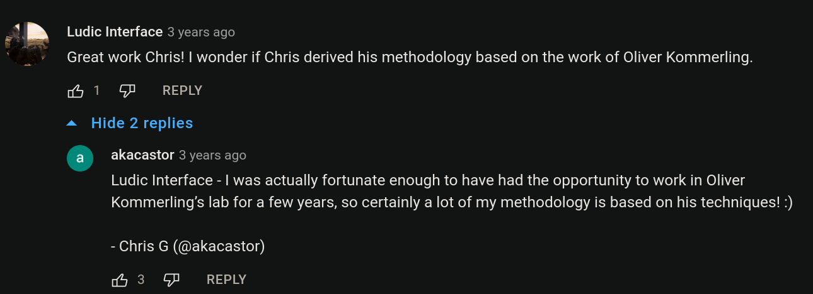
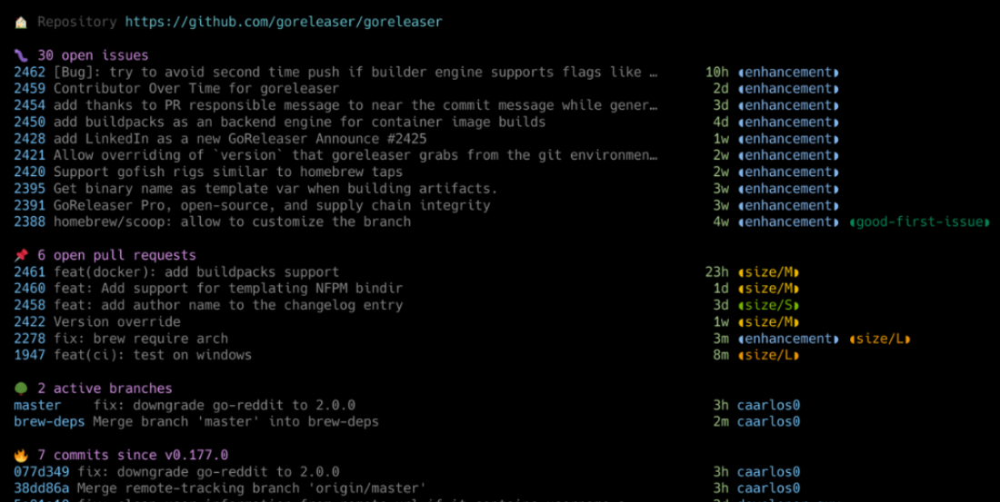
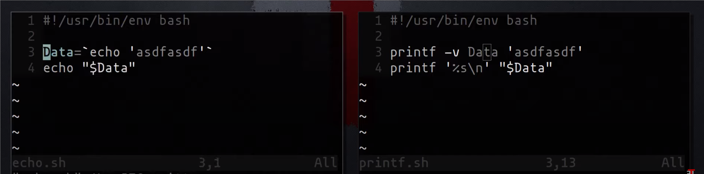
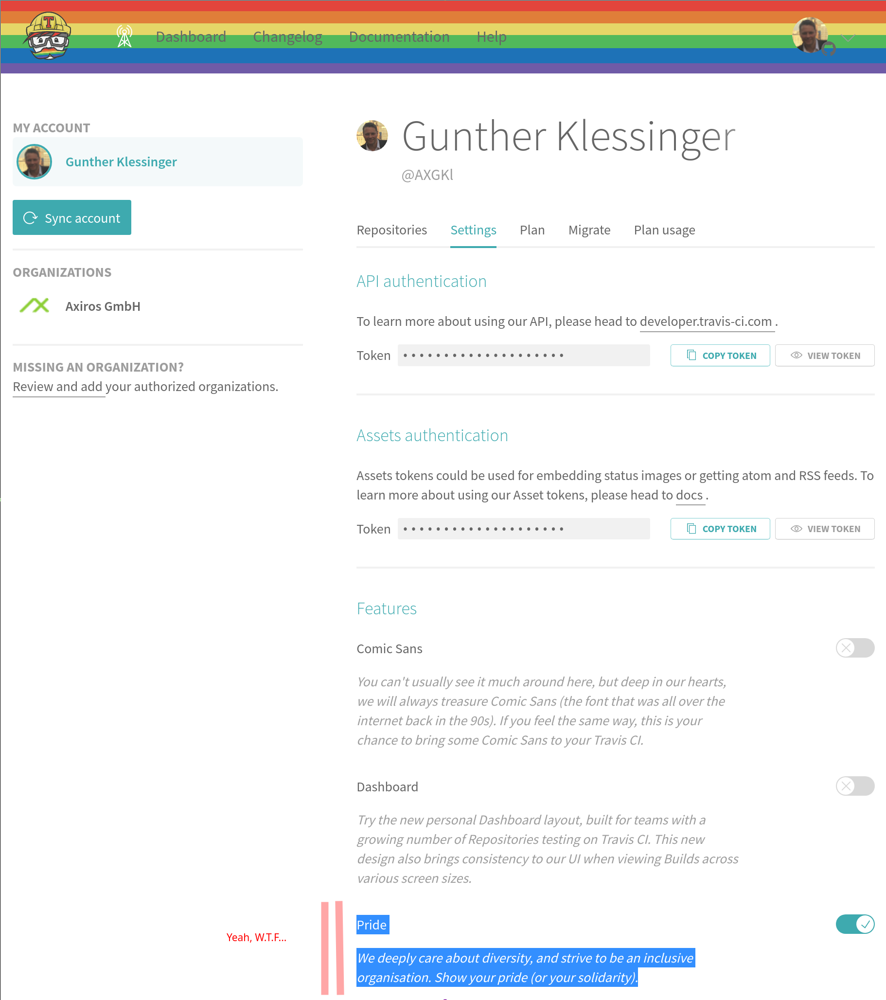
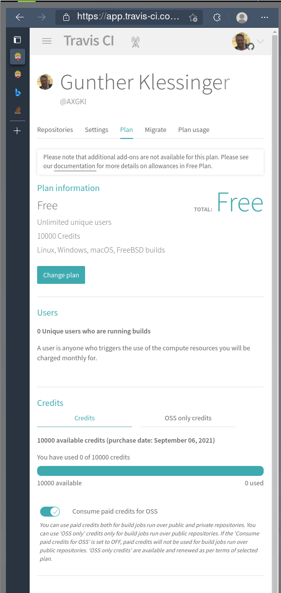
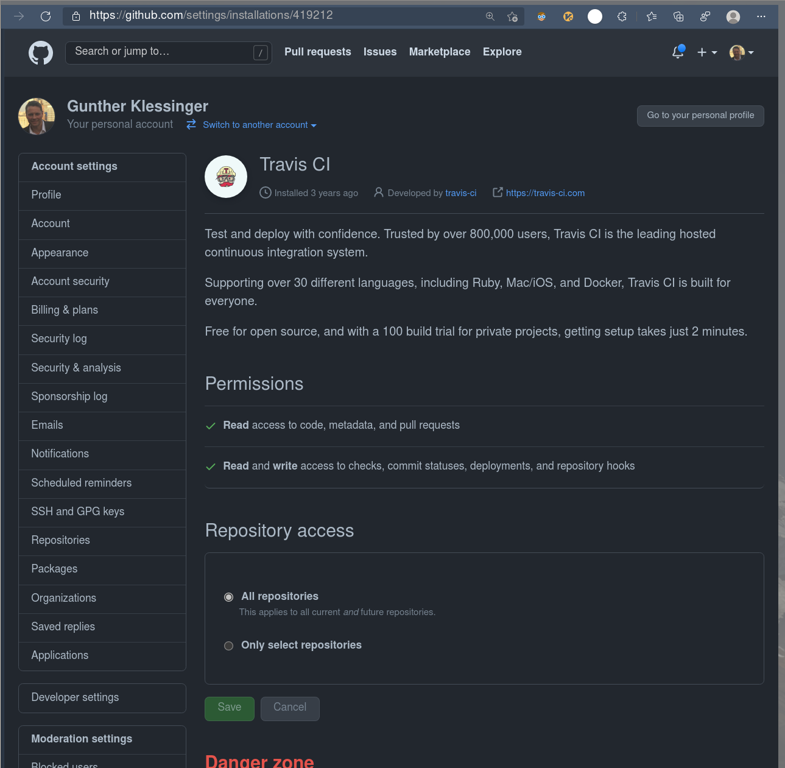
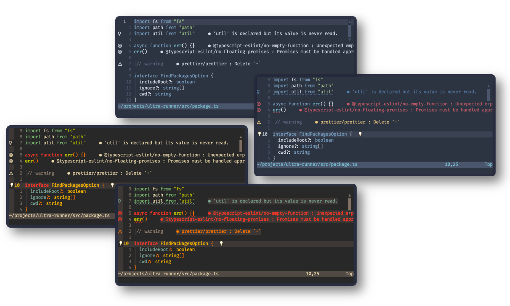
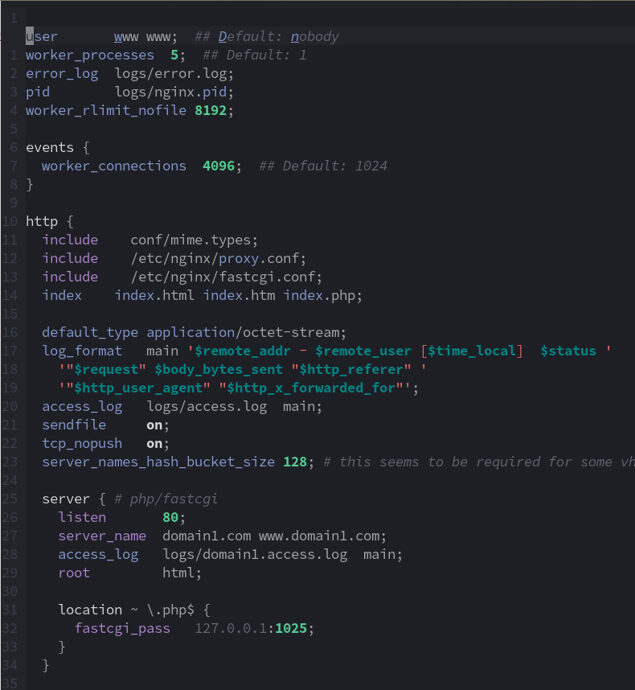
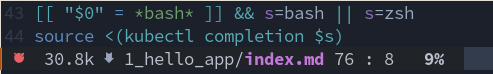

---
hide:
  - navigation
---

# Logbook

<!-- all admons: https://squidfunk.github.io/mkdocs-material/reference/admonitions/#inline-blocks -->
### CCC: Is this guy for real?
??? dev "**Optical** inspection of ROM to get to the data?! - WTF?!"
    [2022-04-10 18:00] 
    
    https://youtu.be/lhbSD1Jba0Q?t=1355

    

    [Oliver Koemmerling...](https://taz.de/Vorwuerfe-gegen-Murdochs-Unternehmen/!5097441/)
 
    https://youtu.be/lhbSD1Jba0Q?t=1355

    Background: I started my "career" at Siemens in the Chip Quality department. We had a big lab,
    with all sorts of microscopes. But reading out the ROM *optically*, that is unheard of...

### :linux: AutoKey: Types stuff into XWindows
??? tip "Away with xdotool type"
    [2022-03-21 20:10] 
    
    Start `autokey-gtk` in dwm autostart.sh -> systray icon or Super-k brings up Editor.

    [FAQ](https://github.com/autokey/autokey/wiki/FAQ)

    Can be pip installed, it's python :-)

    The dates here have been entered via alt-d bound to:

    ```python
    ~ ❯ cat .config/autokey/data/My\ Phrases/Insert\ Date.py
    output = system.exec_command("date -u '+%+2Y-%m-%d %H:%M'")
    keyboard.send_keys('[%s] ' % output)
    ```

    ```json

    ~/.config/autokey/data/My Phrases ❯ cat .Insert\ Date.json                                                                                          6s
    {
    "type": "script",
    "description": "Insert Date",
    "store": {},
    "modes": [
        3
    ],
    "usageCount": 6,
    "prompt": false,
    "omitTrigger": false,
    "showInTrayMenu": false,
    "abbreviation": {
        "abbreviations": [],
        "backspace": true,
        "ignoreCase": false,
        "immediate": false,
        "triggerInside": false,
        "wordChars": "[\\w]"
    },
    "hotkey": {
        "modifiers": [
            "<alt>"
        ],
        "hotKey": "d"
    },
    "filter": {
        "regex": null,
        "isRecursive": false
    }
    }
    ```


### :vim: Install on new Fedora
??? info "nvim: some hassle with lsb to solve"
    [2022-03-01 04:18]  

    1. python -m venv .venv/nvim, there pip install neovim
    1. user install node, put in path, there node i -g neovim
    1. Fix lsp incompat problems See https://jdhao.github.io/2021/12/01/nvim_v06_released/ (also see
       .cache/nvim/lsb.log)
    1. Remove octo plugin (too much foo)
    1. rg over .config/nvim and .local/share/nvim to find those deprecated lua calls.

    :checkhealth provider


### :e-mail: Thunderbird Compose Plaintext Mails
??? success "Hold Shift while clicking Reply or New"
    [2022-02-08 14:32]  

    Not obvious, no mouse over tooltip - you simply have to know it.

    All hotkeys here: https://support.mozilla.org/en-US/kb/keyboard-shortcuts-thunderbird?redirectslug=keyboard-shortcuts&redirectlocale=en-US#w_writing-messages


### :img: Common Image Operations On the CLI
??? success "Not everything requires Gimp"
    [2022-01-13 22:03]  

    Gimp is overkill for these - also automation possibilities, within scripts:

    === "Add alpha channel to png (make transparent)"

        ```bash
        ~ ❯ cat bin/add-alpha.sh
        #!/usr/bin/env bash
        
        # Removes the background (makes transparent)
        # https://stackoverflow.com/a/44542839/4583360
        
        orig="/tmp/img_orig.png"
        
        main() {
            img="$1"
            test -e "$img" || {
                echo "Image file missing: $img"
                exit 1
            }
            shift
        
            test -n "$1" && {
                bgcol="$1"
                shift
            } || bgcol="white"
            test -n "$1" && {
                fuzz="$1"
                shift
            } || fuzz="2%"
        
            rm -f "$orig"
            mv "$img" "$orig"
        
            convert "$orig" -fuzz "$fuzz" -transparent "$bgcol" "$img"
        
            feh --class HUD "$img" &
        
            echo "Alpha added: $img. Original image at $orig."
        }
        
        main "$@"
        
        ```


    === "Resize SVG Canvas to Image Size"

            inkscape --batch-process --verb "EditSelectAll;FitCanvasToSelection;FileSave;FileQuit" filename.svg


### :tv: First Steps on a TV API
??? info "Trying to Remote Control a Samsung Q8"
    [2022-01-09 22:13]  

    Own Article [here](./ll/devices/tv_q8.md)


### :yt: Re-enabling VLC for Youtube Streaming
??? success "Updating Youtube Streaming"
    [2021-12-26 17:46]  

    YT seems not very fond of clients outside the browser, addlessly streaming their stuff.
    Noticed in MPV massive throttling and vlc ran into:

    ```
    [00007fb1744fe6d0] lua stream error: Couldn't process youtube video URL, please check for updates to this script
    [00007fb1744e2a10] access stream error: HTTP 403 error
    ```

    Fix (as root):

    ```bash
    [root@axgk playlist]# pwd
    /usr/lib64/vlc/lua/playlist
    [root@axgk playlist]# mv youtube.luac /tmp/
    [root@axgk playlist]# wget https://raw.githubusercontent.com/videolan/vlc/master/share/lua/playlist/youtube.lua

    ~ ❯ vlc "https://www.youtube.com/watch?v=El90OBILFBw"
    ```

    No luac(ompile) needed, vlc now plays the stream w/o delays (and no adds).


### :gh: [gitty](https://github.com/muesli/gitty): github & gitlab Repo Status Viewer
??? success "All infos you want - but not more"

    [2021-12-16 23:44]  

    gitty is a smart little CLI helper for git projects, that shows you all the relevant issues,
    pull requests and changes at a quick glance, right on the command-line. It currently supports
    the GitHub & GitLab APIs.

     

    - Just call gitty in a repo folder (or on a url) and you have the infos.
    - Also works with multiple repos


### :web: Hacking On the Wire API

??? success "Getting the login right"
    [2021-11-02 23:28]  
    The login process in wire's API docs is outdated. Here a working login, with access to all API endpoints:
    

    !!! danger
        Only problem: `{"code":429,"message":"Logins too frequent","label":"client-error"}` after many
        attempts.

        - No more browser logins as well(!) - lasting, also the next day (try again later).
        - Resolution: Password reset, then they cleared it.

    ```python
    import json, os
    import sys
    import requests
    import structlog

    passw = lambda s: os.popen('pass show %s' % s).read().strip()

    L = structlog.get_logger()
    handle = passw('wire/handle')
    pw = passw('wire/password')
    server = 'https://app.wire.com'
    server = 'https://prod-nginz-https.wire.com'

    loads = json.loads
    dumps = json.dumps


    class S:
        zuid = None
        at = None  # access_token


    class U:
        """interesting users"""

        class lucy:
            accent_id = 4
            domain = 'wire.com'
            handle = 'mylucy'
            id = 'a32e1af9-a93d-a24e-a905-a619f06184c4'
            name = 'Lucy'
            team = None


    def headers():
        h = {
            'Accept': 'application/json, text/plain, */*',
            'Content-Type': 'application/json;charset=UTF-8',
            'Accept-Encoding': 'gzip, deflate, br',
            'Accept-Language': 'en-GB,en-US;q=0.9,en;q=0.8,de;q=0.7',
            'Connection': 'keep-alive',
            'sec-ch-ua': '"Chromium";v="93", " Not;A Brand";v="99"',
            'sec-ch-ua-mobile': '?0',
            'sec-ch-ua-platform': 'Linux',
            'Sec-Fetch-Dest': 'empty',
            'Sec-Fetch-Mode': 'cors',
            'Sec-Fetch-Site': 'same-site',
            'User-Agent': 'Mozilla/5.0 (X11; Linux x86_64) AppleWebKit/537.36 (KHTML, like Gecko) Chrome/93.0.4577.99 Safari/537.36',
        }
        if S.at:
            h['Authorization'] = 'Bearer ' + S.at
        return h


    def req(pth, data=None, meth='post', **kw):
        kw = {'headers': headers()}
        if data:
            kw['json'] = data
        # https://docs.wire.com/understand/api-client-perspective/authentication.html#:
        if S.zuid:
            kw['cookies'] = {'zuid': S.zuid}
        m = getattr(requests, meth)
        r = m(server + pth, **kw)
        if 'zuid' in r.cookies:
            S.zuid = r.cookies['zuid']
        r = r.text
        # json?:
        if r and r[0] in ('{', '['):
            r = loads(r)
            if 'access_token' in r:
                S.at = r['access_token']
        return r


    get = lambda pth, **kw: req(pth, meth='get', **kw)
    post = lambda pth, **kw: req(pth, meth='post', **kw)

    # some useful endpoints in general:
    access = lambda: req('/access')
    self = lambda: get('/self')
    search = lambda q: get('/search/contacts?q=' + q)


    def auth():
        r = req('/login?persist=true', data={'handle': handle, 'password': pw})
        if not 'user' in r:
            L.fatal('Login error', **r)
            sys.exit(1)

        S.user = r['user']
        L.info('Profile', **self())


    def main():
        auth()
        conv = get('/conversations')['conversations']
        # find a converstation:
        conv = [k for k in conv if 'Lucy' in str(k)]
        cnv_domain = 'wire.com'
        cnv = conv['id']
        conv = get(f'/conversations/{cnv_domain}/{cnv}')


    if __name__ == '__main__':
        main()

    ```
### :web: Conversations to pdf in [wire](https://app.wire.com) chat

??? info "A strange failure"
    [2021-11-02 23:32]  

    Here is the docker based pdf exporter, exporting a backup file created via their UI:

    ```bash
    ~ ❯ cat r.sh
    #!/usr/bin/env bash

    podman run --rm -it \
    --privileged \
    -v /home/gk/foo/gk.desktop_wbu:/app/database-in \
    -v /home/gk/bar:/app/database-out \
    -e CLIENT_TYPE=web \
    -e WIRE_USER=$(pass show wire/handle)@wire.com \
    -e WIRE_PASSWORD=$(pass show wire/password) \
    quay.io/wire/backup-export-tool:2.0.0


    ```

    Problem: Fails with

    ```bash
    ~ ❯ ./r.sh                                                     5h 41m 43s
    Backup to PDF converter version: null

    Processing backup:
    Device: xxxxxxxxxxx
    User: xxxxxxx
    id: xxxxxxxxxxx
    created: 2021-11-02T18:10:08.402Z
    platform: Web
    version: 16

    Directories had to be created: false
    com.fasterxml.jackson.databind.exc.MismatchedInputException: Cannot deserialize value of type `java.util.UUID` from Object value (token `JsonToken.START_OBJECT`)
     at [Source: (File); line: 1, column: 978921] (through reference chain: java.lang.Object[][1965]->com.wire.backups.exports.exporters.DesktopExporter$Event["data"]->com.wire.backups.exports.exporters.DesktopExporter$Data["userIds"]->java.util.ArrayList[0])
        at com.fasterxml.jackson.databind.exc.MismatchedInputException.from(MismatchedInputException.java:63)
        at com.fasterxml.jackson.databind.DeserializationContext.reportInputMismatch(DeserializationContext.java:1590)
        (...)

    ```


### :iot: HomeAssistant
??? info "Interesting Tool"
    [2021-09-16 09:29]  
    https://demo.home-assistant.io/#/lovelace/0
    https://www.awesome-ha.com/#themes

### :mkdocs: Interesting mkdocs Plugins
??? info "Scanning the mkdocs wiki"
    [2021-09-15 22:28]  
    - [mike](https://github.com/jimporter/mike)
        Multiple version of documentation in gh-pages branch (major.minor)
    - [simple](https://github.com/athackst/mkdocs-simple-plugin)
        markdown extraction from source files
    - [tags](https://github.com/jldiaz/mkdocs-plugin-tags)
        creates a tags page from yaml metadata in pages
    - [autorefs](https://github.com/mkdocstrings/autorefs)
        finds header slugs and allows to link to them w/o specyfying the page itself.
        There [are](https://github.com/mkdocs/mkdocs/wiki/MkDocs-Plugins#navigation--page-building) many other such links easing plugins.
    - [htmlproofer](https://github.com/manuzhang/mkdocs-htmlproofer-plugin)
        Validates internal and external links in rendered html


### :bash: [TFL](https://www.youtube.com/watch?v=qU4maL_smOs) Tips
??? tip "Just some random notes I try push into my head by writing them" 
    [2021-09-09 02:08]  

    - Pretty much forget `echo`
        printf -v >> echo
        I got reminded about printf and I admit I've done this *a lot* (left side):
        [](./img/printf.png) 

    - `<` instead `cat`: myhosts="$(< /etc/hosts)"

### :terminal: ST  No more crashes on color emojjs
??? success "Patching libxft"
    [2021-09-09 01:56]  
    Details [here](./ll/sl/st.md)

### :vim: Storing last edit position
??? tip "All plugins replaceable by one line"
    [2021-09-08 10:56]  

    Tried:

    ```lua
        --use "farmergreg/vim-lastplace"
        --use "vim-scripts/restore_view.vim"
    ```
    and all have their bugs, like storing and restoring wrong cwd, so that fzf failed opening files
    - with now apparent reason.

    This single line does exactly what I want - and not more:

    ```vim
    " go to the position I was when last editing the file
    au BufReadPost * if line("'\"") > 0 && line("'\"") <= line("$") | exe "normal g'\"" | endif
    ```

### :gh: Bye bye Travis. Github Actions FTW
I spent a [chapter](cloud/ci/github_actions.md) about that...

??? success "GH delivers - Also on CI"
    [2021-09-07 01:19]  
    Ok after further travis trouble with a CI related problem (tmux did not react fast enough, need a
    delay - no reproducable in local ubuntu container) I began to check if the error was happening
    using another CI tool. GH actions was anyway on the list since long.

    Compare: https://docs.github.com/en/actions/learn-github-actions/migrating-from-travis-ci-to-github-actions

    Verdict: Totally rocks. The error was also there in GH, but here I could find and fix it within
    a few minutes, since the turnaround times are that short.

    Plus...I mean: Alone the frontend...:

    [](./img/ghact.png)

    Plus you can cache away your venvs, which would save another 40 secs for poetry install. 

    So, bye bye travis... you should have focussed on *features* - and not an bullsh like that... maybe?

    ??? note "So woke..."

        [](./img/pride.png)

    Lastly, to be fair: They contributed a lot, they were the first to offer CI for free:

    https://www.jeffgeerling.com/blog/2020/travis-cis-new-pricing-plan-threw-wrench-my-open-source-works

### :py: Nail the subprocess shell executable. Always!
??? success "Ubuntu has dash. And dash sucks"
    [2021-09-06 23:09]  

    - `subprocess.check_output(shell=True)` is using /bin/sh
    - On Fedora this is linked to bash => you can send bashisms
    - On Travis all hell breaks loose. Why.

    After an hour I decided to `podman pull ubuntu:xenial` -> run -> export -> systemd-nspawn into it -> run .travis setup -> run test.`

    Breaks. Fine.

    Checking: 

    ```bash
    root@xenial:~ echo -e "Hello"
    Hello
    root@xenial:~# python -c 'import os; os.system("echo -e Hello")'
    -e Hello
    root@xenial:~# FCKUBUNTU
    bash: FCKUBUNTU: command not found
    ```
    
    Solution:

    **`subprocess.check_output(shell=True, executable='/bin/bash')`**


### :gh: Travis: How to enable
??? tip "You always need a plan..."
    [2021-09-06 15:09]  
    In their not so new anymore travis.com you need to first select the free plan - not
    autoselected. Otherwise auth errors.

    On travis.com:

    

    On github:

    [](./img/ghtrav.png)

### :terminal: tmux: Best Guide
??? tip "Very nice and detailed tmux guide"
    [2021-09-04 21:48]  
    https://thevaluable.dev/tmux-config-mouseless/


### :linux: Available Software
??? tip "Garduda has it all..."
    [2021-09-04 21:48]  

    Mental Outlaw recently did a Garduda review - and their software options seem quite extensive.
    [check it out](https://youtu.be/_ZCEiFA8ezA?t=700)


### :linux: Make a WLAN Accesspoint
??? success "Using nmcli - no NetworkManager"
    [2021-09-04 09:05]  
    My Fedora 34 does funnily not use NetworkManager, nmcli was working like a charm:
    
    This does the job for now, incl. IP config, no need to install hostapd or anything else, like suggested on [arch wiki](https://aur.archlinux.org/packages/linux-wifi-hotspot/):

    ```bash
    ~ ❯ cat bin/wlan_access_point
    #!/usr/bin/env bash

    IFNAME="wlp109s0"
    CON_NAME="myhotspot"
    PASS="<xxx>"

    function ap {
        mode=show
        case $1 in
        up) mode=up ;;
        down) mode=down ;;
        esac
        echo "$CON_NAME $mode"
        test $mode == "up" && {
            $0 down
            nmcli con add type wifi ifname $IFNAME con-name "$CON_NAME" autoconnect yes ssid "$CON_NAME"
            nmcli con modify "$CON_NAME" 802-11-wireless.mode ap 802-11-wireless.band bg ipv4.method shared
            nmcli con modify "$CON_NAME" wifi-sec.key-mgmt wpa-psk
            nmcli con modify "$CON_NAME" wifi-sec.psk "$PASS"
            nmcli con up "$CON_NAME"
        }
        test $mode == "down" && {
            nmcli con down "$CON_NAME"
            nmcli con del type wifi ifname "$CON_NAME"
        }
        nmcli con show
    }

    main() {
        test "$1" == "-h" && {
            cat "$0"
            exit 0
        }
        ap "${1:-show}"
    }

    main "$@"

    ```


### :linux: A Better `xdg` hack
??? success "Custom `xdg-open` ftw"
    [2021-08-24 22:07]  

    Xdg is a buggy mess and
    [everybody](https://vermaden.wordpress.com/2021/04/22/freebsd-desktop-part-24-configuration-universal-file-opener/)
    knows this. If you don't then cat out `~/.config/mimeapps.list` and ask yourself again...

    I tried a few hacks in the past to get a simple easily changeable handling for custom schemes
    and extensions into the game, w/o screwing up the system and/or having to provide handlers for
    each and any of these hundreds of file types.
    Wrong was to overlay `xdg-query` or `xdg-mime`. Right seems, as simple as it sounds, to just
    provide an `~/bin/xdg-open`, which when none of your custom scheme and/or extensions and/or file
    criterions are met, just does this at the end `/usr/bin/xdg-open "$@"`.

    Now I can have e.g. my `edit_uri: editor:///home/gk/repos/blog/docs`, w/o having to bypass
    browser security, which I would, with a `file://...` handler, xdg-open gets the editor scheme.

    Or, add indirections, like `edit_uri: editor://$repos/docutools/docs`, only resolved in the custom `xdg-run`.

    And all of this w/o the need to further blow up `./config/mimeapps` or create any stupid `.desktop` files , with just one info, the app to open, burried in
    100 lines of foo.


### :linux: btrfs, timeshift, fedora, encryption, ...
??? tip "Willi Mutschler's blog: timeshift co-author with a great variety of linux subjects"
    [2021-08-22 17:48]  
    He is not only providing [super](https://mutschler.eu/linux/install-guides/fedora-post-install/?q=timeshift) infos about timeshift but about many distros, incl. [fedora](https://mutschler.eu/linux/install-guides/fedora-post-install/) in general.

    !!! note "Apropos btrfs"
    finally understand why my used diskpace is so low, during the reading process:

        UUID=4a9240a1-ee59-403f-b775-e18b67d8ac2e /home btrfs   subvol=home,compress=zstd:1,x-systemd.device-timeout=0 0 0

    compress....:sunglasses: - maybe it actually means: [**compress**](https://fedoramagazine.org/fedora-workstation-34-feature-focus-btrfs-transparent-compression/) :smile:

    [This](https://fedoramagazine.org/recover-your-files-from-btrfs-snapshots/) is a good btrfs resource as well


### :vim: Overriding Specific Colors
??? success "Keeping the colorscheme, using `hi link`"
    [2021-08-22 10:33]

    The lsp errors can get really distracting, especially when you refactor:

    [](./img/lspcolors.png)

    In my most like deep-space scheme it was even heftier, bright green messages spamming me.

    So I first found out the name of the items, see the note below.

    Then tried to set it via the normal `hi LspDiagnosticsHint guifg=grey` in `init.vim`, after loading the scheme. But to no avail the items did not change color.

    *Maybe the colors area loaded async or sth else is setting the colorscheme again afterwards, I did not check*

    But what did work and is anyway even better, because taking the colors of the scheme is using `link`:

    ```vim
        nnoremap <M-enter> :luafile ~/.config/nvim/lua/colorpicker.lua<CR>
        " Written by the colorpicker:
        source ~/.config/nvim/cur_colorscheme.vim
        " the diagnostic mesgs should be rather unobstrusive, LineNrs are:
        :hi def link LspDiagnosticsVirtualTextError LineNr
        :hi def link LspDiagnosticsDefaultHint LineNr
    ```

    !!! note "Apropos vim colors" 

        With a few plugins you easily get over a 1000(!) different coloritems in
        the output of `:hi` (hilight).  
        Better to find out a specific one you need to override via `:so $VIMRUNTIME/syntax/hitest.vim`


### :linux: `evtest` for Better Input Tracing
??? tip "Better than xev for many use cases"
    [2021-08-21 13:07]  
    See [this](./ll/hw/k860.md)

### :vim: pyright error anlysis
??? success "Know the lsp log"
    [2021-08-20 07:09]  
    Pyright consistently ignored the pyproject.toml settings - pyrightconfig.json worked.
    This showed the reason:

    ```bash
    $ tail -f .cache/nvim/lsp.log

    [ WARN ] 2021-08-20T09:08:21+0200 ] ....axYdu21/usr/share/nvim/runtime/lua/vim/lsp/handlers.lua:108 ]   "The language server pyright triggers a registerCapability handler despite dynamicRegistration set to false. Report upstream, this warning is harmless"
    [ ERROR ] 2021-08-20T09:08:21+0200 ] ....axYdu21/usr/share/nvim/runtime/lua/vim/lsp/handlers.lua:402 ]  'Pyproject file parse attempt 1 error: {"name":"TomlError","fromTOML":true,"wrapped":null,"line":117,"col":0,"pos":3496}'
    ```
    
    !!! note "Apropos pyright"

    vim: e.g.: `:PyrightOrganizeImports`

    pyright allows users to configure settings in four ways:

    - Through command-line options
    - Through LSP client settings (including user-specific, project-specific and workspace-specific overrides)
    - A dedicated pyrightconfig.json configuration file (meanwhile also pp.toml)
    - File-specific overrides in the form of # pyright comments


    Sample [config](https://github.com/microsoft/pyright/blob/main/docs/configuration.md):

    ```toml
    [tool.pyright]
    # include = ["src"]
    # pythonVersion = "3.8"
    reportSelfClsParameterName = false
    pythonPlatform = "Linux"
    executionEnvironments = [{ root = "src" }]
    typeCheckingMode = "off"

    ```

    theirs:

    ```toml
    [tool.pyright]
    include = ["src"]
    exclude = ["**/node_modules",
        "**/__pycache__",
        "src/experimental",
        "src/typestubs"
    ]
    ignore = ["src/oldstuff"]
    stubPath = "src/stubs"
    venv = "env367"

    reportMissingImports = true
    reportMissingTypeStubs = false

    pythonVersion = "3.6"
    pythonPlatform = "Linux"

    executionEnvironments = [
      { root = "src/web", pythonVersion = "3.5", pythonPlatform = "Windows", extraPaths = [ "src/service_libs" ] },
      { root = "src/sdk", pythonVersion = "3.0", extraPaths = [ "src/backend" ] },
      { root = "src/tests", extraPaths = ["src/tests/e2e", "src/sdk" ]},
      { root = "src" }
    ]
    ```

### :vim: Ultisnips Programmatically Created
??? success "dynamically creating the ultisnips body itself"
    [2021-08-19 17:38]  
    This is really neat: I can define tags in the environ and ulti shows them to me, per project
    basically:
    ```ultisnips
    global !p
    def create_tag(snip):
        tags = [x.strip() for x in os.environ.get('tags', '<no $tags>').split(',')]
        snip.expand_anon(":${1|%s|}:$0" % ','.join(tags))
    def position_cursor(snip):
        snip.cursor.set(snip.line, snip.column+1)
    endglobal

    post_jump "create_tag(snip)"
    snippet tag "Add a tag exported in $tags" w
    endsnippet
    ```
### :fe: Mixing CSS layouts
??? success "Always invest in extra tags..."
    [2021-08-19 1:34]  

    Timesucker of the evening was the (finally succesfull) attempt to add parent links to the
    navigation plugin in the mkdocs footer. 
    
      
    (from https://github.com/PleatMan/mkdocs-tree-title, which I found useful -
    but I wanted those **linked** to the pages, i.e. behaving like a real breadcrumb system...)

    Cannot be that hard, so I thought...

    BUT:

    !!! note

        A feature of mkdocs is the footer having two huge linked areas, one for prev one for next.
        Big feature, its really convenient for mouse pushing users to not have to target the exact
        word...

    How to get both, i.e. next on the big area *EXCEPT* when clicking on a parent title exactly?

    Original footer, simplyfied:

    ```html
    ~/mi/en/docutools_py37/l/py/si/mkdocs ❯ cat themes/readthedocs/footer.html
    
      <a href="{{ page.next_page.url | url }}" title="{{ page.next_page.title | striptags }}" class="md-footer-nav__link md-footer-nav__link--next" rel="next">
        <div class="md-footer-nav__title">
          <div class="md-ellipsis">
            <span class="md-footer-nav__direction">
              {{ lang.t("footer.next") }}
            </span>
            {{ page.next_page.title }}
          </div>
        </div>
        <div class="md-footer-nav__button md-icon">
        </div>
      </a>
    
    ```

    The tree title plugin basically replaces the string `.title` in `{{ page.next_page.title }}`
    with `page.tree_title`, being set within the plugin for each page, like that:

    ??? note "original plugin code" 
        ```python
        def on_pre_page(self, page, config, files):
            # skip if pages are not yet included in the mkdocs config file
            if not page.title:
                return page

            join_str = self.config['join_string']

            if page.ancestors:
                tree_titles = [x.title for x in page.ancestors[::-1]] + [page.title]
                page.tree_title = join_str.join(tree_titles)
            else:
                page.tree_title = page.title

            return page
        ```

    Simple. 

    So we extended the plugin to not set a string but a list of `[[title parent1, url1],(...)]`, and
    created the links in a jinja loop over that. Did only partially work, clear, the links are nested within
    the big a. The titles themselves where shown, clear.

    *Removing the a screwed up the page, since it had important formatting classes, e.g. float - and
    flex via CSS.*

    Replacing the `<a classes>` with `<div classes>` did work, formatting wise.

    But: the big links where gone.
   
    I tried to add click handlers to the parents via javascript but to no avail, within one big
    `<a>` tag...

    !!! note
        It *may* work, if you remove the enclosing a tag and loop over any child element of the
        replacement div, attaching click handlers, while stopping bubbling up in the inner ones.
        Sounded like a nightmare.

    Was that not possible in CSS/HTML alone?
 
    Answer: Not really, nesting links is simply forbidden.

    !!! quote "W3"

        Links and anchors defined by the A element must not be nested; an A element must not
        contain any other A elements. Since the DTD defines the LINK element to be empty, LINK
        elements may not be nested either.

    What to do.

    ??? success "Link Nesting IS Possible, with HTML5 w/o JS"

        Here the solution for the link nesting problem: 

        ```html
        <div class="block">
          <a class="overlay" href="#overlay-link"></a>
          <div class="inner">
            This entire box is a hyperlink. (Kind of)<br><br><br><br>
            <a href="#inner-link">I'm a W3C compliant hyperlink inside that box</a>
          </div>
        </div>
        ```

        ```css
        .block {
          position:relative;
        }

        .block .overlay {
          position:absolute;
          left:0; top:0; bottom:0; right:0;
        }

        .block .inner {
          position:relative;
          pointer-events: none;
          z-index: 1;
        }

        .block .inner a {
          pointer-events: all;
        }
        ```
    
    Key is the CSS HTML5 access to pointer events. 

    But now the real nightmare started. We have original CSS with float and flex layout - and need
    to mix with classic box model layout.

    All attempts to combine using the same tags failed miserably and in strange ways.

    Solution is really to strictly invest one tag per styling philosophy:


    ```html

       
      <div class="md-footer-nav__link md-footer-nav__link--next">
        {# https://bdwm.be/html5-alternative-nested-anchor-tags/ + 4(!) hours of
        fiddling...: We absolutely wanted to broad links area but also the
        parent links #}
        <div class="overlay_block">
          <a
            class="overlay_link"
            href="{{ page.next_page.url | url }}"
            rel="next"
          ></a>
          <div class="overlay_inner">
            <div class="md-footer-nav__title">
              <div class="md-ellipsis">
                <span class="md-footer-nav__direction">
                  {{ lang.t("footer.next") }}
                </span>
                
                <a href="{{p[1]}}">
                   {{ p[0] }} 
                  <small>{{ p[0] }}</small> - 
                </a>
                
              </div>
            </div>
          </div>
        </div>
        <div style="margin-left: -2rem" class="md-footer-nav__button md-icon">
          
        </div>
      </div>
      <style>
        .overlay_block {
          position: relative;
          width: 100%;
        }
        .overlay_block .overlay_link {
          position: absolute;
          left: 0;
          top: 0;
          bottom: 0;
          right: 0;
        }
        .overlay_block .overlay_inner {
          position: relative;
          pointer-events: none;
          z-index: 1;
        }
        .overlay_block .overlay_inner a {
          pointer-events: all;
        }
      </style>
      

    ```

    And now it all works nicely, as you can see in this blog :sunglasses:.


   
### :vim: [nginx.vim](https://github.com/chr4/nginx.vim): nginx conf highlighter
??? tip "Nice syntax highlighter with lua support"
    [2021-08-19 08:29]  
    [](img/nginx.vim.png)

    
### :python: poetry plugin entrypoints
??? danger "How to make them be found"
    [2021-08-18 14:49]  
    Took me a while to find out how to get an entrypoint working which is contained in the repo
    under development. Not talking of a script, that's clear: `tool.poetry.scripts` but of a plugin:

    ```toml
    [tool.poetry.plugins."mkdocs.plugins"]
    "page-tree" = "lcdoc.mkdocs.page_tree:PageTreePlugin"
    ```

    analogue to setup.py's 

    ```python
    entry_points={
        'mkdocs.plugins': [
            'tree-title = mkdocs_tree_title.plugin:TreeTitlePlugin'
        ]
    }
    ```

    Both create sth like:

    ```ini
    ~/mi/en/docutools_py37/l/py/site-packages ❯ cat docutools-2021.8.10.dist-info/entry_points.txt
    [console_scripts]
    doc=devapp.plugin_tools:main

    [mkdocs.plugins]
    page-tree=lcdoc.mkdocs.page_tree:PageTreePlugin

    ```

    But the plugin was not found by mkdocs, even after rm poetry.lock -> poetry install. 
    
    Resolution: There was an old `<projectroot>.venv` folder around, with an (empty) site-packages,
    which poetry preferred to look for such entry_points.txt files. After removing it all worked
    after a new `poetry install` (not update, not required), those python entryponits are, like
    scripts, installed by `poetry install`.

### :vi: :chrome: [vimium-c](https://github.com/gdh1995/vimium-c/wiki) Rocks
??? tip "`cd-`: like in shell, `T`"
    [2021-08-18 12:41]  
    The vimium-c guy has strong political [opinions](https://github.com/gdh1995/vimium-c/issues/359). Well maybe he is right, who am I to judge. In any case, his extension is the best "vimifier".
    Examples:

    - `T`: Lets you search thru open tabs.
    - Hotkey defs like `cd-`
    - (...)

    === "My Current Non Default Mappings"
        ```ini
        unmap h
        unmap l
        map h goBack
        map l goForward
        map cd- visitPreviousTab
        ```
    === "All Commands"

        All available commands in Vimium C (up to v1.89.1). The list of available options can be seen in `CmdOptions` (for most frontend commands) of [types/messages.d.ts#CmdOptions](https://github.com/gdh1995/vimium-c/blob/master/typings/messages.d.ts#:~:text=interface%20CmdOptions) and `BgCmdOptions` (for other commands) of [background/typed_commands.d.ts](https://github.com/gdh1995/vimium-c/blob/master/background/typed_commands.d.ts).

        ``` json
        [
          "LinkHints.activate",
          "LinkHints.activateMode",
          "LinkHints.activateModeToCopyLinkText",
          "LinkHints.activateModeToCopyLinkUrl",
          "LinkHints.activateModeToDownloadImage",
          "LinkHints.activateModeToDownloadLink",
          "LinkHints.activateModeToEdit",
          "LinkHints.activateModeToHover",
          "LinkHints.activateModeToLeave",
          "LinkHints.activateModeToUnhover",
          "LinkHints.activateModeToOpenImage",
          "LinkHints.activateModeToOpenIncognito",
          "LinkHints.activateModeToOpenInNewForegroundTab",
          "LinkHints.activateModeToOpenInNewTab",
          "LinkHints.activateModeToOpenVomnibar",
          "LinkHints.activateModeToSearchLinkText",
          "LinkHints.activateModeToSelect",
          "LinkHints.activateModeWithQueue",
          "LinkHints.click",
          "LinkHints.unhoverLast",
          "Marks.activate",
          "Marks.activateCreateMode",
          "Marks.activateGotoMode",
          "Marks.clearGlobal",
          "Marks.clearLocal",
          "Vomnibar.activate",
          "Vomnibar.activateBookmarks",
          "Vomnibar.activateBookmarksInNewTab",
          "Vomnibar.activateEditUrl",
          "Vomnibar.activateEditUrlInNewTab",
          "Vomnibar.activateHistory",
          "Vomnibar.activateHistoryInNewTab",
          "Vomnibar.activateInNewTab",
          "Vomnibar.activateTabSelection",
          "Vomnibar.activateUrl",
          "Vomnibar.activateUrlInNewTab",
          "addBookmark",
          "autoCopy",
          "autoOpen",
          "blank",
          "clearCS",
          "clearFindHistory",
          "closeDownloadBar",
          "closeOtherTabs",
          "closeTabsOnLeft",
          "closeTabsOnRight",
          "captureTab",
          "copyCurrentTitle",
          "copyCurrentUrl",
          "copyWindowInfo",
          "createTab",
          "debugBackground",
          "discardTab",
          "duplicateTab",
          "editText",
          "enableCSTemp",
          "enterFindMode",
          "enterInsertMode",
          "enterVisualLineMode",
          "enterVisualMode",
          "firstTab",
          "focusInput",
          "focusOrLaunch",
          "goBack",
          "goForward",
          "goNext",
          "goPrevious",
          "goToRoot",
          "goUp",
          "joinTabs",
          "lastTab",
          "mainFrame",
          "moveTabLeft",
          "moveTabRight",
          "moveTabToIncognito",
          "moveTabToNewWindow",
          "moveTabToNextWindow",
          "newTab",
          "nextFrame",
          "nextTab",
          "openCopiedUrlInCurrentTab",
          "openCopiedUrlInNewTab",
          "openUrl",
          "parentFrame",
          "passNextKey",
          "performAnotherFind",
          "performBackwardsFind",
          "performFind",
          "previousTab",
          "quickNext",
          "reload",
          "reloadGivenTab",
          "reloadTab",
          "removeRightTab",
          "removeTab",
          "reopenTab",
          "reset",
          "restoreGivenTab",
          "restoreTab",
          "runKey",
          "scrollDown",
          "scrollFullPageDown",
          "scrollFullPageUp",
          "scrollLeft",
          "scrollPageDown",
          "scrollPageUp",
          "scrollPxDown",
          "scrollPxLeft",
          "scrollPxRight",
          "scrollPxUp",
          "scrollRight",
          "scrollSelect",
          "scrollTo",
          "scrollToBottom",
          "scrollToLeft",
          "scrollToRight",
          "scrollToTop",
          "scrollUp",
          "searchAs",
          "searchInAnother",
          "sendToExtension",
          "showHelp",
          "showTip",
          "simBackspace",
          "sortTabs",
          "switchFocus",
          "toggleCS",
          "toggleLinkHintCharacters",
          "toggleMuteTab",
          "togglePinTab",
          "toggleStyle",
          "toggleSwitchTemp",
          "toggleViewSource",
          "toggleReaderMode",
          "toggleVomnibarStyle",
          "visitPreviousTab",
          "zoomIn",
          "zoomOut",
          "zoomReset",
        ]
        ```

### :terminal: ZSH: global aliases
??? success "`ps ax pg foo`, `cat foo pclip`, ..."
    [2021-08-18 07:17]  
    Those work within commands:
    ```bash
    alias -g pg='| grep -i '
    alias -g pclip='| xclip -i -selection clipboard'
    ```

    Then

    ```bash
    $ cat foo pclip # and you have it in the clipboard
    $ ps ax pg node
       1215 ?        Ss     0:00 fusermount -o rw,nosuid,nodev,fsname=portal,auto_unmount,subtype=portal --
    /run/user/1000/doc
    ```


### :terminal: ZSH: better `type`
??? success "shows where function is defined"
    [2021-08-18 07:20]  
    === "zsh"
        man zshbuiltins

        ```bash hl_lines="2"    
        ~/mi/en/b/l/py/si/mkdocs ❯ type gomod
        gomod is a shell function from /home/gk/.bashrc-personal

        ~/mi/en/b/l/py/si/mkdocs ❯ type -f gomod
        gomod () {
            local mod="${1:-os}"
            local l="$(python -c "import os, $mod;print(os.path.dirname($mod.__file__))")"
            cd "$l"
            pwd
        }
        ```    

    === "bash"
        ```bash
        [gk@axgk mkdocs]$ type gomod
        gomod is a function
        gomod ()
        {
            local l="$(python -c "import os, $mod;print(os.path.dirname($mod.__file__))")"
            cd "$l";
            pwd
        }

        ```
        But [where is it defined](https://askubuntu.com/questions/1146269/how-can-i-find-where-certain-bash-function-is-defined)?!

### :cloud: [Nuclio](https://nuclio.io/docs/latest/setup/k8s/getting-started-k8s/) FaaS
??? question "New kid on the block in FAAS land"
    [2021-08-18 01:14]  
    See [here](https://github.com/nuclio/nuclio) - found in [this](https://imhotep.io/istio/faas/2018/02/23/combing-lambdas.html) blog of the k9s guy...

### :vi: Ultisnips config: No lua
??? danger "configure in init.vim not in lua"
    [2021-08-18 00:55]  
    See [ultisnips page](./ll/vim/ultisnips.md)

### :linux: [`kmcaster`](https://github.com/DaveJarvis/kmcaster/)
??? tip "Best screenkey recorder"
    [2021-08-17 00:55]  
     

### :linux: openjdk install
??? note "Per App / Non Global"
    [2021-08-17 11:09]

    ```mk_console
    sudo yum -y install curl
    curl -O https://download.java.net/java/GA/jdk14/076bab302c7b4508975440c56f6cc26a/36/GPL/openjdk-14_linux-x64_bin.tar.gz
    tar xvf openjdk-14_linux-x64_bin.tar.gz
    sudo mv jdk-14 /opt/
    ```

    Unlike [here](https://computingforgeeks.com/install-oracle-java-openjdk-14-on-centosfedora-linux/)
    we don't export set any profiles in /etc/profile.d for this but use it per app like:

    `alias screenkeyjs='/opt/jdk-14/bin/java -jar /home/gk/inst/kmcaster.jar -d 60'`


### :linux: gpg-agent cache timeout
??? tip "Avoiding popups every minute"
    [2021-08-17 10:34]

    After a fedora security update I got an annoyingly short gpg timeout for the pass utility. Fix:

    ```bash
    ❯ cat /home/gk/.gnupg/gpg-agent.conf
    default-cache-ttl 7200
    ```

    and `systemctl --user restart gpg-agent`


### :linux: Grub: See the system booting
??? tip "Using grubby"
    [2021-08-16 10:34]

    On Fedora34 fiddling with removing `quiet` and `rhgb`, then grub2-mkconfig did not work, guess I was
    "holding it wrong".
    [This](https://docs.fedoraproject.org/en-US/fedora/rawhide/system-administrators-guide/kernel-module-driver-configuration/Working_with_the_GRUB_2_Boot_Loader/) helped, use RedHat's grubby.

    ```bash
    grubby --default-kernel
    grubby --remove-args="rhgb quiet" --update-kernel /boot/vmlinuz-5.13.8-200.fc34.x86_64
    ```

    No mkconfig necessary.


    !!! warning
        Do **not** add console=tty... as suggested in the example in the tutorial - I had no output
        anymore
    

### :vi: Filedir in galaxyline
??? success "Lua Hack: Displaying parent dir"
    [2021-08-11 18:00]

    Seeing only index.md in the statusline on multiple markdown files is not really cool. galaxyline allows functions:

    Fixed, with embarrassingly low lua skills, we see the first parent directory level now, enough in
    most cases for unique file identification:

    === "Result"
        The directory is shown:

        

    === "Code"
        ```lua
        gls.left[5] = {
            FileDir = {
                provider = function()
                    local fn = vim.fn.expand("%:p")
                    local fn, a = string.match(fn, "(.*)%/(.*)")
                    local a, fn = string.match(fn, "(.*)%/(.*)")
                    return fn .. "/"
                end,
                condition = condition.buffer_not_empty,
                highlight = {colors.fg, colors.bg}
            }
        }

        gls.left[6] = {
            FileName = {
                provider = function()
                    local fn = vim.fn.expand("%:p")
                    local a, b = string.match(fn, "(.*)%/(.*)")
                    return b .. " "
                end,
                condition = condition.buffer_not_empty,
                highlight = {colors.magenta, colors.bg, "bold"}
            }
        }

        ```


### :vi: Lost content on file save
??? danger "Formatter misinterprets files named '-'"
    [2021-08-11 12:59]

    Crazy nvim bug/config problem(?): **You edit a file, write, content gone**.
    Especially when write+quitting this can kill your day.

    Reason: If you managed to create a file with name '-' (a single dash) - then the formatter (run on
    write by nvim) sees this obviously as input and changes the buffer accordingly.

    Solution: Delete the file, all works again: `rm -- -` 


### :chrome: Edge Browser
??? tip "Meanwhile my default"
    [2021-08-11 12:38]

    Politics aside but **Microsoft Edge**/Linux seems currently the technical best browser for me.
    FF is anyway totally
    [political](https://blog.mozilla.org/en/mozilla/we-need-more-than-deplatforming/) meanwhile as
    well

### :linux: pipewire -> pulse
??? info "Avoid problems with old config / alsamixer is great"
    [2021-05-01 11:37]

    Fedora 34 fresh. Sound: Remove pipewire like described by fedora - then removed old
    .config/pulse(! (from arch times)). `systemctl --user restart pulseaudio` -> alsamixer worked, could connect, the
    rest as well

### :vi: Appimage 
??? tip "Best sandbox for newest versions"
    [2021-02-11 12:36]

    nvim: Do not install the package mgr version on a stable distro, nvims' dev speed is crazy (e.g.
    lua support) - the app image (from their github) works perfect.

        /home/gk/inst/nvim.appimage README.md


