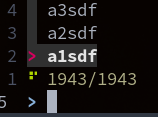

# Python's dup2 Method / Intercepting StdIn

[2022-04-27 06:27]  

That time of the year, where I want to do "simple" terminal stdin redirection/duplication and
realize I forgot everything I knew about it. Lets write it down this time.

## Output Examples


=== "Tee - By Overloading `stdout.write`"


    ```python

    ~/gk1 master ?7 ❯ cat tee.py; echo 'output:'; python tee.py; cat log
    import sys

    class tee :
        def __init__(self, _fd1, _fd2) :
            self.fd1 = _fd1
            self.fd2 = _fd2

        def __del__(self) :
            if self.fd1 != sys.stdout and self.fd1 != sys.stdout :
                self.fd1.close()
            if self.fd2 != sys.stdout and self.fd2 != sys.stdout :
                self.fd2.close()

        def write(self, text) :
            self.fd1.write(text)
            self.fd2.write(text)

        def flush(self) :
            self.fd1.flush()
            self.fd2.flush()

    stdoutsav = sys.stdout
    outputlog = open('log', "w")
    sys.stdout = tee(stdoutsav, outputlog)
    print('foo')

    output:
    foo
    foo
    ```

=== "Simple `os.dup2` Output Example"

    ```python
    import os
    os.dup2(1, 3)
    print('hi', file=os.fdopen(3, 'w'))
    ```


=== "Non Blocking Subproc Stdout Reads (no threads)"
    
    - Both stdout and stderr need to be streamed.
    - Both of them need to be non-blocking: when there is no output and when there are too much output.
    - Do not want to use Threading or multiprocessing, also not willing to use pexpect.
    
    
    ```python
    import subprocess as sbp
    import fcntl
    import os
    
    def non_block_read(output):
        fd = output.fileno()
        fl = fcntl.fcntl(fd, fcntl.F_GETFL)
        fcntl.fcntl(fd, fcntl.F_SETFL, fl | os.O_NONBLOCK)
        try:
            return output.readline()
        except:
            return ""
    
    with sbp.Popen('find / -name foo',
                    shell=True,
                    universal_newlines=True,
                    encoding='utf-8',
                    bufsize=1,
                    stdout=sbp.PIPE,
                    stderr=sbp.PIPE) as p:
        while True:
            out = non_block_read(p.stdout)
            err = non_block_read(p.stderr)
            if out:
                print(out, end='')
            if err:
                print('E: ' + err, end='')
            if p.poll() is not None:
                break
    
    
    ```

=== "Same for fzf (fast)"

    The newlines are fubared in fzf, this works perfect and fast:

    No delay noticable in fzf. nice:
    
    ```python
    
    import subprocess as sbp
    import fcntl
    import os


    def non_block_read(output):
        fd = output.fileno()
        fl = fcntl.fcntl(fd, fcntl.F_GETFL)
        fcntl.fcntl(fd, fcntl.F_SETFL, fl | os.O_NONBLOCK)
        try:
            return output.read(1024)
        except:
            return


    with sbp.Popen(
        'fzf',
        shell=True,
        # universal_newlines=True,
        # encoding='utf-8',
        # bufsize=1,
        stdout=sbp.PIPE,
        stderr=sbp.PIPE,
    ) as p:
        while True:
            out = non_block_read(p.stdout)
            err = non_block_read(p.stderr)
            if out:
                os.write(1, out)
            if err:
                os.write(2, err)
                # print(err.decode('utf-8'))  # , end='')
            if p.poll() is not None:
                break


    ``` 

The inner process can detect it is not writing to a tty (try it out by calling python in a subproc
and print `sys.stdout.isatty()`. But fzf does not care - for stdout and err, behaves normally.


## Intercept / Control User Input to SubProcess

Big question: How to send user input from outside the process into e.g. fzf, i.e. control it.

Up to now we came to the conclusion that doing it from a terminal stream hijacker is the best way:
See [termcontrol](https://github.com/axiros/termcontrol)
 
But can we do it from within python?

I start fzf w/o piping sth into it,  pid is 3124845: 

Via proc file system? First guess, naa, the fds there are api but not the pty itself.


Writing into those does only produce *the illusion* that the user typed sth:

```python
with open('/proc/3124845/fd/0', 'a') as fd: fd.write('a');fd.flush()
```


fzf does not see it - E.g. after we really typed an "a" on the keyboard:


All open fds: `lsof -P -n -p <pid>`


```
~/.config/ptpython ❯ lsof -P -n -p 3140976
COMMAND     PID USER   FD      TYPE DEVICE SIZE/OFF     NODE NAME
fzf     3140976   gk  cwd       DIR   0,41       54 18761005 /home/gk/.config/ptpython
fzf     3140976   gk  rtd       DIR   0,35      160      256 /
fzf     3140976   gk  txt       REG   0,35  3234120  1629801 /usr/bin/fzf
fzf     3140976   gk  mem       REG   0,33           1629801 /usr/bin/fzf (path dev=0,35)
fzf     3140976   gk  mem       REG   0,33           1411886 /usr/lib64/ld-2.33.so (path dev=0,35)
fzf     3140976   gk    0u      CHR  136,7      0t0       10 /dev/pts/7
fzf     3140976   gk    1u      CHR  136,7      0t0       10 /dev/pts/7
fzf     3140976   gk    2u      CHR  136,7      0t0       10 /dev/pts/7
fzf     3140976   gk    3r      CHR    5,0      0t0       11 /dev/tty
fzf     3140976   gk    4u  a_inode   0,14        0    11950 [eventpoll:3,5]
fzf     3140976   gk    5r     FIFO   0,13      0t0 31532188 pipe
fzf     3140976   gk    6w     FIFO   0,13      0t0 31532188 pipe

```

The r/w FIFO at the end is interesting - is FZF maybe internally setting those up to be able to read
data here *and* user input there?

Is it in the filesystem?

Answer - nope. A python program where I open a FIFO on a file reports


`python  3154696   gk    3r  FIFO   0,41      0t0 18768718 /home/gk/myfifo`


I.e. I get the filename. `pipe` - that is the shell pipe which FZF built, using `$FZF_DEFAULT_COMMAND` - not for user input.

Also a grep for fifo on fzf source code says nothing about setting such a fifo up - except in tmux
mode and for some zshell completion.

### Simplified Program

Since we do not know what fzf *really* does internally let's start with a simple python program.

```python
i = input('q> ')
print('have it')

```

lsof reports

```
python  3160241   gk    0u   CHR 136,11      0t0      14 /dev/pts/11
python  3160241   gk    1u   CHR 136,11      0t0      14 /dev/pts/11
python  3160241   gk    2u   CHR 136,11      0t0      14 /dev/pts/11
```

Again the naiv tries just result in stuff getting echoed but the 'have it' never shows up:

From another term I tried:

```mkconsole
echo -e 'foo\n' >> /dev/pts/11
echo -e 'foo\x0a\x0c' >> /dev/pts/11
cat /dev/stdin >/dev/pts/11
cat - > /dev/pts/11
```

!!! important

    There is only one stdin fd and it is owned by the python process itself.

### `os.dup2`

    DESCRIPTION         top
       The dup() system call allocates a new file descriptor that refers
       to the same open file description as the descriptor oldfd.  (For
       an explanation of open file descriptions, see open(2).)  The new
       file descriptor number is guaranteed to be the lowest-numbered
       file descriptor that was unused in the calling process.

       After a successful return, the old and new file descriptors may
       be used interchangeably.  Since the two file descriptors refer to
       the same open file description, they share file offset and file
       status flags; for example, if the file offset is modified by
       using lseek(2) on one of the file descriptors, the offset is also
       changed for the other file descriptor.

       The two file descriptors do not share file descriptor flags (the
       close-on-exec flag).  The close-on-exec flag (FD_CLOEXEC; see
       fcntl(2)) for the duplicate descriptor is off.

    dup2()
       The dup2() system call performs the same task as dup(), but
       instead of using the lowest-numbered unused file descriptor, it
       uses the file descriptor number specified in newfd.  In other
       words, the file descriptor newfd is adjusted so that it now
       refers to the same open file description as oldfd.

       If the file descriptor newfd was previously open, it is closed
       before being reused; the close is performed silently (i.e., any
       errors during the close are not reported by dup2()).

       The steps of closing and reusing the file descriptor newfd are
       performed atomically.  This is important, because trying to
       implement equivalent functionality using close(2) and dup() would
       be subject to race conditions, whereby newfd might be reused
       between the two steps.  Such reuse could happen because the main
       program is interrupted by a signal handler that allocates a file
       descriptor, or because a parallel thread allocates a file
       descriptor.

       Note the following points:

       *  If oldfd is not a valid file descriptor, then the call fails,
          and newfd is not closed.

       *  If oldfd is a valid file descriptor, and newfd has the same
          value as oldfd, then dup2() does nothing, and returns newfd.e


> os.dup2() method in Python is used to duplicate a file descriptor fd to a given value fd2. The
> file descriptor will be duplicated to fd2 only if fd2 is available and duplicated file descriptor
> is inheritable by default.

With 'inheritable':

> A Boolean value, True or False. The default value of this parameter is True, which means
> duplicated file descriptor is inheritable by child processes. To make it non-inheritable set it to
> False.

```python
~ ❯ cat aa.py
import os
fn = 'myfifo'
os.unlink(fn) if os.path.exists(fn) else 0
os.mkfifo(fn)
fd = open(fn)
os.dup2(fd.fileno(), 0)
i = input('q> ')
print('have it:', i)
```

With this we can 'fake' user input from outside the process:

```mkconsole
~ ❯ python aa.py &
[1] 3164080
~ ❯ echo answer > myfifo                                                                             
q> %
have it: answer
[1]  + 3164080 done       python aa.py

```

Nice.

Nonblocking: `fd = os.open(fn, os.O_RDONLY | os.O_NONBLOCK)` - but that breaks the input method.

Question: Is stdin avail also from within the process?

Answer: No.

We get terminal feedback of what we type but that's all - process now ONLY has the FIFO
for user input.

Because - see above:

       If the file descriptor newfd was previously open, it is closed
       before being reused; the close is performed silently (i.e., any
       errors during the close are not reported by dup2()).

If we duplicate the other way round (`os.dup(0, fd_of_fifo)`) then the python process keeps having
normal stdin behaviour - but the fifo is not writeable anymore from outside. 

### Summary So Far

What we got so far is nothing else than a straight forward input redirection:

```python
os.mkfifo(fn)
fd = open(fn)
sys.stdin = fd
```

=> Where is an actual *duplication*, i.e. `stdin` available from 2 processes?


## `pty.fork`

Extremely instructive:

https://stackoverflow.com/questions/4022600/python-pty-fork-how-does-it-work

```python
#!/usr/bin/env python3

import sys
import os
import time
import pty
import subprocess


def log(chars):
    sys.stdout.write('    > ' + chars + '\n')


def main():

    # fork this script such that a child process writes to a pty that is
    # controlled or "spied on" by the parent process

    (child_pid, fd) = pty.fork()

    # A new child process has been spawned and is continuing from here.
    # The original parent process is also continuing from here.
    # They have "forked".

    if child_pid == 0:
        log('This is the child process fork, pid %s' % os.getpid())
        log('Child process will run a subprocess controlled by the parent process')
        log('All output, including this text, will be written to a pty and handled ')
        log('by the parent process.')
        # redirect stdout/stderr if you want to here
        subprocess.run(['bash'])

    else:
        log('This is the parent process fork, pid %s' % os.getpid())
        log('the fd being read from, %s, is not stdout nor stderr; it is ' % fd)
        log('simply what the child is trying to write to its tty. ')
        log('stdout/stderr are combined along with terminal escape codes.')

        print()
        # Read initial output of child process before "typing" anything in its pty
        sys.stdout.write(os.read(fd, 1024).decode())
        print()

        # Run any bash commands you want. I/O to the fd is handled as if you are typing
        # at a terminal.
        os.write(fd, 'ls\n'.encode())
        os.write(fd, 'which git\n'.encode())
        # you can even test tab completions
        os.write(fd, 'git sta\t\t'.encode())
        while True:
            log('parent will read 1024 bytes that the child wrote to its pty')
            log('if no new output is available, parent will wait. Exit with ctrl+c.\n')
            # take out decode() to see raw bytes the child wrote to its pty
            sys.stdout.write(os.read(fd, 1024).decode())
            time.sleep(1)


if __name__ == '__main__':
    main()


```


## Send Stdin Items

Can we control FZF?

With this we can send search results via a fifo:

`mkfifo foo`

Then start:

```python
import socket, subprocess, os

s = open('foo')
print('1')
os.dup2(s.fileno(), 0, inheritable=True) # inheritable True = default
print('2')
p = subprocess.call(['fzf'])
print('done')

```

(will block waiting on open - nothing printed)

Then start:

```python
with open('foo', 'w') as fd:
    n = 0
    while 1:
        for i in range(1000):
            n += 1
            fd.write(f'a{n}sdf\n')
        breakpoint()
```

And you see fzf waiting for more - until you say `fd.close()` - here after the second chunk sent:



(fzf progress indicator eager for more)

If we flushed in the sender we will see in fzf nice chunks of 1000 records. 

Summary: We can dynamically control the data red by fzf - from a python parent process. But faking
User Input is unsolved.

## Solution

Here is the solution: https://github.com/asciinema/asciinema/blob/develop/asciinema/recorder.py

They meanwhile not just simply write what is written on the pty - but really can differentiate the
source, incl. 'i' - input.

Nice.


