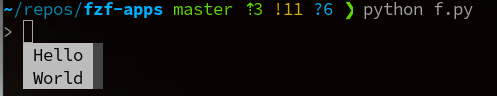

# Prompt Toolkit

[2022-04-27 06:27] 

Want to explore this a bit over time - when I have time.

Seems powerful enough as foundation for e.g. pymux (tmux in python)

See tutorial
[Example](https://python-prompt-toolkit.readthedocs.io/en/master/pages/tutorials/repl.html) about
easy context menus - but there are also layout managers and built in dialogs.


=== "Hotkeys"

    This works also with gevent monkey patched:

    ```python
    from prompt_toolkit import prompt
    from prompt_toolkit.application import run_in_terminal
    from prompt_toolkit.key_binding import KeyBindings

    i = 2

    bindings = KeyBindings()

    @bindings.add('c-t')
    def _(event):
        " Say 'hello' at `c-t`"
        def print_hello():
            print('hello world')
            os.system('bash') # these inputs are NOT captured
        run_in_terminal(print_hello)

    @bindings.add('c-i')
    def _(event):
        " Exit when `c-i` - `c-x` - needs term set ixo foo. "
        event.app.exit()

    @bindings.add('d')
    def _(event):
        global i
        i *= 2

    text = prompt('> ', key_bindings=bindings)
    print(f'You said: {text}')
    print(f'i is now {i}')
    ```

=== "Completions Before Character"

    ```python
    from prompt_toolkit import PromptSession
    from prompt_toolkit.completion import WordCompleter
    completer = WordCompleter([u"Hello", u"World"])
    session = PromptSession(u"> ", completer=completer)
    session.prompt(pre_run=session.default_buffer.start_completion)

    ```

    

