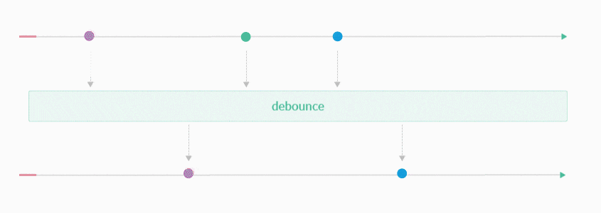

# Reactive Programming With RxPY

## Motivation

Let's build an API server, which can send data the clients as soon as it arrives.

You might say that's trivial but it is not:

Data may arrive e.g.

- *not* en bloc but in parts, like from "follow tailing" files or from stream subscriptions, e.g.
  via websockets
- from jobs of other clients (but still interesting for us)
- from different systems, with vastly varying response times

In all these cases we want to update the client **partially**, as soon as new data is there, w/o having
to wait for the "full" result (if that even exists).

!!! important

    Also we do **not** want to constantly **poll** the server but passively wait for new data, with the server
    being able to push to all interested parties, once there.


The operationally most simple solution is not via websockets but by sending the responses as
[chunks][cte].

[cte]: https://en.wikipedia.org/wiki/Chunked_transfer_encoding

## Solution Stack

- [Flask] [flask] as (not so) Microframework
- [gevent][gevent] as async framwork
- [ReactiveX][rx]
    - for a far more high level coordination of jobs and coroutines, compared to using gevent low level
      machinery 
    - in order to *declaratively* parametrize the server's async behaviour via high level
      coordination functions like this one: 

### Packages

```bash lp
for p in rx gevent flask; do pip show $p || pip install $p; done
```


## Tools

We want to carefully inspect what's going on on the server. For this any invocation of print will
also show 

- millisecs since process start
- threadname (shortened) 
- colors, according to a `who` integer given (so we can see who initiated an event)

Little test, one w/o and one with the gevent monkey patch:

```bash lp eval=always fmt=xt_flat
python tests/rx/tools.py
python tests/rx/tools.py patched
```

- `M` is MainThread, Numbers like `2` are "[Greenlet][greenlet]" numbers. You see w/o the monkey patch that
  gevent actually coordinates everything on the main thread of the process.
- The `[♻️]` symbol is printed for `who=0` (the default) 
- Colors depend on the `who` argument
- You can see that the (pretty complex) monkey patching of all(!) blocking calls consumes well over
  100 milliseconds startup time.

??? "Console Printer Source"

    The tests are done in the main section

    ```python lp mode=show_file fmt=mk_console fn=tests/rx/tools.py lang=python
    ```

## Server

### Intro: Async HTTP processing with greenlets

Any webserver based on gevent will allocate one greenlet per incoming request.

Therefore we can block within the request handler w/o affecting other clients:

```python
def handle_get(job):
    # run within a request specific greenlet
    # blocks for this client request but servers others
    res = request.get("<external api>").text 
    return res
```

The job processing, incl. sending the full response was a direct consequence of the **client request
event**

We have solve now

1. How to send data in parts (chunks)
1. How to allow *any* eventhandler make the client send such a chunk at any time

Here is how this is done: https://bottlepy.org/docs/dev/async.html. Please read - it is pretty
concise.

Note: Flask has a little bit more tedious API than bottle, w/o the convenient queue api. You'll see
below.


### Server Code

We want to build a server, which we can reparametrize **declaratively** how it coordinates the
events.


, i.e. pretty
t. RX to the
rescue.

Here is the codee


[bot]: 
[flask]: https://flask.palletsprojects.com/en/2.0.x/
[rx]: https://en.wikipedia.org/wiki/ReactiveX
[gevent]: http://www.gevent.org/
[greenlet]: https://pypi.org/project/greenlet/
